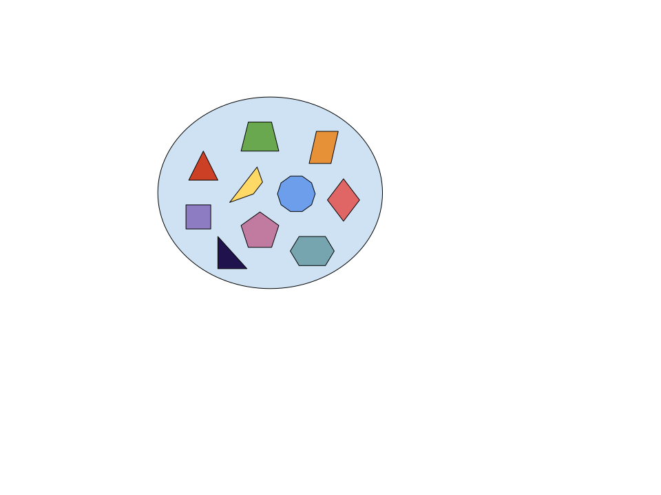
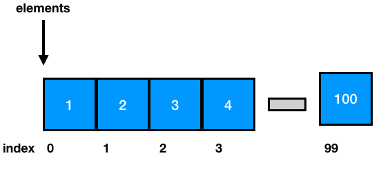
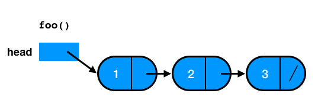
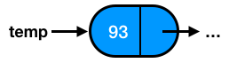
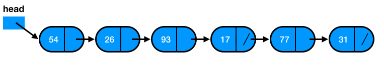

```{r setup, include=FALSE}
knitr::opts_chunk$set(echo = FALSE)
```

## Sets

In mathematics, a **set** is a collection of *distinct* elemets.



## Dynamic Sets

- Sets can be manipulated using appropriate algorithms. Then, sets can grow, shrink, or change over time.

- Dynamic sets can support basic operations such as:
*insert* elements to a set, *remove* elements from a set,
or *search* whether an element belongs to a set.

```script
  insert(S, x)
  # Add an element to a set S pointed to by x.
```

```script
  remove(S, x)
  # Given a pointer x to an element in a set S, remove x from S.
```

```script
  search(S, k)
  # Given a set S and a key k, return a pointer x to an element in S.
  # Output: x.key = k or NIL.
```

## Stacks and Queues (1)

- Stacks and queues are dynamic sets where the way an element can be removed from a set is prespecified.

- In a **stack**, the element to be removed is the one that was most recently inserted into the stack. We name this policy as: *last-in, first-out*, or *LIFO*.

- If a **stack** consists of elements ```S[1..S.top]```, ```S[1]``` is the element at the bottom of the stack and ```S[S.top]``` is the element at the top of the stack. If ```S.top = 0```, the stack is *empty*.

## Stacks and Queues (2)

- In a **queue**, the element to be removed is the one that belongs to the set for the longest time. We name this policy as: *first-in, first-out*, or *FIFO*.

- If a **queue** consists of elements ```Q[1..n]```, ```Q.heap``` points to its head and ```Q.tail``` points the *next* position where a new element can be added to the queue. When ```Q.heap = Q.tail```, it means that the queue is *empty*.

## Stack Operations

- The `insert` operation on a stack is called as `push`.
Additionally, the `remove` operation is called as `pop`.

- In the following example, we implement a stack as an *array* of *n* elements
to demonstate the `push` and `pop` operations.

```{r echo=FALSE}
  # The top element is the 4th one.
  x <- matrix(list(15,6,2,9,"N","N","N"), nrow = 1, dimnames = list(c("S"), c("[1]","[2]","[3]","[4]","[5]","[6]","[7]")))
  x
```

```{r echo=FALSE}
  # New elements (5th and 6th) are added to the end of the stack.
  x <- matrix(list(15,6,2,9,17,3,"N"), nrow = 1, dimnames = list(c("S"), c("[1]","[2]","[3]","[4]","[5]","[6]","[7]")))
  x
```

```{r echo=FALSE}
  # When the 6th element is removed, the next top element is the 5th
  x <- matrix(list(15,6,2,9,17,"[3]","N"), nrow = 1, dimnames = list(c("S"), c("[1]","[2]","[3]","[4]","[5]","[6]","[7]")))
  x
```

## Queue Operations

- The `insert` operation on a queue is called as `enqueue`.
Additionally, the `remove` operation is called as `denqueue`.

- In the following example, we implement a queue as an *array* of *n* elements
to demonstate the `enqueue` and `denqueue` operations.

```{r echo=FALSE}
  # Q.tail = 7 and Q.head = 12
  x <- matrix(list("N","N","N","N","N","N",15,6,9,8,4,"N"), nrow = 1, dimnames = list(c("S"), c("[1]","[2]","[3]","[4]","[5]","[6]","[7]","[8]","[9]","[10]","[11]","[12]")))
  x
```

```{r echo=FALSE}
  # Q.tail = 3 and Q.head = 7
  x <- matrix(list(3,5,"N","N","N","N",15,6,9,8,4,17), nrow = 1, dimnames = list(c("S"), c("[1]","[2]","[3]","[4]","[5]","[6]","[7]","[8]","[9]","[10]","[11]","[12]")))
  x
```

```{r echo=FALSE}
  # Q.tail = 3 and Q.head = 8
  x <- matrix(list(3,5,"N","N","N","N","[15]",6,9,8,4,17), nrow = 1, dimnames = list(c("S"), c("[1]","[2]","[3]","[4]","[5]","[6]","[7]","[8]","[9]","[10]","[11]","[12]")))
  x
```

## Lists

A **list** is a data structure that can store
items (usually) of the same type and
in a specific order.

Typically, we can create a list
by writing the values (items) we want to store
in a comma-separated list
and into square brackets.

```python
   list = [1, 2, 3, 4, 5]
   print(list)
```
  1, 2, 3, 4, 5

## Linked Lists

- A **linked list** is a data structure where objects
are arranged in a linear order and this order is determined
by poiters attached to each element of the list.

- There are two types of linked lists: *singly* and *doubled*.

- Linked lists support *all* the operations of dynamic sets.

- A **doubly linked list** ```L``` represents a dynamic set ```{1, 4, 9, 16}```,
where the attribute ```L.heap``` points to the head of the list
and ```L.tail``` points the last element of the list
(where after this there is no *next* element).
If ```L.heap = NIL```, it means that the list is *empty*.

- Given that ```x``` is an element of a list ```L```, 
```x.next``` points to the successor element of ```x```
and ```x.prev``` points to the predecessor element of ```x```.

## More Forms of Linked Lists

- If a list is **singly linked**, the ```prev``` pointer is omitted.

- If a list is **ordered**, the elements of the list
are arranged in linear order.
Then, the minimum element is the *head* of the list,
whereas the maxinum element is the *tail* of the list.

- If a list is **cincular**,
the ```prev``` pointer of the head of the list points to its tail,
and the ```next``` pointer of the tail of the list points to its head.

## Representation of Data Structures in Computer Memory

An **array** is allocated as one block of memory.
Each array element has its own space in the array and it can be directly accessed
using the ```[]``` syntax.
The following figure illustrates how an array might look like in memory.



## Disadvantages of Arrays

- The size of the arrays is *fixed*.
This means that this size is known at compile time.

- To avoid the above case, we can declare arrays
with more capasity, in case we need this in the future.
Even though this strategy can be convenient,
we maybe have wasted space in the array.
Also, if we finally need to process much more elements
than the capacity of the array,
the code will break.

- Inserting new elements at the front of the array is expensive,
because the already stored elements need to be shifted over to make room
to the new added elements.

To overcome these problems,
we can use **linked lists** that separately allocate memory for each element,
when it is actually necessary.

## Linked List in Memory

- Contrary to arrays that allocate memory for all its elements
together in block of memory,
linked lists *separately* allocate space for *each* element
in its own block of memory called as "linked list element" or "node".

- The list uses *pointers* to connect all its nodes together
(i.e. such as the links in a chain).

- Each *node* has two fields.
A "data" field that stores the element and a "next" field,
which is the pointer to the next node.
Each node is allocated in the *heap*.



## Linked List in Python

In order to implement a linked list in Python,
we need to create a **Node**
that will be store *data* and a *reference* to the next node.

## The Class Node

```python
class Node:
    def __init__(self,initdata):
        self.data = initdata
        self.next = None

    def getData(self):
        return self.data

    def getNext(self):
        return self.next

    def setData(self,newdata):
        self.data = newdata

    def setNext(self,newnext):
        self.next = newnext
```

## The New Node

```python
>>> temp = Node(93)
>>> temp.getData()
93
```



## An Unordered List Class

```python
class UnorderedList:

    def __init__(self):
        self.head = None
        
    def isEmpty(self):
      return self.head == None
      
    def add(self,item):
      temp = Node(item)
      temp.setNext(self.head)
      self.head = temp
```

## The New List

```python
>>> mylist.add(31)
>>> mylist.add(77)
>>> mylist.add(17)
>>> mylist.add(93)
>>> mylist.add(26)
>>> mylist.add(54)
```


