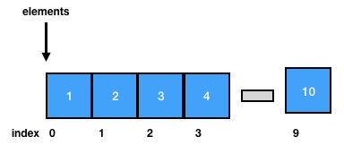
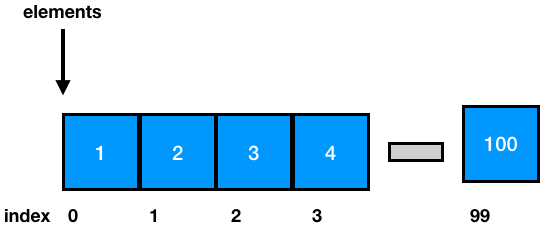
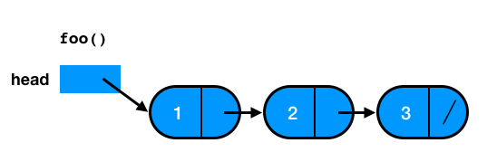
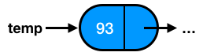
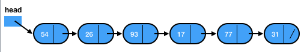
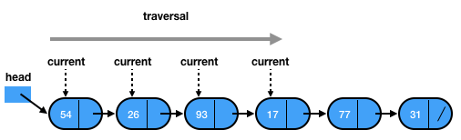
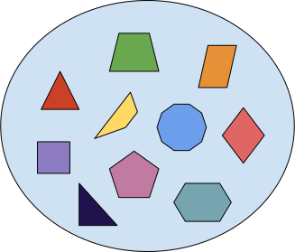
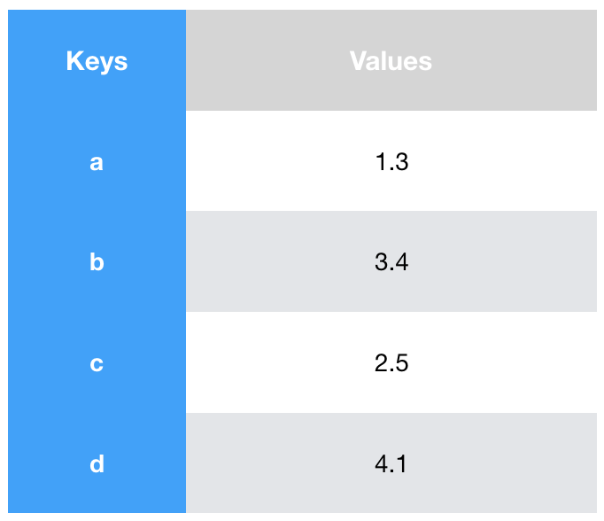
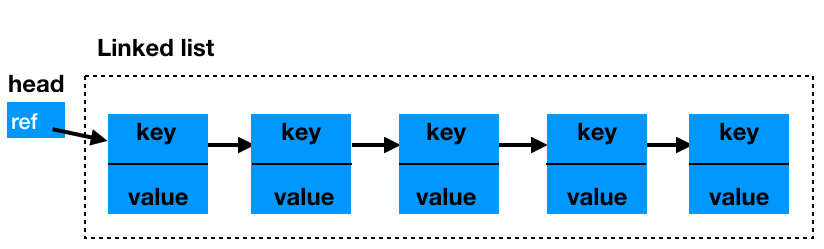
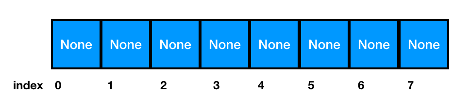

```{r, include=FALSE}
knitr::opts_chunk$set(echo = FALSE)
```

# Basic Data Structures

## Collections 

- Like all containers, collections can grow, shrink, or change over time.

- Collections support basic operations such as:
*insert* elements to a collection, *remove* elements from a collection,
or *search* whether an element belongs to a collection.

```python
# Add an element pointed to by x.
insert(C, x)
```

```python
# Given a pointer x to an element in a collection C, remove x from C.
remove(C, x)
```

```python
# Given a collection C and a key k, return a pointer x to an element in C.
# Output: x.key = k or NIL
search(C, k)
```

## Arrays

An array is a container that can hold a *fixed* number of items
that should be of the same type.

```
arr = [1, 2, 3, 4, 5, 6, 7, 8, 9, 10]
```

- Each array item is called an *element*.

- The location of each element, in an array,
can be identified using numerical *indices*.

- A basic property of an array is its *size*



## Array `insert` {- }

```python
def insert(arr, item, k):
    if k >= len(arr):
        raise Exception
    arr[k] = item
    
    return arr
```

```python
> insert([1,2,3], 4, 1)
[1, 4, 3]
```

**Warning**: Arrays in Python are not arrays, but lists internally. This makes
the implementation of several array operations look weird.

```python
def append(arr, item):
  # Fishy, just for demo purposes
  arr = arr + [None]
  arr[len(arr) - 1] = item
    
  return arr
```

## Array `remove` {- }

```python
def remove(arr, item_index):
  if item_index >= len(arr):
    raise Exception
        
  return arr[0:item_index] + arr[item_index + 1:len(arr)]
```

Remove an item by index splits the array in 2, 1 part from the beggining
of the array till the removal point, second part from the removal point
till the end of the array.

```python
> remove([1,2,3,4,5], 5)
[1, 2, 4, 5, 10]

> remove([1,2,3,4,5,10], 0)
[2, 3, 4, 5, 10]
```

## Array `search` and `contains` {- }

`search` returns the first position of `item` in `arr`

```python
def search(arr, item):
  for i in range(len(arr)):
    if arr[i] == item:
      return i
  return -1
```

```python
> search([1,2,3,4,5], 3)
2
```

`contains` returns a Boolean if the provided item exists in an array

```python
def contains(arr, item):
  for i in arr:
    if i == item:
      return True
  return False
```

## Stacks

- Stacks and queues are *abstract data types* that represent *dynamic collections*,
where the way an element can be removed from a set is prespecified

    * **LIFO:** Last-in, First-out (stacks)
    * **FIFO:** First-in, First-out (queues)

- If a **stack** consists of elements ```S[1..S.top]```, ```S[1]``` is the 
element at the *bottom* of the stack and ```S[S.top]``` is the element at 
the *top* of the stack. If ```S.top = 0```, the stack is *empty*.

## Stack Operations {- }

- The `insert` operation on a stack is called as `push`.
The `remove` operation is called as `pop`.

- The `top` operation on a stack returns that most recently added element.

- The `empty` operation checks whether the stack is empty.

## Representation of Stacks using arrays {- }

Stacks are usually implemented using a backing array and a pointer that
points to the top of the stack:

. . .

```python
class Stack():
    def __init__(self, size = -1):
        # Stack size, configurable
        if size > 0:
            self.size = size
        else:
            self.size = 10
        # Backing array 
        self.arr = map(lambda x: None, range(self.size))
        # Top pointer
        self.top = 0
```

We initialize the Stack calling the constructor

```python
> s = Stack(10)
> s.arr
[None, None, None, None, None, None, None, None, None, None]
> s.top
0
```

## `push` and `pop` {- }

`push` adds an element to a stack.

```python
def push(s, element):
    if s.top >= len(s.arr):
        raise Exception # StackOveflow
    
    s.arr[s.top] = element
    s.top = s.top + 1
    return s

> s = push(s, 10)
> s.arr
[10, None, None, None, None, None, None, None, None, None]
> s.top
1
```

. . .

`pop` removes and returns the top element from the stack

```python
def pop(s):
    if s.top == 0:
        raise Exception # No element in stack
    
    result = s.arr[s.top - 1]
    s.top = s.top - 1 
    return result
    
> pop(s)
10
> s.arr
[10, None, None, None, None, None, None, None, None, None]
> s.top
0
```

## Fun with stacks {- }

One common problem when writing code in languages like Lisp is that we
have too many parentheses to check. To solved this problem, we need to 
implement a  "balanced parenthesis checker (bpc)".

Some Lisp code:

```lisp
(setf (fdefinition 'f) #'(lambda (a) (block f b...)))
```

Some example runs:

* `bpc("()")` -> `True`
* `bpc("(())((())")` -> `False`

```python
def bpc(inp):
  pass
```

## Queues

- In a **queue**, the element to be removed is the oldest one


- If a **queue** consists of elements ```Q[1..n]```, ```Q.head``` points to its 
*head* and ```Q.tail``` points the *next* position where a new element can
be added to the queue. 

When ```Q.head = Q.tail```, it means that the queue is *empty*.

- The `insert` operation on a queue is called as `enqueue`.
The `remove` operation is called as `dequeue`.


## Representation of Queues Using Arrays {- }

A queue with a backing array is the simplest queue. The main dissadvantage
is that it cannot grow dynamically.

. . .

```python
class Queue():
  def __init__(self, size = -1):
    if size > 0:
      self.size = size
    else:
      self.size = 10
      # Backing array initialization
      self.arr = map(lambda x: None, range(self.size))
      # Queue pointers
      self.tail = 0
```

## Adding items with `enqueue` {- }

```python
def enqueue(self, item):
  if self.tail >= len(self.arr):
    raise Exception ## Queue full
          
  self.arr[self.tail] = item
  self.tail = self.tail + 1
  #print "enqueue: [%s] %d" % (', '.join(map(str, self.arr)), self.tail)
```

The `enqueue` operation adds the item to the tail position and advances the
tail pointer.

```python
> q = Queue(10)
> q.enqueue(4)
> q.enqueue(6)

enqueue: [4, None, None, None, None, None, None, None, None, None] 1
enqueue: [4, 6, None, None, None, None, None, None, None, None] 2
```

## Removing items with `dequeue` {- }

```python
def dequeue(self):
  if self.tail == 0:
    raise Exception ## Queue empty

  result = self.arr[self.tail]
  self.arr = self.arr[1:len(self.arr)] + [None]
  self.tail = self.tail - 1
  #print "dequeue: [%s] %d" % (', '.join(map(str, self.arr)), self.tail)
  return result
```

The `dequeue` operation returns the item at the head position.

```python
> q = Queue(10)
> q.enqueue(4)
> q.enqueue(6)
> q.enqueue(8)
> print q.dequeue()
> print q.dequeue()

enqueue: [4, None, None, None, None, None, None, None, None, None] 1
enqueue: [4, 6, None, None, None, None, None, None, None, None] 2
enqueue: [4, 6, 8, None, None, None, None, None, None, None] 3
dequeue: [6, 8, None, None, None, None, None, None, None, None] 2
4
dequeue: [8, None, None, None, None, None, None, None, None, None] 1
6
```

## Extra queue operations {- }

How many empty spots are left in the queue?
```python
def capacity(self):
    return len(self.arr) - self.tail
```

Is the queue empty?
```python
  def isempty():
    return self.tail == 0
```

Is the queue full?
```python
  def isfull():
    return self.tail == len(self.arr) - 1
```

## Uses of queues {- }

* To model producer / consumer problems
    * In multithreading environments we use blocking and sychronized queues 
* To model graph and tree traversals

## Lists

A **list** is a data structure that can store
items (usually) of the same type and
in a specific order.

Typically, we can create a list
by writing the values (items) we want to store
in a comma-separated list.

In Python, a list is an array.

$1, 2, 3, 4, 5$

## Linked Lists {- }

- A **linked list** is a data structure where objects
are arranged in a linear order and this order is determined
by poiters attached to each element of the list.

- There are two types of linked lists: *doubled* and *singly*.

- Linked lists support *all* the operations of dynamic collections.

## Doubly Linked Lists {- }

- A **doubly linked list** ```L``` represents a dynamic collection ```{1, 4, 9, 16}```,
where the attribute ```L.heap``` points to the head of the list
and ```L.tail``` points the last element of the list
(where after this there is no *next* element).
If ```L.heap = NIL```, it means that the list is *empty*.

- Given that ```x``` is an element of a list ```L```, 
```x.next``` points to the successor element of ```x```
and ```x.prev``` points to the predecessor element of ```x```.

## More Forms of Linked Lists {- }

- If a list is **singly linked**, the ```prev``` pointer is omitted.

- If a list is **ordered**, the elements of the list
are arranged in linear order.
Then, the minimum element is the *head* of the list,
whereas the maxinum element is the *tail* of the list.

- If a list is **cincular**,
the ```prev``` pointer of the head of the list points to its tail,
and the ```next``` pointer of the tail of the list points to its head.

## Representation of Data Structures in Computer Memory {- }

An **array** is allocated as one block of memory.
Each array element has its own space in the array and it can be directly accessed
using the ```[]``` syntax.
The following figure illustrates how an array might look like in memory.



## Disadvantages of Arrays (1) {- }

The size of the arrays is *fixed*.
This means that this size is known at compile time.

To avoid the above case, we can declare arrays
with more capasity, in case we need this in the future.

Even though this strategy can be convenient,
we maybe have wasted space in the array.
Also, if we finally need to process much more elements
than the capacity of the array,
the code will break.

## Disadvantages of Arrays (2) {- }

Inserting new elements at the front of the array is expensive,
because the already stored elements need to be shifted over to make room
to the new added elements.

To overcome these problems,
we can use **linked lists**
that separately allocate memory for each element,
when it is actually necessary.

## Linked List in Memory {- }

Contrary to arrays that allocate memory for all its elements
together in block of memory,
linked lists *separately* allocate space for *each* element
in its own block of memory called as "linked list element" or "node".

The list uses *pointers* to connect all its nodes together
(i.e. such as the links in a chain).

## Linked List Nodes {- }

Each *node* has two fields.
A "data" field that stores the element and a "next" field,
which is the pointer to the next node.
Each node is allocated in the *heap*.



## Implementation of a Linked List in Python {- }

In order to implement a linked list in Python,
we need to create a **Node**
that will store *data* and a *reference* to the next node.

## The Class Node {- }

```python
class Node:
    def __init__(self,initdata):
        self.data = initdata
        self.next = None

    def getData(self):
        return self.data

    def getNext(self):
        return self.next

    def setData(self,newdata):
        self.data = newdata

    def setNext(self,newnext):
        self.next = newnext
```

## The New Node {- }

```python
>>> temp = Node(93)
>>> temp.getData()
93
```



## An Unordered List Class {- }

```python
class UnorderedList:

    def __init__(self):
        self.head = None
        
    def isEmpty(self):
      return self.head == None
      
    def add(self,item):
      temp = Node(item)
      temp.setNext(self.head)
      self.head = temp
```

## The New List {- }

```python
>>> mylist.add(31)
>>> mylist.add(77)
>>> mylist.add(17)
>>> mylist.add(93)
>>> mylist.add(26)
>>> mylist.add(54)
```



## Linked List Traversal {- }

- Methods that implement operations, such as ```size```, ```search```, and ```remove```,
are based on a technique that is called as **linked list traversal**.

- Traversal refers to the process of systematically visiting each node of the list.
To achieve this, we use an external reference that starts from the first node of the list,
and we continue the passage.

- In particular, we visit one node, and then we move the reference to the next node by
"traversing" the next reference.

## List Size {- }

- To implement the ```size``` method,
we need to traverse the linked list,
counting the nodes of the list.

- In the beginning, the counter (```current```) is set to ```0```,
because there is not currely any node.

- We continue checking for new nodes
until the ```current``` reference reaches the end of the list (```None```).

```python
def size(self):
    current = self.head
    count = 0
    while current != None:
        count = count + 1
        current = current.getNext()

    return count
```

## Searching in a List {- }

To implement the ```search``` method,
we develop the following strategy.
We visit each node of the list and we check
whether this node has stored the data
that we are looking for.
We conduct this process
until we find the appropriate node.

```python
def search(self,item):
    current = self.head
    found = False
    while current != None and not found:
        if current.getData() == item:
            found = True
        else:
            current = current.getNext()

    return found
```

## Search for an Element {- }

```python
>>> mylist.search(17)
True
```

Here, the traversal needs to move up to the
node that contains the element ```17```.



## Remove an Element {- }

To implement the remove method,
we need to perform two passes.

- First, we *traverse* the list until
we find the element to be removed.
This step is similar with the traversal
we conduct for the ```search``` method.

- Second, we *update* the nodes that
contain the references to the elements.
If we remove the node,
how can we update the links to the next nodes? 

## The ```previous``` Reference {- }

Since a linked list does not permit
backwards traversal,
we use two external references.

The first reference is the ```current``` one
that represents the current location of the traverse,
and the second reference is the ```previous``` one
that represents a node *behind* the ```current```.

## The ```remove``` Method {- }

```python
def remove(self,item):
    current = self.head
    previous = None
    found = False
    while not found:
        if current.getData() == item:
            found = True
        else:
            previous = current
            current = current.getNext()

    if previous == None:
        self.head = current.getNext()
    else:
        previous.setNext(current.getNext())
```

## Sets

In mathematics, a **set** is a collection of *distinct* elemets.




## Implement a Set from a List {- }

```python
class Set(object):

    def __init__(self, iterable):
        data = list(iterable)
        data.sort()
        result = data[:1]
        for elem in data[1:]:
            if elem == result[-1]:
                continue
            # add as it is previously defined in UnorderedList
            result.add(elem)
        self.data = result
```

## Add an Element to a Set {- }

```python
def add(self, elem):
  if elem not in self:
      # see the insert method presented in the arrays
      insert(self.data, elem)
```

## Remove an Element from a Set {- }

```python
def remove(self, elem):
  data = self.data
  # return the index of the item; see arrays' search method
  i = search(self, elem)
  if i<len(data) and data[i] == elem:
      del data[i]
```

## Maps 

A map is an abstract data structure that stores
key-value pairs and
there cannot be duplicate keys.

Such a data structure is also called as:
*associative array*, *symbol table*, or *dictionary*.

Maps are usuful in order to:

- store objects to specific keys, and

- lookup of the values associated with a particular key.

## An Example of a Map {- }



## Operations of the Map Data Type {- }

- The method `put` adds a new key-value pair to a map.
If the `key` is already in the map, it replaces the old value for that key.

- The method `get` returns the value of that key,
or `None` if there is no value.

- The method `delete` removes a key-value pair from a map.

## Implementation of a Map {- }

- Arrays

- Linked-lists

- Binary search trees

- Hash tables

## A Linked List Implementation of a Map {- }

We can store key-value pairs in a linked list
as it is illustrated in the following figure.



## Basic Operations {- }

- `get(k)`:
It iterates the list until
it finds the item with key `k`.

- `put(k, v)`: Given Node `x = get(k)`,
if `x` exists, it replaces the value of `x` with `v`.
Otherwise, it creates a new `node(k,v)`
and adds this at the front of the list.

- `remove(k)`: Given Node `x = get(k)`,
if `x` does not exist, it returns `null`.
Otherwise, it removes node `x` from the list.

- Complexity: $O(n)$ on a map with $n$ elements.

## Implementing Maps Using Hashing {- }

- Can we do better in complexity terms?

- Yes, by building a type of a data structure
that can search in $O(1)$ time.
This can be achieved with a concept called as **hashing**.

## Hash Tables 

- A **hash table** is a collection of elements
that are stored in such a way
that it is easy for one to find them later.

- The positions of a hash table start from $0$
and at each position, it can store an item.

- The **mapping** between an element and a slot in the collection,
where an element belongs to is called **hash function**.
However, we are going to talk in another lecture about it.

## Initialization of a Hash Table {- }

- We are initializing a hash table
by adding the special Python `None` value
to the slots of the table.



## How does it work? {- }

- Assume that we have the set $S= {54,26,93,17,77,31}$
and we want to add the items into a hash table of size $11$.

- A simple hash function takes an item and
divides it by the table size.

- The remainder is the hash value,
which will indicate the positions
where the items will be inserted in the hash table.

## Implementation of Map in Python {- }

```python
class HashTable:
    def __init__(self):
        self.size = 11
        self.slots = [None] * self.size
        self.data = [None] * self.size
```

## Put Values {- }

```python
def put(self,key,data):
  hashvalue = self.hashfunction(key,len(self.slots))

  if self.slots[hashvalue] == None:
    self.slots[hashvalue] = key
    self.data[hashvalue] = data
  else:
    if self.slots[hashvalue] == key:
      self.data[hashvalue] = data  #replace
    else:
      nextslot = self.rehash(hashvalue,len(self.slots))
      while self.slots[nextslot] != None and \
                      self.slots[nextslot] != key:
        nextslot = self.rehash(nextslot,len(self.slots))

      if self.slots[nextslot] == None:
        self.slots[nextslot]=key
        self.data[nextslot]=data
      else:
        self.data[nextslot] = data #replace

def hashfunction(self,key,size):
     return key%size

def rehash(self,oldhash,size):
    return (oldhash+1)%size
```

## Get Values {- }

```python
def get(self,key):
  startslot = self.hashfunction(key,len(self.slots))

  data = None
  stop = False
  found = False
  position = startslot
  while self.slots[position] != None and  \
                       not found and not stop:
     if self.slots[position] == key:
       found = True
       data = self.data[position]
     else:
       position=self.rehash(position,len(self.slots))
       if position == startslot:
           stop = True
  return data

def __getitem__(self,key):
    return self.get(key)

def __setitem__(self,key,data):
    self.put(key,data)
```

## Copyright {- }

This work is (c) 2017 - onwards by TU Delft and Maria Kechagia
and licensed under the [Creative Commons Attribution-NonCommercial-ShareAlike 
4.0 International](http://creativecommons.org/licenses/by-nc-sa/4.0/) license.

<!--html_preserve-->
<script>
  (function(i,s,o,g,r,a,m){i['GoogleAnalyticsObject']=r;i[r]=i[r]||function(){
  (i[r].q=i[r].q||[]).push(arguments)},i[r].l=1*new Date();a=s.createElement(o),
  m=s.getElementsByTagName(o)[0];a.async=1;a.src=g;m.parentNode.insertBefore(a,m)
  })(window,document,'script','https://www.google-analytics.com/analytics.js','ga');

  ga('create', 'UA-2510585-3', 'auto');
  ga('send', 'pageview');

</script>
<!--/html_preserve-->
