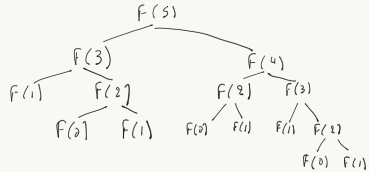

```{r, echo=F, warning=FALSE}
library(ggplot2)
```

```{r child="header.Rmd", include=FALSE}
```

## Algorithm analysis

Algorithm analysis is the theoretical study of program performance
and resource usage.[@Leirs05]

**D:** What resources do programs consume?

. . .

* CPU time
* Memory and disk
* Network I/O

**Q:** Why is algorithm analysis important?

. . .

Because it allows us to determine what is possible to do given a problem.

## A simple (?) algorithm

```{python}
def fib(x):
  if x == 0: return 0
  elif x == 1: return 1
  else: return fib(x - 2) + fib(x - 1)
```

**D:** How many steps will this algorithm need to make to calculate `fib(5)`?

. . .



## Analysing `fib`

What we observe is that `fib` takes a number of steps that is _proportional_
to its argument.

* `fib(2)` requires 2 steps
* `fib(3)` requires `steps(fib(2))` + 1 = 3 steps
* `fib(4)` requires `steps(fib(3))`  + `steps(fib(2))` + 1 = 6 steps

The question that **algorithm analysis** will enable us answer is: 

_How many steps does `fib(n)` require?_

## Kinds of algorithm analyses

* **Worst-case:** $T(n)$ The maximum steps/time/memory taken by an algorithm to
complete the solution for inputs of size $n$

* **Average-case:** The expected time over all inputs with the same characteristics
(e.g. size).

* **Best-case:** The performance in ideal situations. Rarely used.

When analysing algorithmic performance, we ignore computational resources (e.g.
CPU speed); we only care about the growth of $T(n)$ as $n \rightarrow \infty$

This is called the **asymptotic behaviour**

## $\Theta$ notation

The $\Theta$ notation defines its exact asymptotic beviour of a function $f(n)$
by restricting its upper and lower bounds in terms of another function:

$f(n) = \Theta(g(n))$ means that: 
$\forall n > n_0: \exists c_1 > 0, c_2 > 0, n_0:$
$0 <= c_1 g(n) \le f(n) \le c_2  g(n)$

This means that there exist positive constants $c_1$, $c_2$, and $n_0$ such
that if $f(n)$ is $\Theta(g(n))$, then $f(n)$ execution steps/time are bound by 
the equation above.

In practice, this means there exists a value $n_0$ such as a $\Theta(n^2)$ 
algorithm will behave worse that $\Theta(n)$ algorithm

## $O$ notation

Most times we only care about the worse case behaviour. This is what $O$ defines:

$f(n) = O(g(n))$ means that: 

$\forall n > n_0, \exists c > 0, n_0 > 0: 0 \le f(n) \le cg(n)$

. . .

**Q:** Is $2n^2 = O(n^3)$?

. . .

We take $c = 1$ and $n_0 = 2$ and replace in the "constructor:"

$0 \le 2n^2 \le n^3$. The equation holds $\forall n$

This also means that we can overestimate our compexity scale and be ok!

## Asymptotic growth

Asymptotic growth analysis allows to estimate the (usually, upper) bounds
of functions as a function of problem size.

It also enables us to compare algorithm implementations: an $O(n^2)$ algorithm
is _always_ worse than an $O(log(n))$ one.

## Math growth functions

We usually determine the asymptotic growth in terms of the following functions.
Each one is asymptotically better than the following:

1. $f(x) = n$ (constant function)
2. $f(x) = log(x)$ (logarithmic function)
3. $f(x) = sqrt(x)$ (square root function)
4. $f(x) = x$ (linear function)
5. $f(x) = nlog(n)$ (log-linear function)
6. $f(x) = x^2$ (quadratic function)
7. $f(x) = x^3$ (cubic function)
7. $f(x) = a^x, \forall a > 1$ (exponential function)

## Function growth examples

Growth of important functions for $x \in (0, 1)$

```{r, echo=F, warning=FALSE}
ggplot(data.frame(x=c(0,1)), aes(x)) +
  stat_function(fun=function(x)x^3, geom="line", aes(colour="x^3")) +
  stat_function(fun=function(x)x^2, geom="line", aes(colour="x^2")) +
  stat_function(fun=exp, geom="line", aes(colour="e^x")) +
  stat_function(fun=function(x)log(x), geom="line", aes(colour="log(x)")) +
  stat_function(fun=function(x)x*log(x), geom="line", aes(colour="xlog(x)")) +
  stat_function(fun=function(x)x, geom="line", aes(colour="linear")) +
  stat_function(fun=function(x)1, geom="line", aes(colour="constant")) +
  stat_function(fun=function(x)sqrt(x), geom="line", aes(colour="sqrt(x)")) +
  ylab("") + xlab("") + theme_bw()
```

---

Growth of the same functions for $x \in (0, 2)$

```{r, echo=F, warning=FALSE}
ggplot(data.frame(x=c(0,2)), aes(x)) +
  stat_function(fun=function(x)x^3, geom="line", aes(colour="x^3")) +
  stat_function(fun=function(x)x^2, geom="line", aes(colour="x^2")) +
  stat_function(fun=exp, geom="line", aes(colour="e^x")) +
  stat_function(fun=function(x)log(x), geom="line", aes(colour="log(x)")) +
  stat_function(fun=function(x)x*log(x), geom="line", aes(colour="xlog(x)")) +
  stat_function(fun=function(x)x, geom="line", aes(colour="linear")) +
  stat_function(fun=function(x)1, geom="line", aes(colour="constant")) +
  stat_function(fun=function(x)sqrt(x), geom="line", aes(colour="sqrt(x)")) +
  ylab("") + xlab("") + theme_bw()
```

---

Growth of the same functions for $x \in (0, 5)$

```{r, echo=F, warning=FALSE}
ggplot(data.frame(x=c(0,5)), aes(x)) +
  stat_function(fun=function(x)x^3, geom="line", aes(colour="x^3")) +
  stat_function(fun=function(x)x^2, geom="line", aes(colour="x^2")) +
  stat_function(fun=exp, geom="line", aes(colour="e^x")) +
  stat_function(fun=function(x)log(x), geom="line", aes(colour="log(x)")) +
  stat_function(fun=function(x)x*log(x), geom="line", aes(colour="xlog(x)")) +
  stat_function(fun=function(x)x, geom="line", aes(colour="linear")) +
  stat_function(fun=function(x)1, geom="line", aes(colour="constant")) +
  stat_function(fun=function(x)sqrt(x), geom="line", aes(colour="sqrt(x)")) +
  ylab("") + xlab("") + theme_bw()
```

---

Growth of sane functions for $x \in (0, 10)$

```{r, echo=F, warning=FALSE}
ggplot(data.frame(x=c(0,10)), aes(x)) +
  stat_function(fun=function(x)log(x), geom="line", aes(colour="log(x)")) +
  stat_function(fun=function(x)x*log(x), geom="line", aes(colour="xlog(x)")) +
  stat_function(fun=function(x)x, geom="line", aes(colour="linear")) +
  stat_function(fun=function(x)1, geom="line", aes(colour="constant")) +
  stat_function(fun=function(x)sqrt(x), geom="line", aes(colour="sqrt(x)")) +
  ylab("") + xlab("") + theme_bw()
```


## Function growth in time

If the time to execute for input size $n = 1$ is 1 sec, then for input size $n = 1000$ 

* An $O(log(n))$ algorithm will take 7 secs
* An $O(sqrt(n))$ algorithm will take 31 secs
* An $O(n)$ algorithm will take 1000 secs
* An $O(n^2)$ algorithm will take 277 hours
* An $O(n^3)$ algorithm will take 32 years
* An $O(e^x)$ algorithm will take billions of years!

## Examples with big-O 

$f(x) = 5x + 30$ is $O(n)$, because intuitively it is bound by a linear
function (e.g. $g(x) = 6x$)


```{r, echo=F, warning=FALSE}
ggplot(data.frame(x=c(0,100)), aes(x)) +
  stat_function(fun=function(x){5*x + 30}, geom="line", aes(colour="5x + 30"))+
  stat_function(fun=function(x)x, geom="line", aes(colour="x")) +
  stat_function(fun=function(x){6*x}, geom="line", aes(colour="6x")) +
  ylab("") + xlab("") + theme_bw() 
```

## Examples with big-O

What is the asymptotic complexity of the following polynomials?

$f(x) = 5x + 40$

. . .

$f(x) = O(x)$

$f(x) = 5x^2 + 3x +2$

. . .

$f(x) = O(x^2)$

## Calculating the number of steps
We can now estimate the asymptotic complexity of algorithms, but what we
are missing is a way to evaluate the number of "steps" an algorithm takes as
a function of the input size, i.e., the $f(x)$ function.

What is a "step"?

* Perfoming a calculation: `4 + 2`
* Evaluating an expression: `x = x + 2` 
* Accessing an array by index: `a[1]`
* Calling a method: `x = foo(1,bar)`
* Allocating memory: `x = Person("foo")`

In general, any operation that consumes computing resources can be considered
as a step

## Calculating complexity - Example 1

```python
def foo(x):
  if x == 0:
    print x
  else:
    print x[0]
```

. . .

Steps:

* 1 comparison 
* 1 printing operation
* 1 (perhaps) accessing memory

None of the above actions depend on the size of `x`. Therefore this algorithm
is $O(1)$. This means that no matter how big `x` is, it will run in constant time.

## Iteration

```python
def foo(a):
  for i in a:
    y = y + i
    
  return y
```

. . .

Per item of a:

* 1 memory access to "load" `a` in `i` 
* 1 addition 
* 1 assignment

then, also a return statement

Our complexity function is $f(x) = 3x + 1$, which can be upper bounded by $g(x) = 5x$.
Therefore, the compexity class is $O(n)$

## Matrix multiplication

```python
# a is (n x m) and b is (m x p). The result is (n x p)
def matrix_multiply(a, b):
  result = [[0 for x in range(len(a))] for y in range(len(b[0]))] 
  for i in range(len(a[0])):
    for j in range(len(b[0])):
      sum = 0
      for k in range(len(a)):
        sum = sum + a[i][k] * b[k][j]
        result[i][j] = sum

  return result
```

Ignoring initialization, for each element in `a`, we need:

* access `len(b[0])` times all elements in `b`
* access `len(a)` times all lines in `a`
* do a multiplication and an assignment

$f(a,b) = len(a[0]) \times len(b[0]) \times len(a) + 1$ or $f(a,b) = n \times m \times p + 1$. 
If we take $a = max(n, m, p)$, we can prove that $f(a,b)$ is bounded by $O(a^3)$.

```{r child="footer.Rmd", include=FALSE}
```
