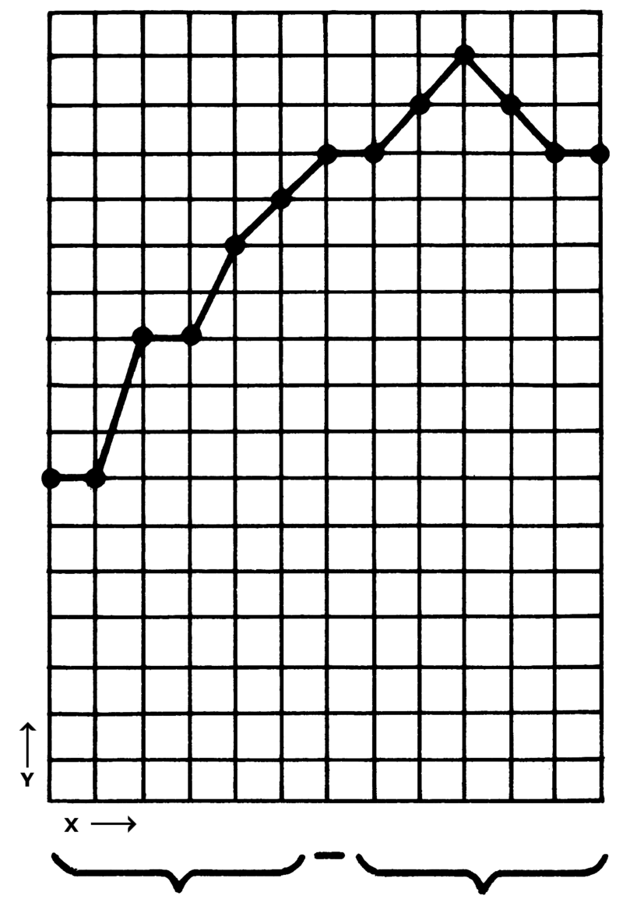

```{r setup, include=FALSE}
knitr::opts_chunk$set(echo = FALSE)
library(GGally)
library(network)
library(sna)
#library(ggplot2)
#library(visNetwork) 
library(reticulate)
#library(geomnet)
#library(ggnetwork)
library(igraph)

# http://www.cookbook-r.com/Graphs/Multiple_graphs_on_one_page_(ggplot2)/
multiplot <- function(..., plotlist=NULL, file, cols=1, layout=NULL) {
  library(grid)

  # Make a list from the ... arguments and plotlist
  plots <- c(list(...), plotlist)

  numPlots = length(plots)

  # If layout is NULL, then use 'cols' to determine layout
  if (is.null(layout)) {
    # Make the panel
    # ncol: Number of columns of plots
    # nrow: Number of rows needed, calculated from # of cols
    layout <- matrix(seq(1, cols * ceiling(numPlots/cols)),
                    ncol = cols, nrow = ceiling(numPlots/cols))
  }

 if (numPlots==1) {
    print(plots[[1]])

  } else {
    # Set up the page
    grid.newpage()
    pushViewport(viewport(layout = grid.layout(nrow(layout), ncol(layout))))

    # Make each plot, in the correct location
    for (i in 1:numPlots) {
      # Get the i,j matrix positions of the regions that contain this subplot
      matchidx <- as.data.frame(which(layout == i, arr.ind = TRUE))

      print(plots[[i]], vp = viewport(layout.pos.row = matchidx$row,
                                      layout.pos.col = matchidx$col))
    }
  }
}
```

# Part 1

## Introduction to Graphs
- What is a graph
- Directions and cycles
- Graph representation


## Not about

### Charts and Grafs
{ width=20% } { width=30% }

## Nodes represent objects

(e.g. people, cities, countries, computers).

```{r,  message=FALSE, warning=FALSE, cache=FALSE, fig.width = 7, fig.height = 4}
# make data accessible
data(blood, package = "geomnet")

set.seed(12252016)
ggnet2(network::network(blood$edges[, 1:2], directed=F), 
       mode = "circle", size = 15, label = F, 
       arrow.size = 10, arrow.gap = 0.05, vjust = 0.5,
       edge.color = "white", node.color = "darkred", label.color = "grey80")
# https://cran.r-project.org/web/packages/ggCompNet/vignettes/examples-from-paper.html
```

Nodes can be called vertices as well.


## Edges represent relationships

(e.g. friendship, connectedness)

```{r,  message=FALSE, warning=FALSE, cache=FALSE, fig.width = 7, fig.height = 4}
set.seed(12252016)
ggnet2(network::network(blood$edges[, 1:2], directed=F), 
       mode = "circle", size = 15, label = F, 
       arrow.size = 10, arrow.gap = 0.05, vjust = 0.5,
       node.color = "darkred", label.color = "grey80")
```

Graphs can be called networks as well.

## Direction of relationships

(e.g. A follows B, A is a student of B)

```{r,  message=FALSE, warning=FALSE, cache=FALSE, fig.width = 7, fig.height = 4}
set.seed(12252016)
ggnet2(network::network(blood$edges[, 1:2], directed=T), 
       mode = "circle", size = 15, label = F, 
       arrow.size = 10, arrow.gap = 0.05, vjust = 0.5,
       node.color = "darkred", label.color = "grey80")
```

Does it remind you something?

## Blood donation

```{r,  message=FALSE, warning=FALSE, cache=FALSE, fig.width = 7, fig.height = 4}
set.seed(12252016)
ggnet2(network::network(blood$edges[, 1:2], directed=T), 
       mode = "circle", size = 15, label = T, 
       arrow.size = 10, arrow.gap = 0.05, vjust = 0.5,
       node.color = "darkred", label.color = "grey80")
```

O- can donate blood to anybody. AB+ can donate blood only to themselves.

## Position of nodes
```{r,  message=FALSE, warning=FALSE, cache=FALSE, fig.width = 10, fig.height = 4}

set.seed(12252016)
p1 <- ggnet2(network::network(blood$edges[, 1:2], directed=T), 
       mode = "circle", size = 7, label.size = 3, label = T, 
       arrow.size = 5, arrow.gap = 0.05, vjust = 0.5,
       node.color = "darkred", label.color = "grey80")
p2 <- ggnet2(network::network(blood$edges[, 1:2], directed=T), 
       mode = "fruchtermanreingold", size = 7, label.size = 3,label = T, 
       arrow.size = 5, arrow.gap = 0.05, vjust = 0.5,
       node.color = "darkred", label.color = "grey80")
p3 <- ggnet2(network::network(blood$edges[, 1:2], directed=T), 
       mode = "circrand", size = 7, label.size = 3,label = T, 
       arrow.size = 5, arrow.gap = 0.05, vjust = 0.5,
       node.color = "darkred", label.color = "grey80")
p4 <- ggnet2(network::network(blood$edges[, 1:2], directed=T), 
       mode = "kamadakawai", size = 7, label.size = 3,label = T, 
       arrow.size = 5, arrow.gap = 0.05, vjust = 0.5,
       node.color = "darkred", label.color = "grey80")
multiplot(p1, p2, p3, p4, cols=2)
```

Does not change semantics of the graph

## Edge weights

(e.g. cost of travel, distance, energy to transition)

```{r,  message=FALSE, warning=FALSE, cache=FALSE, fig.width = 7, fig.height = 4}

set.seed(123234)
m <- matrix(rnorm(25,2,2),5,5)
m <- round(m)
diag(m) <- 0
m[lower.tri(m)] <- 0
net <- network(m, directed=F, names.eval = "weights", ignore.eval = FALSE)

ggnet2(net, 
       mode = "circle", size = 15, label = T, 
       vjust = 0.5,
       node.color = "darkred", label.color = "grey80", edge.label = "weights", edge.label.color = "black")
# arrow.size = 10, arrow.gap = 0.05, 
```

In a directional graph cost in one direction could be different than back (e.g. going up hill and downhill).

## Node degree

Number of edges incident on a node. 

```{r,  message=FALSE, warning=FALSE, cache=FALSE, fig.width = 7, fig.height = 4}

set.seed(123234)
m <- matrix(rnorm(25,2,2),5,5)
m <- round(m)
diag(m) <- 0
m[lower.tri(m)] <- 0
net <- network(m, directed=F, names.eval = "weights", ignore.eval = FALSE)

ggnet2(net, 
       mode = "circle", size = 15, label = T, 
       vjust = 0.5,
       node.color = "darkred", label.color = "grey80", edge.label = "weights", edge.label.color = "black")
# arrow.size = 10, arrow.gap = 0.05, 
```

degree("1") = 3; degree("3") = 4. What is your node degree on LinkedIn?


# Part 2

## Graph representation
We can define a graph using:

- Edge list
- Adjacency list
- Adjacency matrix


## Edge list

[Edge1, Edge2, Edge3, Edge4]

Edge1 = [Node1, Node2]

```{python, echo = TRUE}

edge_list = [[0,1],[1,2],[1,3],[2,3]]

```

```{r,  message=FALSE, warning=FALSE, cache=FALSE, fig.width = 6, fig.height = 3}

m <- matrix(
  c(0, 1, 0, 0,
    1, 0, 1, 1,
    0, 1, 0, 1,
    0, 1, 1, 0),
  nrow = 4, ncol = 4
)
rownames(m) = c(0,1,2,3)
colnames(m) = c(0,1,2,3)

net <- network(m, directed=F, names.eval = "weights", ignore.eval = FALSE)

ggnet2(net, 
       mode = "circle", size = 15, label = T, 
       vjust = 0.5,
       node.color = "darkred", label.color = "grey80")
```


## Adjacency list

[Node1Conns, Node2Conns, Node3Conns, Node4Conns]

Node1Conns = [Node2, Node3]

```{python, echo = TRUE}

adj_list = [[1],[0,2,3],[1,3],[1,2]]

```

```{r,  message=FALSE, warning=FALSE, cache=FALSE, fig.width = 6, fig.height = 3}
ggnet2(net, 
       mode = "circle", size = 15, label = T, 
       vjust = 0.5,
       node.color = "darkred", label.color = "grey80")
```


## Adjacency list

More efficient storage options for sparse graphs

```{python, echo = TRUE}

adj_list = [[1],[0,2,3],[1,3],[1,2],[],[],[],[],[],[],[],[],[],[]]


adj_dict = {
  "v0": ["v1"],
  "v1": ["v0","v2","v3"],
  "v2": ["v1","v3"],
  "v3": ["v1","v2"]
}


adj_dict_weights = {
  "v0": {"v1":1},
  "v1": {"v0":1,"v2":1,"v3":1},
  "v2": {"v1":1,"v3":1},
  "v3": {"v1":1,"v2":1}
}
```


## Adjacency matrix

Column names = Nodes, Row names = Nodes, Cells = Edges

```{python, echo = TRUE}

adj_matrix = [
[0, 1, 0, 0],
[1, 0, 1, 1],
[0, 1, 0, 1],
[0, 1, 1, 0],
]

```

```{r,  message=FALSE, warning=FALSE, cache=FALSE, fig.width = 5, fig.height = 3}
ggnet2(net, 
       mode = "circle", size = 10, label = T, 
       vjust = 0.5,
       node.color = "darkred", label.color = "grey80")
```

## Adjacency matrix (non directional)

Cells are symmetrical across the main diagonal.

```{python, echo = TRUE}

adj_matrix = [
[0, 1, 0, 0],
[1, 0, 1, 1],
[0, 1, 0, 1],
[0, 1, 1, 0],
]

```

```{r,  message=FALSE, warning=FALSE, cache=FALSE, fig.width = 5, fig.height = 3}
ggnet2(net, 
       mode = "circle", size = 10, label = T, 
       vjust = 0.5,
       node.color = "darkred", label.color = "grey80")
```

## Adjacency matrix (directional)

Cells can be not symmetrical across the main diagonal.

```{python, echo = TRUE}

adj_matrix = [
[0, 1, 0, 0],
[1, 0, 1, 1],
[1, 0, 0, 1],
[0, 0, 0, 0],
]

```

```{r,  message=FALSE, warning=FALSE, cache=FALSE, fig.width = 5, fig.height = 3}
m <- matrix(
  c(0, 1, 1, 0,
    1, 0, 0, 0,
    0, 1, 0, 0,
    0, 1, 1, 0),
  nrow = 4, ncol = 4
)
rownames(m) = c(0,1,2,3)
colnames(m) = c(0,1,2,3)

net <- network(m, directed=T, names.eval = "weights", ignore.eval = FALSE)


ggnet2(net, 
       mode = "circle", size = 10, label = T, 
       vjust = 0.5,
       node.color = "darkred", label.color = "grey80", arrow.size = 10, arrow.gap = 0.05)
```

## Adjacency matrix (directional)

Cells can represent weights.

```{python, echo = TRUE}

adj_matrix = [
[0, 1, 0, 0],
[1, 0, 3, 1],
[2, 0, 0, 1],
[0, 0, 0, 0],
]

```

```{r,  message=FALSE, warning=FALSE, cache=FALSE, fig.width = 5, fig.height = 3}
m <- matrix(
  c(0, 1, 2, 0,
    1, 0, 0, 0,
    0, 3, 0, 0,
    0, 1, 1, 0),
  nrow = 4, ncol = 4
)
rownames(m) = c(0,1,2,3)
colnames(m) = c(0,1,2,3)

net <- network(m, directed=T, names.eval = "weights", ignore.eval = FALSE)


ggnet2(net, 
       mode = "circle", size = 10, label = T, 
       vjust = 0.5, edge.label = "weights",
       node.color = "darkred", label.color = "grey80", arrow.size = 10, arrow.gap = 0.05)
```

## Graph in Python

```{python, message=FALSE,echo = TRUE}
class Graph:
  def __init__(self, graph_dict=None):
    """ initializes a graph object 
        If no dictionary or None is given, 
        an empty dictionary will be used
    """
    if graph_dict == None:
        graph_dict = {}
    self.__graph_dict = graph_dict
  
  def vertices(self):
    """ returns the vertices of a graph """
    return list(self.__graph_dict.keys())
  
  def edges(self):
    """ returns the edges of a graph """
    return self.__generate_edges()
  
  def add_vertex(self, vertex):
    """ If the vertex "vertex" is not in 
        self.__graph_dict, a key "vertex" with an empty
        list as a value is added to the dictionary. 
        Otherwise nothing has to be done. 
    """
    if vertex not in self.__graph_dict:
        self.__graph_dict[vertex] = []
  
  def add_edge(self, edge):
    """ assumes that edge is of type set, tuple or list; 
        between two vertices can be multiple edges! 
    """
    edge = set(edge)
    (vertex1, vertex2) = tuple(edge)
    if vertex1 in self.__graph_dict:
        self.__graph_dict[vertex1].append(vertex2)
    else:
        self.__graph_dict[vertex1] = [vertex2]
  
  def __generate_edges(self):
    """ A static method generating the edges of the 
        graph "graph". Edges are represented as sets 
        with one (a loop back to the vertex) or two 
        vertices 
    """
    edges = []
    for vertex in self.__graph_dict:
        for neighbour in self.__graph_dict[vertex]:
            if {neighbour, vertex} not in edges:
                edges.append({vertex, neighbour})
    return edges
  
  def __str__(self):
    res = "vertices: "
    for k in self.__graph_dict:
        res += str(k) + " "
    res += "\nedges: "
    for edge in self.__generate_edges():
        res += str(edge) + " "
    return res
```

# Part 3

## Graph Types, Cycles, Paths

- Graph Types
- Cycles, Euler path, Hamiltonian path

## Types of graphs
```{r,  message=FALSE, warning=FALSE, cache=FALSE, fig.width = 11, fig.height = 6}
set.seed(12252016)

par(mfrow = c(2, 3),cex.main=3)

fg <- make_empty_graph(10)
plot(fg, vertex.size=20, vertex.label=NA, main= "Empty")

st <- make_star(10)
plot(st, vertex.size=20, vertex.label=NA, main = "Star")

tr <- make_tree(20, children = 3, mode = "undirected") 
plot(tr, vertex.size=20, vertex.label=NA, main = "Tree")

rn <- make_ring(10)
plot(rn, vertex.size=20, vertex.label=NA, main = "Ring")

fg <- make_full_graph(10)
plot(fg, vertex.size=20, vertex.label=NA, main = "Full")

# Random bipartite graph
inc <- matrix(sample(0:1, 50, replace = TRUE, prob=c(2,1)), 10, 5)
g <- graph_from_incidence_matrix(inc)
plot(g, layout = layout_as_bipartite,vertex.size=20, vertex.label=NA,
     vertex.color=c("red","orange")[V(g)$type+1], main = "Bipartite")

```

## Traversal

Process of visiting (checking and/or updating) each node in a graph. Such traversals are classified by the order in which the vertices are visited.

```{r,  message=FALSE, warning=FALSE, cache=FALSE, fig.width = 7, fig.height = 4}
ggnet2(net, 
       mode = "circle", size = 15, label = T, 
       vjust = 0.5,
       node.color = "darkred", label.color = "grey80", edge.label.color = "black")
```


## Cycle

A closed path where all edges are different (0 - 1 - 3 - 2 - 0)

```{r,  message=FALSE, warning=FALSE, cache=FALSE, fig.width = 7, fig.height = 4}
ggnet2(net, 
       mode = "circle", size = 15, label = T, 
       vjust = 0.5,
       node.color = "darkred", label.color = "grey80", edge.label.color = "black")
```

Trees can not have cycles. Graphs can have cycles.

## Hamiltonian path

Path that visits each *node* exactly once. (0 - 2 - 3 - 1 - 0)

Hamiltonian cycle is Hamiltonian path which is a cycle.

```{r,  message=FALSE, warning=FALSE, cache=FALSE, fig.width = 7, fig.height = 4}
ggnet2(net, 
       mode = "circle", size = 15, label = T, 
       vjust = 0.5,
       node.color = "darkred", label.color = "grey80", edge.label.color = "black")
```


## Eulerian path

Path that visits each *edge* exactly once. (2 - 3 - 1 - 0 - 2 - 1)

Eulerian cycle is Eulerian path which is a cycle. (Not this case)

```{r,  message=FALSE, warning=FALSE, cache=FALSE, fig.width = 7, fig.height = 4}
ggnet2(net, 
       mode = "circle", size = 15, label = T, 
       vjust = 0.5,
       node.color = "darkred", label.color = "grey80", edge.label.color = "black")
```


# Part 4

## Search Algorithms
- Breadth-first search (BFS)
- Depth-first search (DFS)

Visualization of search algorithms: 

- https://visualgo.net/en/dfsbfs
- https://www.cs.usfca.edu/~galles/visualization/BFS.html


## Graph to Traverse

```{r,  message=FALSE, warning=FALSE, cache=FALSE, fig.width = 14, fig.height = 6}
set.seed(123234)

g <- graph.ring(10)
g <- set.vertex.attribute(g, "color", value = c("white","white","white","white","white","white","white","white","white","white"))
plot(g)
```

Start with Node 1 and see how BFS and DFS traverse the graph.

## Breadth-first search (BFS)

Breadth-first search is an algorithm for traversing or searching tree or graph data structures. It starts at some arbitrary node of a graph and explores the neighbor nodes first, before moving to the next level neighbours.

{ width=40% }

Worst-case performance = O(|V| + |E|)

## Breadth-first search (BFS) Step 1

```{r,  message=FALSE, warning=FALSE, cache=FALSE, fig.width = 14, fig.height = 6}
set.seed(123234)
g <- set.vertex.attribute(g, "color", value = c("gray","white","white","white","white","white","white","white","white","white"))
plot(g)
```

## Breadth-first search (BFS) Step 2

```{r,  message=FALSE, warning=FALSE, cache=FALSE, fig.width = 14, fig.height = 6}
set.seed(123234)
g <- set.vertex.attribute(g, "color", value = c("gray","gray","white","white","white","white","white","white","white","white"))
plot(g)
```

## Breadth-first search (BFS) Step 3

```{r,  message=FALSE, warning=FALSE, cache=FALSE, fig.width = 14, fig.height = 6}
set.seed(123234)
g <- set.vertex.attribute(g, "color", value = c("gray","gray","white","white","white","white","white","white","white","gray"))
plot(g)
```

## Breadth-first search (BFS) Step 4

```{r,  message=FALSE, warning=FALSE, cache=FALSE, fig.width = 14, fig.height = 6}
set.seed(123234)
g <- set.vertex.attribute(g, "color", value = c("gray","gray","gray","white","white","white","white","white","white","gray"))
plot(g)
```

## Breadth-first search (BFS) Step 5

```{r,  message=FALSE, warning=FALSE, cache=FALSE, fig.width = 14, fig.height = 6}
set.seed(123234)
g <- set.vertex.attribute(g, "color", value = c("gray","gray","gray","white","white","white","white","white","gray","gray"))
plot(g)
```

## Breadth-first search (BFS) Step 6

```{r,  message=FALSE, warning=FALSE, cache=FALSE, fig.width = 14, fig.height = 6}
set.seed(123234)
g <- set.vertex.attribute(g, "color", value = c("gray","gray","gray","gray","white","white","white","white","gray","gray"))
plot(g)
```

## Breadth-first search (BFS) Step 7

```{r,  message=FALSE, warning=FALSE, cache=FALSE, fig.width = 14, fig.height = 6}
set.seed(123234)
g <- set.vertex.attribute(g, "color", value = c("gray","gray","gray","gray","white","white","white","gray","gray","gray"))
plot(g)
```

## Breadth-first search (BFS) Step 8

```{r,  message=FALSE, warning=FALSE, cache=FALSE, fig.width = 14, fig.height = 6}
set.seed(123234)
g <- set.vertex.attribute(g, "color", value = c("gray","gray","gray","gray","gray","white","white","gray","gray","gray"))
plot(g)
```

## Breadth-first search (BFS) Step 9

```{r,  message=FALSE, warning=FALSE, cache=FALSE, fig.width = 14, fig.height = 6}
set.seed(123234)
g <- set.vertex.attribute(g, "color", value = c("gray","gray","gray","gray","gray","white","gray","gray","gray","gray"))
plot(g)
```

## Breadth-first search (BFS) Step 10

```{r,  message=FALSE, warning=FALSE, cache=FALSE, fig.width = 14, fig.height = 6}
set.seed(123234)
g <- set.vertex.attribute(g, "color", value = c("gray","gray","gray","gray","gray","gray","gray","gray","gray","gray"))
plot(g)
```

## BFS - Python

```{python, echo = TRUE}

def bfs(graph, s, target):
  for v in graph.nodes:
    v.distance = inf;
    v.color = white
    v.path = None
  s.color = gray
  s.distance = 0
  s.path = None
  Q = []
  Q.append(s)
  v = None
  while length(Q)>0 and v!= target:
    u = Q.pop()
    for v in u.adj_nodes:
      if v.color == white:
        v.color = gray
        v.distance = u.d +1
        v.path = u
        Q.append(v)
    u.color = Black
  
```

## Depth-first search (DFS)

Breadth-first search is an algorithm for traversing graph data structures. One starts selecting some arbitrary node as the root and explores as far as possible along each branch before backtracking.

{ width=40% }

Worst-case performance O(|V| + |E|)


## Depth-first search (DFS) Step 1

```{r,  message=FALSE, warning=FALSE, cache=FALSE, fig.width = 14, fig.height = 6}
set.seed(123234)
g <- set.vertex.attribute(g, "color", value = c("gray","white","white","white","white","white","white","white","white","white"))
plot(g)
```

## Depth-first search (DFS) Step 2

```{r,  message=FALSE, warning=FALSE, cache=FALSE, fig.width = 14, fig.height = 6}
set.seed(123234)
g <- set.vertex.attribute(g, "color", value = c("gray","gray","white","white","white","white","white","white","white","white"))
plot(g)
```

## Depth-first search (DFS) Step 3

```{r,  message=FALSE, warning=FALSE, cache=FALSE, fig.width = 14, fig.height = 6}
set.seed(123234)
g <- set.vertex.attribute(g, "color", value = c("gray","gray","gray","white","white","white","white","white","white","white"))
plot(g)
```

## Depth-first search (DFS) Step 4

```{r,  message=FALSE, warning=FALSE, cache=FALSE, fig.width = 14, fig.height = 6}
set.seed(123234)
g <- set.vertex.attribute(g, "color", value = c("gray","gray","gray","gray","white","white","white","white","white","white"))
plot(g)
```

## Depth-first search (DFS) Step 5

```{r,  message=FALSE, warning=FALSE, cache=FALSE, fig.width = 14, fig.height = 6}
set.seed(123234)
g <- set.vertex.attribute(g, "color", value = c("gray","gray","gray","gray","gray","white","white","white","white","white"))
plot(g)
```

## Depth-first search (DFS) Step 6

```{r,  message=FALSE, warning=FALSE, cache=FALSE, fig.width = 14, fig.height = 6}
set.seed(123234)
g <- set.vertex.attribute(g, "color", value = c("gray","gray","gray","gray","gray","gray","white","white","white","white"))
plot(g)
```

## Depth-first search (DFS) Step 7

```{r,  message=FALSE, warning=FALSE, cache=FALSE, fig.width = 14, fig.height = 6}
set.seed(123234)
g <- set.vertex.attribute(g, "color", value = c("gray","gray","gray","gray","gray","gray","gray","white","white","white"))
plot(g)
```

## Depth-first search (DFS) Step 8

```{r,  message=FALSE, warning=FALSE, cache=FALSE, fig.width = 14, fig.height = 6}
set.seed(123234)
g <- set.vertex.attribute(g, "color", value = c("gray","gray","gray","gray","gray","gray","gray","gray","white","white"))
plot(g)
```

## Depth-first search (DFS) Step 9

```{r,  message=FALSE, warning=FALSE, cache=FALSE, fig.width = 14, fig.height = 6}
set.seed(123234)
g <- set.vertex.attribute(g, "color", value = c("gray","gray","gray","gray","gray","gray","gray","gray","gray","white"))
plot(g)
```

## Depth-first search (DFS) Step 10

```{r,  message=FALSE, warning=FALSE, cache=FALSE, fig.width = 14, fig.height = 6}
set.seed(123234)
g <- set.vertex.attribute(g, "color", value = c("gray","gray","gray","gray","gray","gray","gray","gray","gray","gray"))
plot(g)
```

## Depth-first search (DFS)

```{python, echo = TRUE}
def dfs(graph):
  for v in graph.nodes:
    u.color = white
    u.path = None
  time = 0
  for v in graph.nodes:
    if u.color == white:
      dfs_visit(graph, u)

def dfs_visit(graph, u):
  time = time + 1
  u.distance = time
  u.color = gray
  for v in u.adj_nodes:
    if v.color == white:
      v.path = u
      dfs_visit(graph, v)
  u.color = black
  time = time = 1
  u.f = time

```

# References

## Sources used to prepare this lecture

- https://classroom.udacity.com/courses/cs215/
- https://classroom.udacity.com/courses/ud513/
- the book Introduction to algorithms
- https://briatte.github.io/ggnet/
- http://kateto.net/network-visualization
- https://www.udacity.com/wiki/creating-network-graphs-with-python
- http://www.kateto.net/wp-content/uploads/2016/01/NetSciX_2016_Workshop.pdf
- https://rstudio-pubs-static.s3.amazonaws.com/74248_3bd99f966ed94a91b36d39d8f21e3dc3.html


