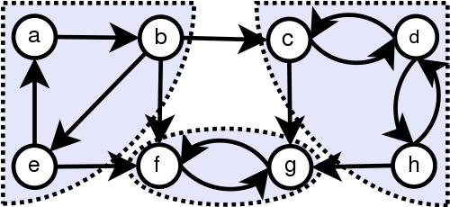
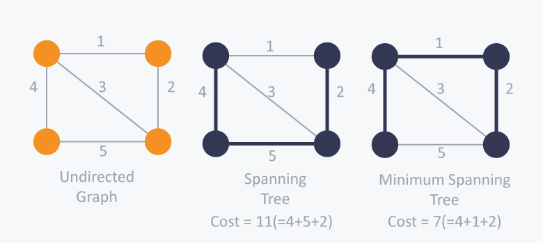

```{r, include=FALSE}
knitr::opts_chunk$set(echo = FALSE)
library(GGally)
library(network)
library(sna)
#library(ggplot2)
#library(visNetwork) 
library(reticulate)
#library(geomnet)
#library(ggnetwork)
library(igraph)

# http://www.cookbook-r.com/Graphs/Multiple_graphs_on_one_page_(ggplot2)/
multiplot <- function(..., plotlist=NULL, file, cols=1, layout=NULL) {
  library(grid)

  # Make a list from the ... arguments and plotlist
  plots <- c(list(...), plotlist)

  numPlots = length(plots)

  # If layout is NULL, then use 'cols' to determine layout
  if (is.null(layout)) {
    # Make the panel
    # ncol: Number of columns of plots
    # nrow: Number of rows needed, calculated from # of cols
    layout <- matrix(seq(1, cols * ceiling(numPlots/cols)),
                    ncol = cols, nrow = ceiling(numPlots/cols))
  }

 if (numPlots==1) {
    print(plots[[1]])

  } else {
    # Set up the page
    grid.newpage()
    pushViewport(viewport(layout = grid.layout(nrow(layout), ncol(layout))))

    # Make each plot, in the correct location
    for (i in 1:numPlots) {
      # Get the i,j matrix positions of the regions that contain this subplot
      matchidx <- as.data.frame(which(layout == i, arr.ind = TRUE))

      print(plots[[i]], vp = viewport(layout.pos.row = matchidx$row,
                                      layout.pos.col = matchidx$col))
    }
  }
}
```

# **Part I - Shortest Path**

## Shortest path

Is a problem of finding a path between two nodes, such that the sum of the weights of its constituent edges is minimized.

```{r,  message=FALSE, warning=FALSE, cache=FALSE, fig.width = 5, fig.height = 3}

m <- matrix(
  c(0, 1, 0, 0, 1, 0,
    1, 0, 1, 0, 1, 0,
    0, 1, 0, 1, 0, 0,
    0, 0, 1, 0, 1, 1,
    1, 1, 0, 1, 0, 0,
    0, 0, 0, 1, 0, 0),
  nrow = 6, ncol = 6
)
rownames(m) = c(1,2,3,4,5,6)
colnames(m) = c(1,2,3,4,5,6)

net <- network(m, directed=F, names.eval = "weights", ignore.eval = FALSE)

set.seed(43)
ggnet2(net, 
       mode = "fruchtermanreingold", size = 10, label = T,
       vjust = 0.5,
       node.color = c("tomato","darkred","darkred","darkred","darkred","steelblue"), label.color = "grey80", arrow.size = 10, arrow.gap = 0.05)
```

* Paths between 1 and 6: 1-5-4-6 and 1-2-3-4-6. 
* Which is the shortest?

## Shortest path

```{r,  message=FALSE, warning=FALSE, cache=FALSE, fig.width = 5, fig.height = 3}

m <- matrix(
  c(0, 1, 0, 0, 4, 0,
    1, 0, 1, 0, 1, 0,
    0, 1, 0, 1, 0, 0,
    0, 0, 1, 0, 6, 1,
    4, 1, 0, 6, 0, 0,
    0, 0, 0, 1, 0, 0),
  nrow = 6, ncol = 6
)
rownames(m) = c(1,2,3,4,5,6)
colnames(m) = c(1,2,3,4,5,6)

net <- network(m, directed=F, names.eval = "weights", ignore.eval = FALSE)

set.seed(43)
ggnet2(net, 
       mode = "fruchtermanreingold", size = 10, label = T, 
       vjust = 0.5,
       node.color = c("tomato","darkred","darkred","darkred","darkred","steelblue"), label.color = "grey80", arrow.size = 10, edge.label = "weights", arrow.gap = 0.05)
```

* What is the shortest path now?
* How can we programmatically calculate the shortest path between any 2 nodes for any graph?


## Dijkstra - Initialization 


$$ 
\begin{aligned} 
&InitializeSingleSource(G,s)\\
&\qquad for \space each \space vertex \space v \in G.V \\
&\qquad \qquad v.d = \infty \\
&\qquad \qquad v.\pi = NIL \\
&\qquad s.d = 0 \\
\end{aligned}
$$

## Dijkstra - Relax function


$$ 
\begin{aligned}
&Relax(u,v,w)\\
&\qquad if \space v.d > u.d + w(u,v)\\
&\qquad \qquad v.d = u.d + w(u,v)\\
&\qquad \qquad v.\pi = u \\
\end{aligned}
$$

## Dijkstra - Main algorithm

$$ 
\begin{aligned}
&Dijkstra(G,w,s)\\
&\qquad InitializeSingleSource(G,s)\\
&\qquad S = \emptyset\\
&\qquad Q = G.V \\
&\qquad while \space Q \neq \emptyset\\
&\qquad \qquad u = ExtractMin(Q) \\
&\qquad \qquad S = S \cup \{u\} \\ 
&\qquad \qquad for \space each \space v \in G.Adj[u]\\
&\qquad \qquad \qquad Relax(u,v,w)\\
\end{aligned}
$$

## Dijkstra Visualization Step 1

```{r,  message=FALSE, warning=FALSE, cache=FALSE, fig.width = 5, fig.height = 3}

m <- matrix(
  c(0, 1, 0, 0, 4, 0,
    1, 0, 1, 0, 1, 0,
    0, 1, 0, 1, 0, 0,
    0, 0, 1, 0, 6, 1,
    4, 1, 0, 6, 0, 0,
    0, 0, 0, 1, 0, 0),
  nrow = 6, ncol = 6
)
rownames(m) = c("0","INF","INF","INF","INF","INF")
colnames(m) = c("0","INF","INF","INF","INF","INF")

net <- network(m, directed=F, names.eval = "weights", ignore.eval = FALSE)

set.seed(43)
ggnet2(net, 
       mode = "fruchtermanreingold", size = 10, label = T, 
       vjust = 0.5,
       node.color = c("darkgreen","darkred","darkred","darkred","darkred","steelblue"), label.color = "grey80", arrow.size = 10, edge.label = "weights", arrow.gap = 0.05)
```

*Green* - current node, *Red* - unvisited node, *Blue* - target node. Assign distance to the start node as 0, and INF to all others. Assign the start node as the current node.

## Dijkstra Visualization Step 2

```{r,  message=FALSE, warning=FALSE, cache=FALSE, fig.width = 5, fig.height = 3}

m <- matrix(
  c(0, 1, 0, 0, 4, 0,
    1, 0, 1, 0, 1, 0,
    0, 1, 0, 1, 0, 0,
    0, 0, 1, 0, 6, 1,
    4, 1, 0, 6, 0, 0,
    0, 0, 0, 1, 0, 0),
  nrow = 6, ncol = 6
)
rownames(m) = c("0","INF","INF","INF","4","INF")
colnames(m) = c("0","INF","INF","INF","4","INF")

net <- network(m, directed=F, names.eval = "weights", ignore.eval = FALSE)

set.seed(43)
ggnet2(net, 
       mode = "fruchtermanreingold", size = 10, label = T, 
       vjust = 0.5,
       node.color = c("darkgreen","darkred","darkred","darkred","darkred","steelblue"), label.color = "grey80", arrow.size = 10, edge.label = "weights", arrow.gap = 0.05)
```

Updating the distance to neighbors of the current node.


## Dijkstra Visualization Step 3

```{r,  message=FALSE, warning=FALSE, cache=FALSE, fig.width = 5, fig.height = 3}

m <- matrix(
  c(0, 1, 0, 0, 4, 0,
    1, 0, 1, 0, 1, 0,
    0, 1, 0, 1, 0, 0,
    0, 0, 1, 0, 6, 1,
    4, 1, 0, 6, 0, 0,
    0, 0, 0, 1, 0, 0),
  nrow = 6, ncol = 6
)
rownames(m) = c("0","1","INF","INF","4","INF")
colnames(m) = c("0","1","INF","INF","4","INF")

net <- network(m, directed=F, names.eval = "weights", ignore.eval = FALSE)

set.seed(43)
ggnet2(net, 
       mode = "fruchtermanreingold", size = 10, label = T, 
       vjust = 0.5,
       node.color = c("darkgreen","darkred","darkred","darkred","darkred","steelblue"), label.color = "grey80", arrow.size = 10, edge.label = "weights", arrow.gap = 0.05)
```

Updating the distance to neighbors of the current node.

## Dijkstra Visualization Step 4

```{r,  message=FALSE, warning=FALSE, cache=FALSE, fig.width = 5, fig.height = 3}

m <- matrix(
  c(0, 1, 0, 0, 4, 0,
    1, 0, 1, 0, 1, 0,
    0, 1, 0, 1, 0, 0,
    0, 0, 1, 0, 6, 1,
    4, 1, 0, 6, 0, 0,
    0, 0, 0, 1, 0, 0),
  nrow = 6, ncol = 6
)
rownames(m) = c("0","1","INF","INF","4","INF")
colnames(m) = c("0","1","INF","INF","4","INF")

net <- network(m, directed=F, names.eval = "weights", ignore.eval = FALSE)

set.seed(43)
ggnet2(net, 
       mode = "fruchtermanreingold", size = 10, label = T, 
       vjust = 0.5,
       node.color = c("tomato","darkgreen","darkred","darkred","darkred","steelblue"), label.color = "grey80", arrow.size = 10, edge.label = "weights", arrow.gap = 0.05)
```

Make the second node as current node. Mark the first node is visited.

## Dijkstra Visualization Step 5

```{r,  message=FALSE, warning=FALSE, cache=FALSE, fig.width = 5, fig.height = 3}

m <- matrix(
  c(0, 1, 0, 0, 4, 0,
    1, 0, 1, 0, 1, 0,
    0, 1, 0, 1, 0, 0,
    0, 0, 1, 0, 6, 1,
    4, 1, 0, 6, 0, 0,
    0, 0, 0, 1, 0, 0),
  nrow = 6, ncol = 6
)
rownames(m) = c("0","1","INF","INF","2","INF")
colnames(m) = c("0","1","INF","INF","2","INF")

net <- network(m, directed=F, names.eval = "weights", ignore.eval = FALSE)

set.seed(43)
ggnet2(net, 
       mode = "fruchtermanreingold", size = 10, label = T, 
       vjust = 0.5,
       node.color = c("tomato","darkgreen","darkred","darkred","darkred","steelblue"), label.color = "grey80", arrow.size = 10, edge.label = "weights", arrow.gap = 0.05)
```

Updating the distance to neighbors of the current node.

## Dijkstra Visualization Step 6

```{r,  message=FALSE, warning=FALSE, cache=FALSE, fig.width = 5, fig.height = 3}

m <- matrix(
  c(0, 1, 0, 0, 4, 0,
    1, 0, 1, 0, 1, 0,
    0, 1, 0, 1, 0, 0,
    0, 0, 1, 0, 6, 1,
    4, 1, 0, 6, 0, 0,
    0, 0, 0, 1, 0, 0),
  nrow = 6, ncol = 6
)
rownames(m) = c("0","1","2","INF","2","INF")
colnames(m) = c("0","1","2","INF","2","INF")

net <- network(m, directed=F, names.eval = "weights", ignore.eval = FALSE)

set.seed(43)
ggnet2(net, 
       mode = "fruchtermanreingold", size = 10, label = T, 
       vjust = 0.5,
       node.color = c("tomato","darkgreen","darkred","darkred","darkred","steelblue"), label.color = "grey80", arrow.size = 10, edge.label = "weights", arrow.gap = 0.05)
```

Updating the distance to neighbors of the current node.

## Dijkstra Visualization Step 7

```{r,  message=FALSE, warning=FALSE, cache=FALSE, fig.width = 5, fig.height = 3}

m <- matrix(
  c(0, 1, 0, 0, 4, 0,
    1, 0, 1, 0, 1, 0,
    0, 1, 0, 1, 0, 0,
    0, 0, 1, 0, 6, 1,
    4, 1, 0, 6, 0, 0,
    0, 0, 0, 1, 0, 0),
  nrow = 6, ncol = 6
)
rownames(m) = c("0","1","2","INF","2","INF")
colnames(m) = c("0","1","2","INF","2","INF")

net <- network(m, directed=F, names.eval = "weights", ignore.eval = FALSE)

set.seed(43)
ggnet2(net, 
       mode = "fruchtermanreingold", size = 10, label = T, 
       vjust = 0.5,
       node.color = c("tomato","tomato","darkred","darkred","darkgreen","steelblue"), label.color = "grey80", arrow.size = 10, edge.label = "weights", arrow.gap = 0.05)
```

Assign node 7 as the current node.

## Dijkstra Visualization Step 8

```{r,  message=FALSE, warning=FALSE, cache=FALSE, fig.width = 5, fig.height = 3}

m <- matrix(
  c(0, 1, 0, 0, 4, 0,
    1, 0, 1, 0, 1, 0,
    0, 1, 0, 1, 0, 0,
    0, 0, 1, 0, 6, 1,
    4, 1, 0, 6, 0, 0,
    0, 0, 0, 1, 0, 0),
  nrow = 6, ncol = 6
)
rownames(m) = c("0","1","2","8","2","INF")
colnames(m) = c("0","1","2","8","2","INF")

net <- network(m, directed=F, names.eval = "weights", ignore.eval = FALSE)

set.seed(43)
ggnet2(net, 
       mode = "fruchtermanreingold", size = 10, label = T, 
       vjust = 0.5,
       node.color = c("tomato","tomato","darkred","darkred","darkgreen","steelblue"), label.color = "grey80", arrow.size = 10, edge.label = "weights", arrow.gap = 0.05)
```

Updating the distance to neighbors of the current node.

## Dijkstra Visualization Step 9

```{r,  message=FALSE, warning=FALSE, cache=FALSE, fig.width = 5, fig.height = 3}

m <- matrix(
  c(0, 1, 0, 0, 4, 0,
    1, 0, 1, 0, 1, 0,
    0, 1, 0, 1, 0, 0,
    0, 0, 1, 0, 6, 1,
    4, 1, 0, 6, 0, 0,
    0, 0, 0, 1, 0, 0),
  nrow = 6, ncol = 6
)
rownames(m) = c("0","1","2","8","2","INF")
colnames(m) = c("0","1","2","8","2","INF")

net <- network(m, directed=F, names.eval = "weights", ignore.eval = FALSE)

set.seed(43)
ggnet2(net, 
       mode = "fruchtermanreingold", size = 10, label = T, 
       vjust = 0.5,
       node.color = c("tomato","tomato","darkgreen","darkred","tomato","steelblue"), label.color = "grey80", arrow.size = 10, edge.label = "weights", arrow.gap = 0.05)
```

Assign node 3 as the current node.

## Dijkstra Visualization Step 10

```{r,  message=FALSE, warning=FALSE, cache=FALSE, fig.width = 5, fig.height = 3}

m <- matrix(
  c(0, 1, 0, 0, 4, 0,
    1, 0, 1, 0, 1, 0,
    0, 1, 0, 1, 0, 0,
    0, 0, 1, 0, 6, 1,
    4, 1, 0, 6, 0, 0,
    0, 0, 0, 1, 0, 0),
  nrow = 6, ncol = 6
)
rownames(m) = c("0","1","2","3","2","INF")
colnames(m) = c("0","1","2","3","2","INF")

net <- network(m, directed=F, names.eval = "weights", ignore.eval = FALSE)

set.seed(43)
ggnet2(net, 
       mode = "fruchtermanreingold", size = 10, label = T, 
       vjust = 0.5,
       node.color = c("tomato","tomato","darkgreen","darkred","tomato","steelblue"), label.color = "grey80", arrow.size = 10, edge.label = "weights", arrow.gap = 0.05)
```

Updating the distance to neighbors of the current node.

## Dijkstra Visualization Step 11

```{r,  message=FALSE, warning=FALSE, cache=FALSE, fig.width = 5, fig.height = 3}

m <- matrix(
  c(0, 1, 0, 0, 4, 0,
    1, 0, 1, 0, 1, 0,
    0, 1, 0, 1, 0, 0,
    0, 0, 1, 0, 6, 1,
    4, 1, 0, 6, 0, 0,
    0, 0, 0, 1, 0, 0),
  nrow = 6, ncol = 6
)
rownames(m) = c("0","1","2","3","2","INF")
colnames(m) = c("0","1","2","3","2","INF")

net <- network(m, directed=F, names.eval = "weights", ignore.eval = FALSE)

set.seed(43)
ggnet2(net, 
       mode = "fruchtermanreingold", size = 10, label = T, 
       vjust = 0.5,
       node.color = c("tomato","tomato","tomato","darkgreen","tomato","steelblue"), label.color = "grey80", arrow.size = 10, edge.label = "weights", arrow.gap = 0.05)
```

Assign node 5 as the current node.

## Dijkstra Visualization Step 12

```{r,  message=FALSE, warning=FALSE, cache=FALSE, fig.width = 5, fig.height = 3}

m <- matrix(
  c(0, 1, 0, 0, 4, 0,
    1, 0, 1, 0, 1, 0,
    0, 1, 0, 1, 0, 0,
    0, 0, 1, 0, 6, 1,
    4, 1, 0, 6, 0, 0,
    0, 0, 0, 1, 0, 0),
  nrow = 6, ncol = 6
)
rownames(m) = c("0","1","2","3","2","4")
colnames(m) = c("0","1","2","3","2","4")

net <- network(m, directed=F, names.eval = "weights", ignore.eval = FALSE)

set.seed(43)
ggnet2(net, 
       mode = "fruchtermanreingold", size = 10, label = T, 
       vjust = 0.5,
       node.color = c("tomato","tomato","tomato","darkgreen","tomato","steelblue"), label.color = "grey80", arrow.size = 10, edge.label = "weights", arrow.gap = 0.05)
```

Updating the distance to neighbors of the current node.

## Dijkstra Visualization Step 13

```{r,  message=FALSE, warning=FALSE, cache=FALSE, fig.width = 5, fig.height = 3}

m <- matrix(
  c(0, 1, 0, 0, 4, 0,
    1, 0, 1, 0, 1, 0,
    0, 1, 0, 1, 0, 0,
    0, 0, 1, 0, 6, 1,
    4, 1, 0, 6, 0, 0,
    0, 0, 0, 1, 0, 0),
  nrow = 6, ncol = 6
)
rownames(m) = c("0","1","2","3","2","4")
colnames(m) = c("0","1","2","3","2","4")

net <- network(m, directed=F, names.eval = "weights", ignore.eval = FALSE)

set.seed(43)
ggnet2(net, 
       mode = "fruchtermanreingold", size = 10, label = T, 
       vjust = 0.5,
       node.color = c("tomato","tomato","tomato","tomato","tomato","darkgreen"), label.color = "grey80", arrow.size = 10, edge.label = "weights", arrow.gap = 0.05)
```

Mark the current node as visited.

## Dijkstra Visualization Finish

```{r,  message=FALSE, warning=FALSE, cache=FALSE, fig.width = 5, fig.height = 3}

m <- matrix(
  c(0, 1, 0, 0, 4, 0,
    1, 0, 1, 0, 1, 0,
    0, 1, 0, 1, 0, 0,
    0, 0, 1, 0, 6, 1,
    4, 1, 0, 6, 0, 0,
    0, 0, 0, 1, 0, 0),
  nrow = 6, ncol = 6
)
rownames(m) = c("0","1","2","3","2","4")
colnames(m) = c("0","1","2","3","2","4")

net <- network(m, directed=F, names.eval = "weights", ignore.eval = FALSE)

set.seed(43)
ggnet2(net, 
       mode = "fruchtermanreingold", size = 10, label = T, 
       vjust = 0.5,
       node.color = c("tomato","tomato","tomato","tomato","tomato","tomato"), label.color = "grey80", arrow.size = 10, edge.label = "weights", arrow.gap = 0.05)
```

The algorithm finished.

See other visualizations here: https://www.cs.usfca.edu/~galles/visualization/Dijkstra.html

## Dijkstra in Python (algorithm)

```{python, echo = TRUE}
def dijkstra(graph, start):
    props = {
        start:{
            "distance": 0,
            "parent": None,
            "visited": False
        }
    }
    while len(filterListDictionaries(props,"visited", False).keys())>0:
        u = closestNotVisitedNode(props)
        for v in set(graph[u]) - set(filterListDictionaries(props,"visited", True)):
            if v not in props:
                props[v] = {
                        "distance": float("inf"),
                        "parent": None,
                        "visited": False
                }
            props = relax(props,u,v,graph[u][v])
        props[u]["visited"] = True
    return props
```


## Dijkstra in Python (helper functions)

```{python, echo = TRUE}
def filterListDictionaries(l, f, value):
    return {k: v for k, v in l.iteritems() if v[f] == value}

def closestNotVisitedNode(nodes_prop):
    not_visited = filterListDictionaries(nodes_prop,"visited", False)
    lam = lambda x: not_visited[x]["distance"]
    return min(not_visited, key = lam)

def relax(nodes_prop, u, v, w):
    if nodes_prop[v]["distance"] > nodes_prop[u]["distance"] + w:
        nodes_prop[v]["distance"] = nodes_prop[u]["distance"] + w
        nodes_prop[v]["parent"] = u
    return nodes_prop
```

## Dijkstra in Python to find target

```{python, echo = TRUE}
def dijkstra_pair(graph, start, end):
    props = dijkstra(graph, start)
    if end in props:
        return getPath(props, end)
    return None
  
def getPath(nodes, targetNode):
    current = targetNode
    path = []
    while nodes[current]["parent"]:
        path.append(nodes[current]["parent"])
        current = nodes[current]["parent"]
    return path
```

## Know your heroes

{ width=20% }

**Edsger W. Dijkstra** - Dutch computer scientist  

_11/05/1930 - 06/08/2002_

* B.S., M.S. Leiden University
* Ph.D., University of Amsterdam
* Turing Award

## Shortest-path problem variations

* Single-destination shortest-paths problem
* Single-pair shortest-path problem
* All-pairs shortest paths problem

## Shortest-path algorithms

* **Dijkstra's algorithm** solves the single-source shortest path problem.
* **Bellman–Ford algorithm** solves the single-source problem if edge weights may be negative.
* **A* search algorithm** solves for single pair shortest path using heuristics to try to speed up the search.
* **Floyd–Warshall algorithm** solves all pairs shortest paths.
* **Johnson's algorithm** solves all pairs shortest paths, and may be faster than Floyd–Warshall on sparse graphs.
* **Viterbi algorithm** solves the shortest stochastic path problem with an additional probabilistic weight on each node.

## All-pairs shortest path.

- Searching in big graphs is computationally expensive
- It is good to search all shortest paths in advance, 
to later only retrieve them when needed.

**How would you calculate shortest paths for all pairs?**

## Betweenness centrality

In graph theory, betweenness centrality is a measure of centrality in a graph based on shortest paths.

$$
g(v) = \sum{\frac{\sigma_{st}(v)}{\sigma_{st}}}
$$
where $\sigma_{st}$ is the total number of shortest paths from node s to not t and $\sigma_{st}(v)$ is the number of those paths that pass through $v$. [image source](https://en.wikipedia.org/wiki/Betweenness_centrality)

{ width=25% }


## Closeness centrality

In a connected graph, the normalized closeness centrality (or closeness) of a node is the average length of the shortest path between the node and all other nodes in the graph. 

$$
C(x) = \frac{1}{\sum_yd(y,x)}
$$
where $d(y,x)$ is the distance between vertices $x$ and $y$.


# **Part II - Challenges to solve using graphs**

## Challenge #1

How to identify communities in social media?

{ width=30%}

## Connected components

A connected component of an undirected graph is a subgraph in which any two nodes are connected to each other by paths, and which is connected to no additional vertices in the supergraph. 

```{r,  message=FALSE, warning=FALSE, cache=FALSE, fig.width = 5, fig.height = 3}
set.seed(123234)
m <- matrix(
  c(0, 1, 1, 0,0,0,
    1, 0, 0, 0,0,0,
    0, 1, 0, 0,0,0,
    0, 1, 1, 0,0,0,
    0, 0, 0, 0,0,1,
    0, 0, 0, 0,1,0),
  nrow = 6, ncol = 6
)
rownames(m) = c(0,1,2,3,4,5)
colnames(m) = c(0,1,2,3,4,5)

net <- network(m, directed=F, names.eval = "weights", ignore.eval = FALSE)


ggnet2(net, 
       mode = "circle", size = 10, label = T, 
       vjust = 0.5,
       node.color = "darkred", label.color = "grey80", arrow.size = 10, arrow.gap = 0.05)
```

Graph with 2 components

## Finding connected components

Running a search algorithm (BFS or DFS) with a given start node we find only 1 connected component. 

```{r,  message=FALSE, warning=FALSE, cache=FALSE, fig.width = 5, fig.height = 3}
set.seed(123234)
m <- matrix(
  c(0, 1, 1, 0, 0, 0,
    1, 0, 0, 0, 0, 0,
    0, 1, 0, 0, 0, 0,
    0, 1, 1, 0, 0, 0,
    0, 0, 0, 0, 0, 1,
    0, 0, 0, 0, 1, 0),
  nrow = 6, ncol = 6
)
rownames(m) = c(0,1,2,3,4,5)
colnames(m) = c(0,1,2,3,4,5)

net <- network(m, directed=F, names.eval = "weights", ignore.eval = FALSE)


ggnet2(net, 
       mode = "circle", size = 10, label = T, 
       vjust = 0.5,
       node.color = "darkred", label.color = "grey80", arrow.size = 10, arrow.gap = 0.05)
```

Looping through nodes which where not visited yet and running a search algorithm for them, can help to find all connected components in linear time O(|V| + |E|).


## Strongly Connected Components

A directed graph is called strongly connected if there is a path in each direction between each pair of vertices of the graph. 



https://en.wikipedia.org/wiki/Strongly_connected_component


## Finding Strongly Connected Components

For a directed graph:

- call $DFS(G)$ to compute finishing times $v.f$ for each node
- compute $G^T$
- call $DFS(G)$, but in the main loop of $DFS$ consider the nodes in order of decreasing $u.f$
- output the vertices of each tree in the depth-first forest formed in prev line as a separate strongly connected component


## Challenge #2

How to schedule lectures some of which depend on others?


## Topological sort (for DAG)


- call $DFS(G)$ to compute finishing times $v.f$ for each node
- as each node is finished, insert it onto the front of a linked list
- return the list of nodes

{ width=60% }

## Challenge #3

Telecom company tries to lay cable in a neighborhood. How to decide where to bury the cable to make sure all the houses are connected?


## Minimum Spanning Trees (MST)

A subset of the edges of a connected, edge-weighed undirected graph that connects all nodes together, without cycles and with the minimum total edge weight.



[image source](https://www.hackerearth.com/practice/algorithms/graphs/minimum-spanning-tree/tutorial/)

## MST (Kruskal's algorithm)

{ width=45% }


[image source](https://www.hackerearth.com/practice/algorithms/graphs/minimum-spanning-tree/tutorial/)

## Challenge #4

How to rank webpages and build a search engine?


## Page rank

[algorithm slides](https://web.stanford.edu/class/cs54n/handouts/24-GooglePageRankAlgorithm.pdf)

[algorithm example](https://lizrush.gitbooks.io/algorithms-for-webdevs-ebook/content/chapters/page-rank.html)


```{r,  message=FALSE, warning=FALSE, cache=FALSE, fig.width = 5, fig.height = 3}

m <- matrix(
  c(0, 0, 0, 0,
    1, 0, 0, 0,
    0, 1, 0, 0,
    0, 1, 1, 0),
  nrow = 4, ncol = 4
)
rownames(m) = c("D1","D2","D3","D4")
colnames(m) = c("D1","D2","D3","D4")

net <- network(m, directed=T, names.eval = "weights", ignore.eval = FALSE)

set.seed(43)
ggnet2(net, 
       mode = "circle", size = 10, label = T, 
       vjust = 0.5,
       node.color = c("darkred","darkred","darkred","darkred"), label.color = "white", arrow.size = 10, arrow.gap = 0.05)
```

## Page rank algorithm

```{r,  message=FALSE, warning=FALSE, cache=FALSE, fig.width = 5, fig.height = 3}

m <- matrix(
  c(0, 0, 0, 0,
    1, 0, 0, 0,
    0, 1, 0, 0,
    0, 1, 1, 0),
  nrow = 4, ncol = 4
)
rownames(m) = c("0.25","0.25","0.25","0.25")
colnames(m) = c("0.25","0.25","0.25","0.25")

net <- network(m, directed=T, names.eval = "weights", ignore.eval = FALSE)

set.seed(43)
ggnet2(net, 
       mode = "circle", size = 13, label = T, 
       vjust = 0.5,
       node.color = c("darkred","darkred","darkred","darkred"), label.color = "white", arrow.size = 10, arrow.gap = 0.05)
```

- Assign to all nodes 1/N weight (0.25)
- While PageRank not stable:
-   for node in nodes:
-     PR(node) = sum(PR(node.neigbor)/DegreeOut(node.neighbor))


## Page rank algorithm

```{r,  message=FALSE, warning=FALSE, cache=FALSE, fig.width = 5, fig.height = 3}

m <- matrix(
  c(0, 0, 0, 0,
    1, 0, 0, 0,
    0, 1, 0, 0,
    0, 1, 1, 0),
  nrow = 4, ncol = 4
)
rownames(m) = c("0.08","0.33","0.21","0.37")
colnames(m) = c("0.08","0.33","0.21","0.37")

net <- network(m, directed=T, names.eval = "weights", ignore.eval = FALSE)

set.seed(43)
ggnet2(net, 
       mode = "circle", size = 13, label = T, 
       vjust = 0.5,
       node.color = c("darkred","darkred","darkred","darkred"), label.color = "white", arrow.size = 10, arrow.gap = 0.05)
```

- Assign to all nodes 1/N weight (0.25)
- While PageRank not stable:
-   for node in nodes:
-     PR(node) = sum(PR(node.neigbor)/DegreeOut(node.neighbor))

## Page rank algorithm in Python

http://dpk.io/pagerank

```{python, echo = TRUE}
def pagerank(graph, damping=0.85, epsilon=1.0e-8):
    inlink_map = {}
    outlink_counts = {}
    
    def new_node(node):
        if node not in inlink_map: inlink_map[node] = set()
        if node not in outlink_counts: outlink_counts[node] = 0
    
    for tail_node, head_node in graph:
        new_node(tail_node)
        new_node(head_node)
        if tail_node == head_node: continue
        
        if tail_node not in inlink_map[head_node]:
            inlink_map[head_node].add(tail_node)
            outlink_counts[tail_node] += 1
    
    all_nodes = set(inlink_map.keys())
    for node, outlink_count in outlink_counts.items():
        if outlink_count == 0:
            outlink_counts[node] = len(all_nodes)
            for l_node in all_nodes: inlink_map[l_node].add(node)
    
    initial_value = 1 / len(all_nodes)
    ranks = {}
    for node in inlink_map.keys(): ranks[node] = initial_value
    
    new_ranks = {}
    delta = 1.0
    n_iterations = 0
    while delta > epsilon:
        new_ranks = {}
        for node, inlinks in inlink_map.items():
            new_ranks[node] = ((1 - damping) / len(all_nodes)) + (damping * sum(ranks[inlink] / outlink_counts[inlink] for inlink in inlinks))
        delta = sum(abs(new_ranks[node] - ranks[node]) for node in new_ranks.keys())
        ranks, new_ranks = new_ranks, ranks
        n_iterations += 1
    
    return ranks, n_iterations
```


# **Other resources**

## Online course  (Very basic)

{ width=70% }

[Course Intro to Algorithms](https://classroom.udacity.com/courses/cs215)

## Tutorial (Basic)

{ width=70% }

[Graph algorithms in Python](http://interactivepython.org/runestone/static/pythonds/Graphs/toctree.html)

## Book (Advanced)

{ width=40% }

[Introduction to Algorithms](https://tudelft.on.worldcat.org/search?queryString=Introduction+to+Algorithms#/oclc/676697295)

## Sources used to prepare this lecture

- https://classroom.udacity.com/courses/cs215/
- https://classroom.udacity.com/courses/ud513/
- https://briatte.github.io/ggnet/
- http://kateto.net/network-visualization
- https://www.udacity.com/wiki/creating-network-graphs-with-python
- http://www.kateto.net/wp-content/uploads/2016/01/NetSciX_2016_Workshop.pdf
- https://rstudio-pubs-static.s3.amazonaws.com/74248_3bd99f966ed94a91b36d39d8f21e3dc3.html
- https://www.hackerearth.com/practice/algorithms/graphs/minimum-spanning-tree/tutorial/


