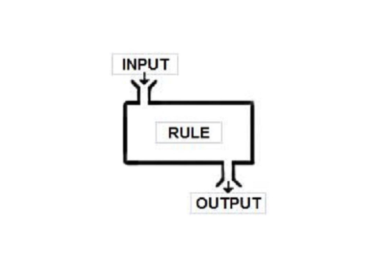
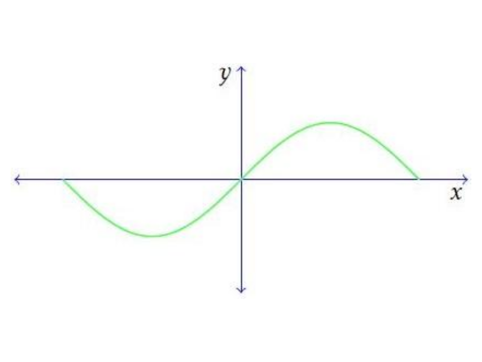
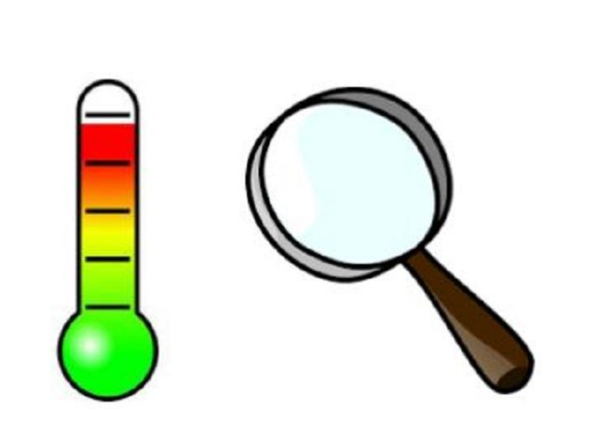
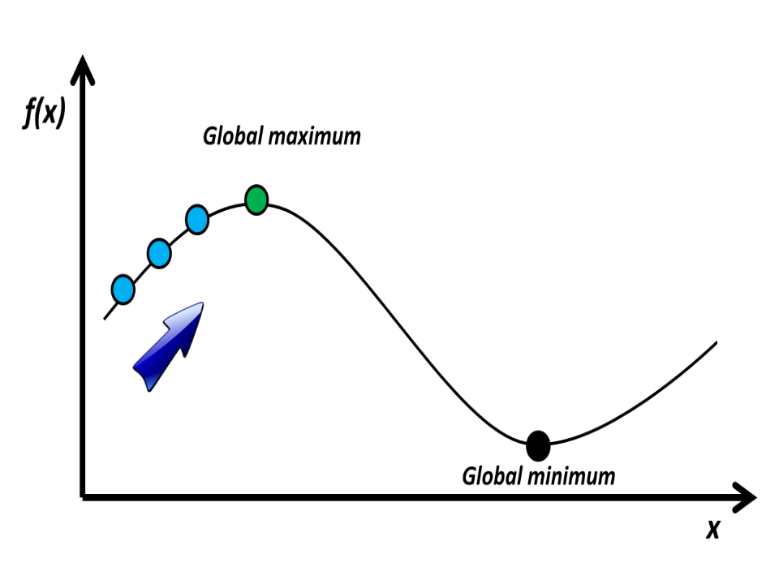
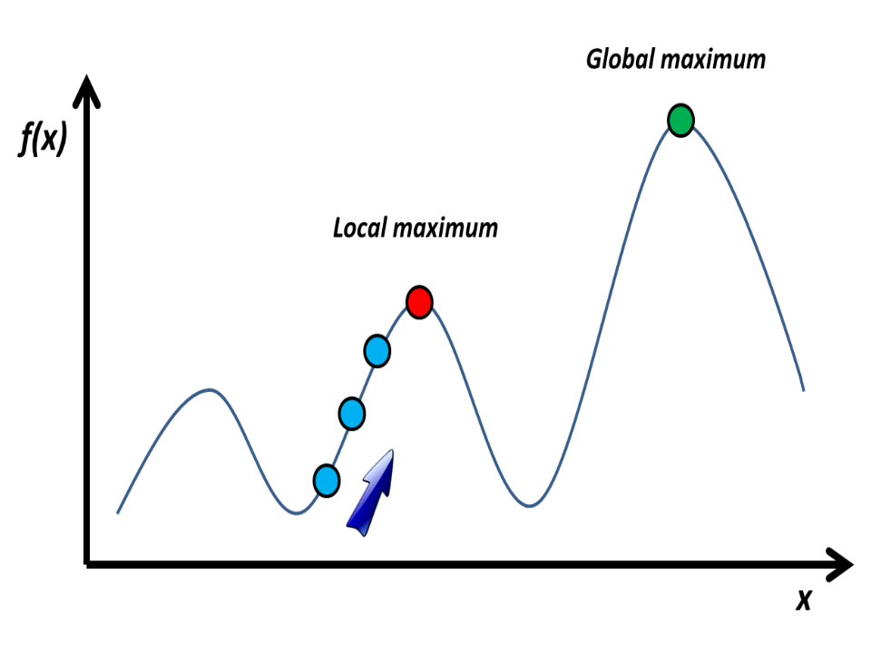
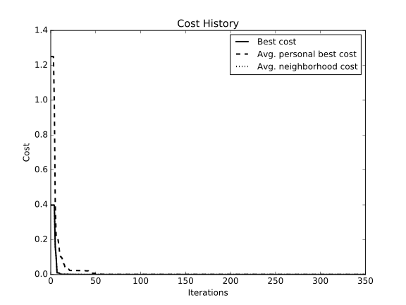

```{r child="./../header.Rmd", include=FALSE}
```

## **What is optimization about?**


{width=70%}


## **What Is Optimization?**
{width=45%}

- Optimization is the process of adjusting the **inputs** to or
  **characteristics** of a device, mathematical process, or experiment to find
  the minimum or maximum output.      
  e.g., adjusting the screen light so it takes as little power as possible to
  produce sufficient light!
  

## **Dynamic Optimization**
Optimization depends on secondary variables like time!       

**_examples:_**    
- The fastest way to work may depend on the time of day and weather.     
- The cheapest flight ticket depends on the season of the year.   
{width=45%}
   
Any other situation you can think of?    

## **Static Optimization**

Finding the minimum for $f(x) = x^2$ does not depend on a secondary variable like time!    

It is less complex than dynamic optimization!

{width=45%}

## **Discrete or Continuous Optimization**

**Discrete** variables have a finite number of possible values        
_e.g.:_ the order to do a series of tasks on a list to take as little time
as possible.        
**Continuous** variables have an infinite number of possible values,
like below:                
{width=45%}

## **Trial and Error Optimization**

refers to the process of adjusting variables that affect the output without
knowing much about the process that produces the output.

**_examples:_**     
adjusting the antenna to get the best reception.

{width=35%}

mixing chemicals to find new drugs, _e.g. antibiotics_.

## **Natural Optimization Methods**

- **Simulated Annealing - _SA_**             
  -- inspired by the anealing process for material      
- **Particle Swarm Optimization - _PSO_**         
  -- inspired by flocking birds/schooling fish           
- **Ant Colony Optimization - _ACO_**       
  -- inspired by the social behavior of ants              
- **Genetic Algorithm - _GA_**     
  -- inspired by the Darwinian evolution process     
- **_etc_**. 


## **Simulated Annealing**
Simulates the annealing process:     
{width=45%}

. . . 

a substance is heated above its melting temperature and then gradually cooled to
produce the crystalline lattice, which minimizes its energy probability
distribution.


## **Simulated Annealing**
So lowering the temperature until the material is in a steady _frozen_ state can
be preceived as searching for the material state in
which the internal particles have the minimum energy.

{width=40%}

## **Simulated Annealing (SA) Algorithm**
    
1. Set temperature **$T$** to maximum
2. Generate a random solution
3. Calculate fitness/cost
4. Generate a neighbouring solution
5. Calculate the fitness/cost of the new solution
6. Compare **$f$~(_new_)~** and **$f$~(_old_)~**      
  **if**  the new solution is better then take it!        
  **else** use an acceptance rate to choose between the two!       
7. Reset **$T$**:  **$T$** * **$alpha$**       
    (normally $0.8<$**$alpha$**$<0.99$)
8. Repeat 4-7 until:   
		either the global optimum is found  
		or **$T$** reaches the minimum.

## **Let's play a guessing game!**

{width=75%}


## **Guess implementation**

Generate a random string which has the same size with the target string
_(password)_.
```{python}
class Guess:
    def __init__(self, chars, fitness):
        # a guess is made of characters and has a fitness score
        self.Chars = chars
        self.Fitness = fitness

def generate_guess(length, charSet, get_fitness):
    chars = []
    #pick (length) random elements from the charSet (set of genes)
    chars.extend(random.sample(charSet, length))
    #turn the assembled set of characters into a string
    chars = ''.join(chars)
    fitness = get_fitness(chars)
    return Guess(chars, fitness)
```
## **How to get a neighbor solution?**     

A neighbor solution has a minimal difference with the current one!
```{python}
def get_neighbor(parent, charSet, get_fitness):
    # get a random index
    index = random.randrange(0, len(parent.Chars))
    #turn the parent characters into a list
    childChars = list(parent.Chars)
    #pick 2 random characters from the possible set of genes
    newChar, alternate = random.sample(charSet, 2)
    #replace the index character with one of the randomly found genes
    childChars[index] = alternate if newChar == childChars[index] else newChar
    chars = ''.join(childChars)
    #get the fitness of the newly generated character set
    fitness = get_fitness(chars)
    return Guess(chars, fitness)
```
    
## **Fitness function and acceptance rate**    
      
Reward a guess for every correct character in the right place!       
```{python , echo=TRUE}   
def get_fitness(guess, target):
    #increment the fitness score by 1 for every matching character
    return sum(1 for expected, actual in zip(target, guess)
               if expected == actual)
```        
. . .      
   
As the temprature goes down (search progresses), the probability of
accepting a worse guess also goes down!   
```{python , eval=FALSE}
def acceptance_probability(prev_score, next_score, temperature):     
    return math.exp(temperature/(1+temperature))
``` 

## **Implementation of the annealing process**  

Until the temperature hits the minimum, keep searching for better neighbors,
and somtimes allow worse ones to enter the loop.
```{python}
def anneal(get_fitness, targetLen, optimalFitness, charSet, display, temperature, min_temp, alpha):
    #make the random initial guess
    bestGuess = generate_guess(targetLen, charSet, get_fitness)
    display(bestGuess)
    best_fitness = bestGuess.Fitness
    #If the guess is already perfect then no need to go on with the search!
    if bestGuess.Fitness >= optimalFitness:
        return bestGuess
    #Set the temperatures
    T = temperature
    T_min = min_temp
    #until the temperature reaches the minimum, search!
    while T > T_min:
        new_solution = get_neighbor(bestGuess, charSet, get_fitness)
        new_fitness = new_solution.Fitness
        #If the generated neighbor is already good, return it.
        if new_fitness == optimalFitness:
            return new_solution
        #If the generated neighbor is better, move on to it.
        if new_fitness > best_fitness:
            bestGuess = new_solution
            best_fitness = new_fitness
        else:
            ar = acceptance_probability(best_fitness, new_fitness, T)
            #let the acceptance rate recommend whether to switch to the worse or not.
            if ar > random.uniform(2,3):
                bestGuess = new_solution
                best_fitness = new_fitness
        #the temperature decreases
        T = T*alpha
        display(bestGuess)
    return bestGuess
```
    

## **Let's now guess a password, using SA!** ##

```{python , eval=FALSE}
class GuessPasswordTest(unittest.TestCase):
    # The set of possible genes to choose randomly from.
    charset = " abcdefghijklmnopqrstuvwxyzABCDEFGHIJKLMNOPQRSTUVWXYZ!.,"
    def test_sa(self):
        # The target string to search for
        target = "Hello World!"
        self.guess_password(target)
```  
```{python , eval=FALSE}
    def guess_password(self, target):
        startTime = datetime.datetime.now()
        
        #wrapper for the fitness function to pass to GA
        def fnGetFitness(chars):
            return sa.get_fitness(chars, target)

        #optimal fitness score based on the length of the target string
        optimalFitness = len(target)
        
        #let's search for it
        best = sa.anneal(fnGetFitness, len(target), optimalFitness,
                                self.charset, fnDisplay, 100000.0, 0.00001, 0.99 )
        #The search result must be the same as the target string!
        self.assertEqual(best.Chars, target)
```

## **Hill Climbing:**     
**a very similar optimziation algorithm to SA**

The difference is that worse neighbours will never get to be selected!

{width=50%}

## **Local Optimum**

{width=55%}

. . .       

If hill climbing hits the local optimum, one approach is to restart the search!

## **Particle Swarm Optimization - _PSO_**
PSO simulates the behavior of bird flocking.    
**_Suppose_**: a group of birds are randomly searching food in an area. There is
only one piece of food in the area being searched. No bird knows where the food
is. But they know how far the food is in each iteration. An effective way to
find the food is to **follow the bird which is nearest to the food.**

{width=55%}

## **PSO**
PSO is a population based algorithm that uses a number of _particles_ which form
a swarm to search for an optimum.     

Each particle adjusts their flying based on their own and other particle's
experience until the swarm finally **finds the optimum** or the **search budget
is exhausted**.      

_Search budget_ could be based on time, number of iterations, etc.

## **PSO Algorithm** ##
1. Begin with a random population of particles _(solutions)_.     
2. For each particle, calculate the fitness score.      
  -- Fitness score shows the distance from the optimum                     
  -- If the fitness score is better than the value the row has ever had, update
  **pBest**.     
3. Choose the particle with the best fitness score.
4. For each particle, calculate the **velocity**, and update the **position** of
  the particle accordingly.      
5. repeat 2-4 until global optimum is found, or search budget is
   exhausted.       

## **How to calculate position and velocity?**
**$x$**^$i$^~$(k+1)$~ $=$ $x$^$i$^~$k$~ $+$ $v$^$i$^~$(k+1)$~             
**$v$**^$i$^~$(k+1)$~ $=$ $w$~$k$~**$v$**^$i$^~$k$~ $+$ $c$~$1$~$r$~$1$~
(**$p$**^$i$^~$k$~ $-$ **$x$**^$i$^~$k$~) $+$ $c$~$2$~$r$~$2$~
(**$p$**^$g$^~$k$~ $-$ **$x$**^$i$^~$k$~)                

. . .
     
**where:**               
**$p$**^$i$^~$(k)$~ $=$ best position particle $i$ has had                
**$p$**^$g$^~$(k)$~ $=$ best particle position        
$w$~$k$~ $=$ constant inertia weight       
$c$~$1$~, $c$~$2$~ $=$  learning factors (usually $c$~$1$~ $=$ $c$~$2$~ $=$
$2$)          
$r$~$1$~, $r$~$2$~ $=$  random numbers between $0$ and $1$      

## **Let's find the minimum for $f(x) = x^2$ !**      
{width=45%}     

We can use the Python library called _PySwarms:_     
https://github.com/ljvmiranda921/pyswarms
   
## **SOP example, using _PySwarms_**

Set up the PSO parameters, then call an optimizer.     
 
You could plot the search progress and animate it _(optional)_.

```{python, eval=FALSE}
import pyswarms as ps
import matplotlib.pyplot as plt
from pyswarms.utils.functions import single_obj as fx
from pyswarms.utils.environments import PlotEnvironment

#Set-up optimizer
options = {'c1':0.5, 'c2':0.3, 'w':0.9}
optimizer = ps.single.GlobalBestPSO(n_particles=10, 
                                    dimensions=3, 
                                    options=options)
#Initialize plot environment
plt_env = PlotEnvironment(optimizer, fx.sphere_func, 350)
#Plot the cost
plt_env.plot_cost(figsize=(8,6));
plt.show()
#animate the search process
anim = plt_env.plot_particles2D(limits=((-1.2,1.2),(-1.2,1.2)))
anim.save('animation.gif', writer='imagemagick', fps=15)
```  

## **What does it look like?** 
   
  
## **What does it look like?**    
 
   
## **More on PSO**   
For more on PSO, check out the following:  
              
 - https://ch.mathworks.com/help/gads/particle-swarm-optimization-algorithm.html


## **Genetic Algorithms**
Inspired by the _Darwinian evolution_ and the concept of **survival of the
fittest**!
{width=75%}

## **Genetic Algorithm Overview**
Each point in the search space is an referred to as an _individual_
or _chromosome_.    

Individuals collectively form a _population_, which is _iteratively evolved_
until the optimum is found or the search budget is exhausted.

{width=75%}

## **How to select individuals for evolution?** 
- **Roulette Wheel selection** 

- **Rank selection**

- **Tournament selection**

- **Elitism**

- **etc.**

## **Roulette Wheel selection**
Parents are selected according to their fitness share.     

1. Calculate fitness percentage for each chromosome
2. Define a range for each chromosome based on the fitness share    
3. Generate a random number $x$ from $0-100$
4. Select the individual whose fitness covers the range for $x$

{width=50%}

## **Rank selection**
The previous selection approach becomes biased if fitness values do not vary
much!

Rank selection ranks chromosomes based on their fitness value, where the wors
chromosome is ranked $1$, and the best is ranked $N$.

While this approach allows worse ones to have a chance, it also may lead to
slower convergence!

{width=30%}

## **Tournament selection**
Chromosomes are compared relatively in each tournament, as opposed to the
previous selection operators.

1. Selects $k$ chromosomes randomly.
2. The best chromosome has $p$ probability to be selected.
3. The 2nd best chromosome has $1-p$ probability to be selected.
4. The 3rd best chromosome has $1-p^2$ probability to be selected.
5. etc.

## **Elitism** 

When creating new population by crossover and mutation, we have a big
chance that we will loose the best chromosome.

Elitism first copies the best chromosome (or a few) to the new
population. The rest is done in a classical way.       
       
**_note:_** Elitism can very rapidly increase performance of GA!
  
{width=40%}

## **Evolutionary Operators in GA**      

Evolutionary operators are used to evolve the next generation of _individuals_!

**Crossover** is used to _re-combine_ the _properties_ from parents.    
**Mutation** is applied to explore the _neighborhood_!

{width=75%}

## **Let's play the same guessing game!**

{width=75%}

## **What do we need to implement?**
1. Individual (_chromosome_) generator
2. Fitness function
3. Evolutionary operators (_only mutation for now_)
4. Search engine
5. Display function, showing the search progress (optional!) 

## **Individual Generator and Fitness Function**

Same as done for SA!
```{python, eval=FALSE}
class Chromosome:
    def __init__(self, genes, fitness):
        self.Genes = genes
        self.Fitness = fitness
```
. . .     

```{python, eval=FALSE}
def generate_parent(length, geneSet, get_fitness):
    genes = []
    while len(genes) < length:
        genes.extend(random.sample(geneSet, length))
    genes = ''.join(genes)
    fitness = get_fitness(genes)
    return Chromosome(genes, fitness)
```
. . .     

```{python, eval=FALSE}  
def get_fitness(guess, target):
    return sum(1 for expected, actual in zip(target, guess)
               if expected == actual)
```

## **Mutation**

Similar to the way neighbors were found in SA!

```{python, eval=FALSE}
def mutate(parent, geneSet, get_fitness):
    index = random.randrange(0, len(parent.Genes))
    childGenes = list(parent.Genes)
    newGene, alternate = random.sample(geneSet, 2)
    childGenes[index] = alternate if newGene == childGenes[index] 
                                  else newGene
    genes = ''.join(childGenes)
    fitness = get_fitness(genes)
    return Chromosome(genes, fitness)
```
. . .  

## **A minimal search engine**   

```{python, eval=FALSE}
def get_best(get_fitness, targetLen, optimalFitness, geneSet, display):
    #generate a chromosome
    bestParent = _generate_parent(targetLen, geneSet, get_fitness)
    #if it is already good, no need to go for evolution
    if bestParent.Fitness >= optimalFitness:
        return bestParent
    while True:
        child = _mutate(bestParent, geneSet, get_fitness)
        #if the mutated chromosome is worse, discard it.
        if bestParent.Fitness >= child.Fitness:
            continue
        #if the mutated chromosome is optimal, return it!
        if child.Fitness >= optimalFitness:
            return child
        #if the mutated chromosome is a better one, save it!
        bestParent = child
```

## **What was missing in the implementation?** ##

{width=75%}     
    
. . .
    
 - making a _population_
       
. . .  

- implementation of _selection_

. . .

- implementation of _crossover_

. . .

- implementation of _insertion_


## **Let's test it!**
```{python, eval=FALSE}
class GuessPasswordTest(unittest.TestCase):
    geneset = " abcdefghijklmnopqrstuvwxyzABCDEFGHIJKLMNOPQRSTUVWXYZ!.,"
    def test_GA(self):
        target = "Hello World!"
        self.guess_password(target)

    def guess_password(self, target):
        startTime = datetime.datetime.now()

        def fnGetFitness(genes):
            return genetic.get_fitness(genes, target)

        optimalFitness = len(target)
        best = genetic.get_best(fnGetFitness, len(target), optimalFitness,
                                self.geneset, fnDisplay)
        self.assertEqual(best.Genes, target)
```

## **Let's do the 8 Queens Puzzle**
It is the problem of placing eight chess queens on an $8*8$ chessboard so that no two queens threaten each other. Thus, a solution requires
that no two queens share the same row, column, or diagonal.    
{width=30%}

Let's use the _pyeasyga_ library this time!
https://pypi.python.org/pypi/pyeasyga

## **Creating an individual**

Each individual in this problem could be represented by a list of positions
where the queens can be placed!

```{python, eval=FALSE}
def create_individual(data):
    #copy the array of data to an individual
    individual = data[:]
    #shuffle the genes
    random.shuffle(individual)
    return individual
```

## **The crossover and mutation operators **

Let's swap the elements between the two parents!

```{python, eval=FALSE}
def crossover(parent_1, parent_2):
    crossover_index = random.randrange(1, len(parent_1))
    child_1a = parent_1[:crossover_index]
    child_1b = [i for i in parent_2 if i not in child_1a]
    child_1 = child_1a + child_1b

    child_2a = parent_2[crossover_index:]
    child_2b = [i for i in parent_1 if i not in child_2a]
    child_2 = child_2a + child_2b

    return child_1, child_2
```

Let's flip 2 genes at random indexes of the individual

```{python, eval=FALSE}
def mutate(individual):
    mutate_index1 = random.randrange(len(individual))
    mutate_index2 = random.randrange(len(individual))
    individual[mutate_index1], individual[mutate_index2] = individual[mutate_index2], individual[mutate_index1]
```

## **The fitness function**

Each queen has to be checked for clashes in _rows_, _columns_, and _diagonal_.
For each clash, the fitness score is incremented by 1.
Since there can be 28 different pairs of queens, the worst fitness score would
be 28!

```{python, eval=FALSE}
def fitness (individual):
    collisions = 0
    for item in individual:
        item_index = individual.index(item)
        for elem in individual:
            elem_index = individual.index(elem)
            if item_index != elem_index:
                if item - (elem_index - item_index) == elem \
                    or (elem_index - item_index) + item == elem:
                    collisions += 1
    return collisions
```

## **Travelling Salesman Problem**

To further practice, try implementing GA for the TS problem!

_**TSP:**_ asks the following question: "Given a list of cities and the
distances between each pair of cities, what is the shortest possible route that
visits each city and returns to the origin city?"

{width=55%}

## **What are the _similarities_ and _differences_ among the algorithms?**

- individual representation
- fitness function
- random initialization
- local/global approaches

## **Which search algorithm to use?**
**No Free Lunch Theorem** says that the average performance of all search
algorithms on all optimization problems is equal!

_i.e._ GA performs no better than pure random search when applied to all
problems!

{width=40%}

## **So again - which search algorithm to use?**
We can always start by simpler algorithms, e.g. hill climbing, and see if they
are good enough for the problem at hand.

If the search landscape is perturbated, more advanced algorithms which can
effectively explore the landscape may be a better start.


## **REFERENCES**

* The GA implementation for the guessing game is borrowed from:          
https://github.com/handcraftsman/GeneticAlgorithmsWithPython

* The GA implementation for the 8 queens problem is from:
https://github.com/remiomosowon/pyeasyga/tree/develop/examples

* Details on _PSO_ is taken from:       
http://www.swarmintelligence.org/tutorials.php

* Optimizing a sphere example is from:        
https://github.com/ljvmiranda921/pyswarms 

## Copyright
 This
work is (c) 2017 - onwards by TU Delft and Mozhan Soltani and licensed under the
[Creative Commons Attribution-NonCommercial-ShareAlike 4.0
International](http://creativecommons.org/licenses/by-nc-sa/4.0/) license.

<!--html_preserve-->
<script>
  (function(i,s,o,g,r,a,m){i['GoogleAnalyticsObject']=r;i[r]=i[r]||function(){
  (i[r].q=i[r].q||[]).push(arguments)},i[r].l=1*new Date();a=s.createElement(o),
  m=s.getElementsByTagName(o)[0];a.async=1;a.src=g;m.parentNode.insertBefore(a,m)
  })(window,document,'script','https://www.google-analytics.com/analytics.js','ga');

  ga('create', 'UA-2510585-3', 'auto');
  ga('send', 'pageview');

</script>
<!--/html_preserve-->
