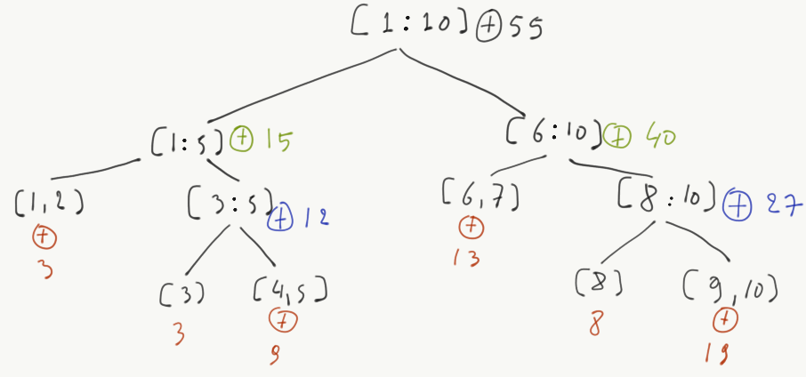
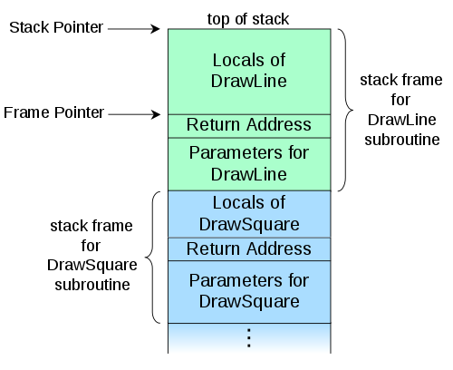

```{r child="header.Rmd", include=FALSE}
```

# Recursion

## The greatest common divisor problem

The [greatest common divisor (GCD)](https://en.wikipedia.org/wiki/Greatest_common_divisor) 
of two integers is the largest positive integer that divides them cleanly.

For example, given $p = 32$ and $q = 24$, their GCD is 8, even though 2 and
4 are also dividing them cleanly

**Q:** How can we compute it?

. . .

One typical way of computing the GCD is Euclid's algorithm:

\[
  gcd(p, q) =
  \begin{cases}
    p & \text{if } q = 0 \\
    gcd(q, p \bmod q), & \text{otherwise}
  \end{cases}
\]

## Converting to code {- }

\[
  gcd(p, q) =
  \begin{cases}
    p & \text{if } q = 0 \\
    gcd(q, p \bmod q), & \text{otherwise}
  \end{cases}
\]

Let's try to convert GCD into code:

```{python gcd, eval=F}
def gcd(p, q):
  if q == 0:
    return p
  return gcd(q, p % q)
```

Let's try to call it on some examples

```{python gcd1, eval=F}
print gcd(32, 24)
print gcd(128, 256)
print gcd(10021, 1342)
print gcd(1007, 143)
```

```{python, ref.label=c('gcd', 'gcd1'), echo=F}
```

## How is `gcd` evaluated? {- }

We modify `gcd` to print its arguments 

```{python gcdprint, eval=F}
def gcd(p, q):
  if q > 0:
    mod = p % q
    print "p=%d, q=%d, mod=%d" % (p, q, mod)
  if q == 0:
    return p
  return gcd(q, mod)
  
print gcd(10021, 1342)
```

The output we get is:

```{python ref.label=c('gcdprint'), echo=F}
```

## Recursion 

**Recursion** is a problem solving method where the solution to a problem 
depends on solutions to smaller instances of the same problem.

In practice, recursive functions follow this pattern:

```python
# Pseudocode
def recursive(args):
  if simple_case is True:
    return simple_case_result
  else:
    recursive(simplified(args))
```

Recursion is everywhere in CS: 

* Algorithms
* Data types:  `List = EmptyList | Cons Item List`
* Acronyms: **GNU** means GNU is Not Unix

## Types of recursion {- }

* **Linear** recursion: Only one recursive call in function body, e.g. `gcd`
* **Binary** recursion: Two recursive calls
* **Multiple** recursion: Multiple recursive calls

Binary recursion is typical with *divide-and-conquer* algorithms: the 
problem is split in two equally sized sub-parts and the solution is
recursively computed by aggregating the results of the sub-parts.

## Divide-and-conquer matrix addition {- }

Suppose we have an array

```python
a = [1,2,3,4,5,6,7,8]
```

how can we compute the sum of its elements recursively?

```python
def sum_dc(a):
    if len(a) == 1:
        return a[0]
    if len(a) == 2:
        return a[0] + a[1]

    mid = len(a) / 2
    left = a[0:mid]
    right = a[mid:len(a)]
    return sum_dc(left) + sum_dc(right)
```

. . .

Of course, this only works because `+` (addition) is commutitative.
It wouldn't work with, e.g. '/'

## How is `sum_dc` evaluated? {- }



This is an example of a recursive evaluation tree

## Recursion and the stack

**Q:** What does the following code do?

```python
def foo(i):
  if i == 1000:
    return "Done"
  return foo(i + 1)

foo(0)
```

. . .

```python
>>> foo(1000)
'Done'
>>> foo(100)
'Done'
>>> foo(0)
[...]
  File "<stdin>", line 4, in foo
  File "<stdin>", line 4, in foo
  File "<stdin>", line 4, in foo
  File "<stdin>", line 4, in foo
  File "<stdin>", line 4, in foo
RuntimeError: maximum recursion depth exceeded
```

One typical problem related with recursive algorithms is stack overflow errors!

## What is a call stack? {- }

For the following program
```python
def DrawSquare(p, length):
  DrawLine(p.x, p.y, p.x + length, p.y)
```

When `DrawLine` is invoked, the computer must know where it will return
when done

<div id="left">

</div>

<div id="right">
* **Locals** are variables allocated while a function is running
* **Return address** is where in `DrawSquare` should `DrawLine` return
* **Parameters** are the arguments 
</div>

## Tail recursion

If the recursive call is the last statement in a function, then we call this
a _tail recursion_.  

To avoid the problem of stack overflows, some languages (not Python) implement 
an optimization called _tail call elimination_. This would convert the
following code 

```python
def foo(i):
  if i == 1000:
    return "Done"
  return foo(i + 1)
```

into

```python
def foo_opt(i):
  while i < 1000:
    pass
  return "Done"
```

## Fun with recursion: Towers of Hannoi


Move all disks to the right most peg, observing the following rules:

1. Only one disk can be moved at a time.
2. The upper disk from one of the stacks is placed on top of another stack
3. No disk may be placed on top of a smaller disk

## Solution in Python {- }

```python
def hanoi(n, source, tmp, target):
  if n == 0:
    return
    
  # move tower of size n - 1 to helper
  hanoi(n - 1, source, target, tmp)
  print "Move disk %d from %s to %s" %(n, source, target)
  # move tower of size n-1 from helper to target
  hanoi(n - 1, tmp, source, target)
```

Here is the intuition:

* Move a tower of height-1 to an temp pole, using the final pole.
* Move the remaining disk to the final pole.
* Move the tower of height-1 from the intermediate pole to the final pole using the original pole.

For a visual solution, have a look [here](http://towersofhanoi.info/)

## Content credits {- }

* [Call stack](https://commons.wikimedia.org/wiki/File:Call_stack_layout.svg), by R. S. Shaw on Wikipedia
* [Towers of Hanoi image](https://en.wikipedia.org/wiki/Tower_of_Hanoi#/media/File:Tower_of_Hanoi.jpeg), by User:Evanherk.


```{r child="footer.Rmd", include=FALSE}
```
