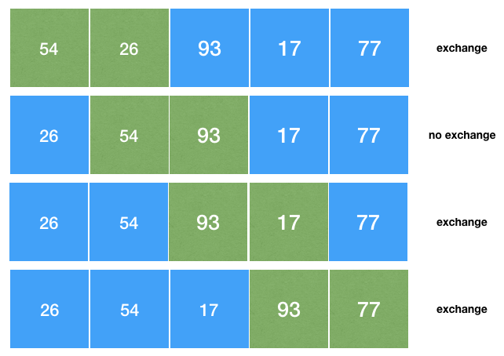
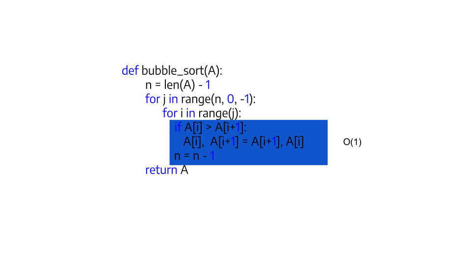
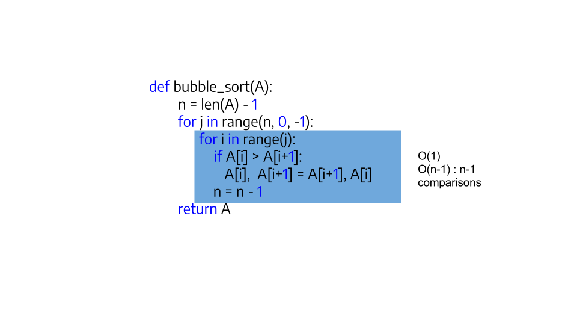
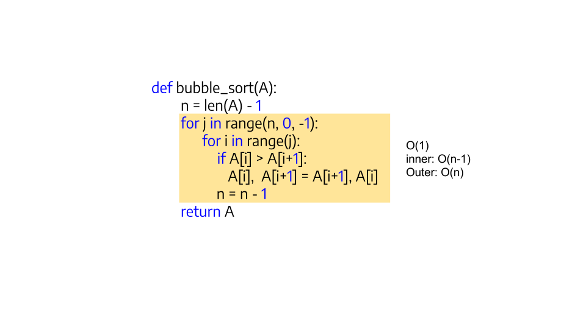
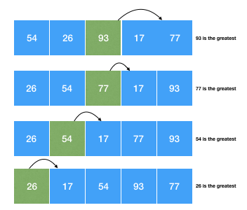
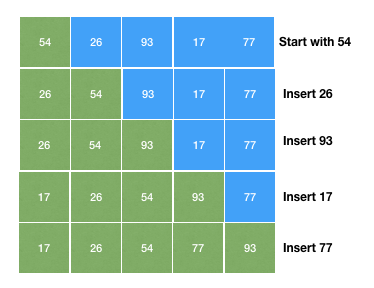
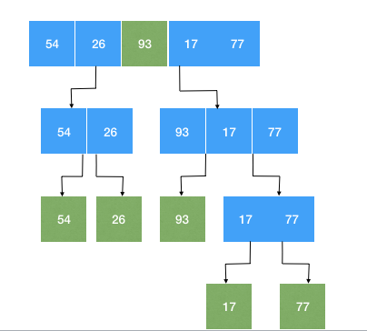
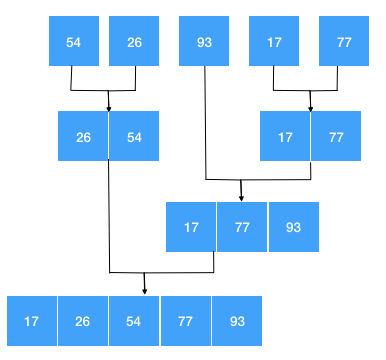
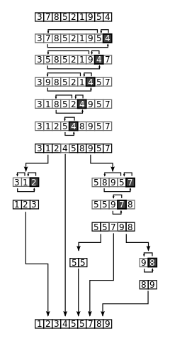

```{r setup, include=FALSE}
knitr::opts_chunk$set(echo = FALSE)
```

## Searching and Sorting Algorithms

### *Sorting*

* Discuss & implement:
    + Selection sort, Bubble sort, Merge sort
    + Quick sort, Shell sort  
* Comparison of the time complexity for each of these algorithms

### *Searching*

* Discuss & implement Sequential Search & Binary Search
* Comparison of the time complexity for each of these algorithms
* Introduction of search index  

# Sorting

## Introduction

* Sorting is the process of assigning the elements of a collection (e.g. list)
in **a particular order** (e.g. put words in an alphabetical order).

* A simplistic *systematic way* to sort the elements of a collection
is, *first*, to compare two values from the collection
seeing which is the smaller (or greater).

* And, *second*, if the two values are not in the correct order,
based on their *comparison*, we need to *exchange* them.

* This *exchange* is expensive and, therefore, the total *number* of the needed
exchanges will indicate the *efficiency* of a sorting algorithm.


## Bubbles Sort

* One of the most simplest sorting algorithms

* Given a list of size $N$:
    + Compare the first and second element:
``` python
if first < second:
   pass
else:
   swap(first, second)
```
    + Compare second and third element:
```python
      repeat above
```
    * Continue for $N$ times (e.g to end of array)  

## Bubble Sort: Example



## Bubble Sort Implementation

```python
def bubble_sort(A):
    n = len(A) - 1
    for j in range(n, 0, -1):
        for i in range(j):
            if A[i] > A[i+1]:
                A[i], A[i+1] = A[i+1], A[i]
            n = n - 1
    return A
```

```python
alist = [54,26,93,17,77,31,44,55,20]
bubble_sort(alist)
print alist
```

```python
[17, 20, 26, 31, 44, 54, 55, 77, 93]
```

## Bubble Sort Complexity



## Bubble Sort Complexity (1)



## Bubble Sort Complexity (2)

{width=70%}

Comparisons:

$n-1 + n-2 + ... + 2 + 1 = n(n-1)/2$


This makes it $O(n^2)$


## Bubble Sort Complexity (3)

Regardless of how the items are arranged in the initial list,
$n−1$ passes will be made to sort a list of size $n$.

In the *best* case scenario,
if the list is already ordered,
we will need to perform no exchanges.

However, in the *worst* case, every comparison will cause an exchange.
Therefore, the complexity of the algorithm is $O(n^2)$.

## Bubble Sort Complexity: Any useful?

* isn't the most efficient sorting algorithm 
* we could do some optimizations:
    + not comparing numbers that are in their final position 
    + stop sorting if the list is already sorted

## Selection Sort

The selection sort makes *one* exchange for every pass in the list.
The algorithm finds the greater element in the list
and then places it in the proper location (from the end of the list).



## Selection Sort Implementation

```python
def selectionSort(alist):
   for fillslot in range(len(alist)-1,0,-1):
       positionOfMax=0
       for location in range(1,fillslot+1):
           if alist[location]>alist[positionOfMax]:
               positionOfMax = location

       temp = alist[fillslot]
       alist[fillslot] = alist[positionOfMax]
       alist[positionOfMax] = temp
```

```python
alist = [54,26,93,17,77,31,44,55,20]
selectionSort(alist)
print(alist)
```

```python
[17, 20, 26, 31, 44, 54, 55, 77, 93]
```

## Selection Sort Complexity

The selection sort makes the same number of comparisons
as the bubble sort and is therefore also $O(n^2)$.

However, due to the reduction in the number of exchanges,
the selection sort typically executes faster than the bubble sort.

## Insertion Sort

The insertion sort algorith maintains
a sorted sublist in the lowest positions of a list.
Each new item is "inserted" sorted
to the sublist.



## Insertion Sort Implementation

```python
def insertionSort(alist):
   for index in range(1,len(alist)):

     currentvalue = alist[index]
     position = index

     while position>0 and alist[position-1]>currentvalue:
         alist[position]=alist[position-1]
         position = position-1

     alist[position]=currentvalue
```

```python
alist = [54,26,93,17,77,31,44,55,20]
insertionSort(alist)
print(alist)
```

```python
[17, 20, 26, 31, 44, 54, 55, 77, 93]
```

## Insertion Sort Complexity

The maximum number of comparisons for an insertion sort
is the sum of the first $n−1$ integers.
This is $O(n^2)$.

However, in the best case,
only one comparison needs to be done on each pass.
This would be the case for an already sorted list.

## Shell Sort

This algorithm starts by sorting pairs of elements far apart from each other,
then progressively reducing the gap between elements to be compared.

It is a generalization of the bubble and insertion sort algorithms.

XX: to be continued

## Merge Sort

Merge sort is a recursive algorithm that continually splits a list in the middle.

After two halves are sorted,
then the **merge** operation is performed.



## Merge



## Complexity of Merge Sort

A merge sort is an $O(n log n)$ algorithm.

Can you explain why?

## Quick Sort

A quick sort first selects a value,
which is called the *pivot* value.

The role of the pivot value is to assist with splitting the list.
The actual position where the pivot value belongs in the final sorted list,
commonly called the split point,
will be used to divide the list for subsequent calls to the quick sort.

## How does it works?



## Quick Sort Complexity

In the worst case, the split points may not be in the middle and
can be very skewed to the left or the right.
In this case, sorting a list of $n$ items divides into
sorting a list of $0$ items and a list of $n−1$ items.

Then sorting a list of $n−1$ divides into a list of size $0$ and a list of size $n−2$, and so on.
The result is an $O(n^2)$ sort with all of the overhead that recursion requires.

# Searching

## Search in a simple array

A search returns `true` if the element is found in a collection, and
`false` when it does not reside in that collection.

In Python, we can use the `in` operator
to search whether an element is a member of a particular collection of items.

But, how is this operation actually implemented?

```python
>>> 15 in [3,5,2,4,1]
False
>>> 3 in [3,5,2,4,1]
True
>>>
```

## Sequential Search

When elements are stored in a collection,
such as a list, where there are relative to each other,
we say that these elements have a linear or sequential relationship.
Since the values of lists are indexed,
it is possible to order the items and process them in a sequence.

```python
def sequentialSearch(alist, item):
    pos = 0
    found = False
    while pos < len(alist) and not found:
        if alist[pos] == item:
            found = True
        else:
            pos = pos+1
	
    return found
```

## Complexity of Sequential Search

To find the **complexity** of a sequential search algorithm,
we need to count the number of the comparisons we need to perform
until we find the element we are looking for in a collection.

If we make the assumption that the elements of a list are in a **random order**
the probability to find an element in a particular position,
is the same as if it was allocated in any other position in the list.

Whereas if the elements are in an **ascending order**,
we still need to make `n` comparisons to find a particular element,
but our search will be faster if the element is not, finally, in the list.

## Comparisons in Random Assignment

If an element does not belong in a randomly ordered list, `L = {2, 6, 1, ... n}`,
we will need to conduct `n` comparisons for a sequential search.

On the contrary, if an element does belong in the above list,
we will conduct either `1` comparison (best case scenario),
or `n` comparisons (worst case scenario) to find the right element.

Therefore, the complexity of the sequential search algorithm is `O(n)`.

## Comparisons in Ordered List

If an element does not belong in a ordered list, `L = {1, 2, 3, ... n}`,
we will need to conduct either `1` comparison (best case scenario)
or `n` comparisons (worst case scenario) for a sequential search.
What if we search for the element `30` in the following list?

If an element does belong in the above list,
we will conduct either `1` comparison (best case scenario),
or `n` comparisons (worst case scenario) to find the right element.

Therefore, the complexity of the sequential search algorithm is again `O(n)`.


## Binary Search

We can split the list in the middle and applying the searching process in its
both halfs. For instance, consider to find the element `54` by using the
so-called *divide and conquer* strategy.


## Implementation of Binary Search Algorithm

```python
	def binarySearch(alist, item):
	    first = 0
	    last = len(alist)-1
	    found = False
	    while first<=last and not found:
	        midpoint = (first + last)//2
	        if alist[midpoint] == item:
	            found = True
	        else:
	            if item < alist[midpoint]:
	                last = midpoint-1
	            else:
	                first = midpoint+1
	    return found
```

## Complexity of Binary Search

To estimate the complexity of a binary search algorithm,
we should take into account that each comparison eliminates
about half of the remaining elements.

If we have an *ordered* list of `n` elements,
around $n/2$ elements will be left after the first comparison.
After the second comparison, there will be around $n/4$, and so on.

The following table helps to understand how many time we need to split a list.

XX: the table to be added here.


## Bibliography

- Problem Solving with Algorithms and Data Structures using Python, by Brad Miller and David Ranum, Luther College.

## Copyright

This work is (c) 2017 - onwards by TU Delft and Maria Kechagia, Joseph Hejderup
and licensed under the [Creative Commons Attribution-NonCommercial-ShareAlike 
4.0 International](http://creativecommons.org/licenses/by-nc-sa/4.0/) license.

<!--html_preserve-->
<script>
  (function(i,s,o,g,r,a,m){i['GoogleAnalyticsObject']=r;i[r]=i[r]||function(){
  (i[r].q=i[r].q||[]).push(arguments)},i[r].l=1*new Date();a=s.createElement(o),
  m=s.getElementsByTagName(o)[0];a.async=1;a.src=g;m.parentNode.insertBefore(a,m)
  })(window,document,'script','https://www.google-analytics.com/analytics.js','ga');

  ga('create', 'UA-2510585-3', 'auto');
  ga('send', 'pageview');

</script>
<!--/html_preserve-->
