```{r setup, include=FALSE}
knitr::opts_chunk$set(echo = FALSE)
```

# Sorting

## Introduction

* Sorting is the process of assigning the elements of a collection (e.g. list)
in **a particular order** (e.g. put words in an alphabetical order).

* A simplistic *systematic way* to sort the elements of a collection
is, *first*, to compare two values from the collection
seeing which is the smaller (or greater).

* And, *second*, if the two values are not in the correct order,
based on their *comparison*, we need to *exchange* them.

* This *exchange* is expensive and, therefore, the total *number* of the needed
exchanges will indicate the *efficiency* of a sorting algorithm.


## The Sorting Problem


* **Input:** Sequence of *n* values $c_1,c_2,c_3,...,c_n$
* **Output:** Reordered (permutation) $c'_1,c'_2,c'_3,...,c'_n$ of the input 
  sequence with the order  $c'_1 \leq c'_2 \leq  c'_3 ... \leq c'_n$ 

Example:

* **Input:** $6,4,3,1,2,5$
* **Output:** $1,2,3,4,5,6$


## The Sorting Problem

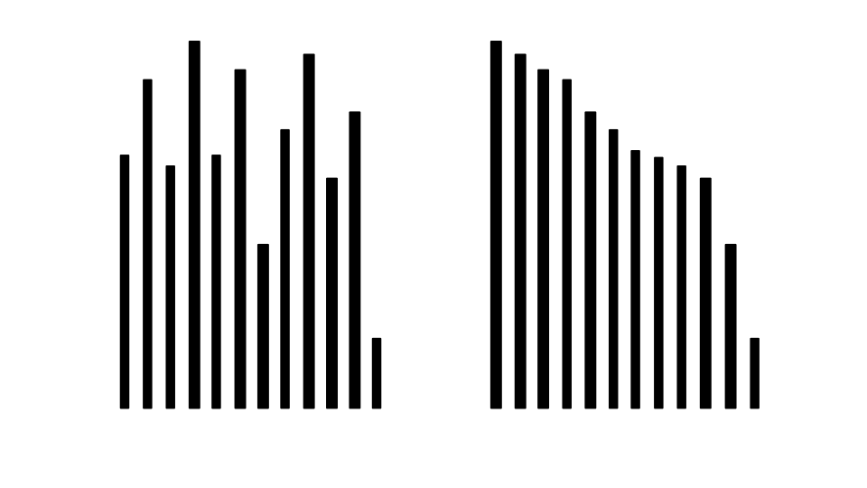{width=60%}


<center>You have to arrange the sticks in descending order, how would you
process this? </center>

## Bubble Sort

A simple sort algorithm where list elements "bubbles" to the position in the
list where it belongs (e.g holding the *order* invariant)

* How does it work?
    * Compares each pair of elements in a list
    + Swap the order of the pair of elements, if they are in the wrong order
    + Repeatedly traverse the list and swap pair of elements until the entire
      list is ordered

## Bubble Sort: Overview

Given a list $C[]$ with $n$ elements

1. Compare $C[0]$ with $C[1]$
    + if $C[0] > C[1]$, swap the elements
    + if $C[0] < C[1]$, elements are in order
2. Traverse to the next element, $C[1]$ and compare it with $C[2]$
    + if $C[1] > C[2]$, swap the elements
    + if $C[1] < C[2]$, elements are in order
    + Do this for every pair of elements until the end of the list.
3. Repeatedly perform steps 1 and 2 $n$ times

## Bubble Sort: Example

Sort the following list $C = [7,6,1]$

This would require 2 comparisons for a list of 3 values 

.   .   .

**First iteration **

1. Compare $7$ with $6$, swap them $[7,6,1]$ -> $[\textbf{6,7},1]$
2. Compare $7$ with $1$, swap them $[6,7,1]$ -> $[6,\textbf{1,7}]$


.   .   .


**Second iteration**

1. Compare $6$ with $1$, swap them $[6,1,7]$ -> $[\textbf{1,6},7]$


.   .   .


**Third iteration**

Values are in order

## Bubble Sort: Exercise

Sort the following list $C = [5,3,1,9,8,2,4,7]$ using bubble sort

## Bubble Sort: Solution

<!-- 
http://www.geeksforgeeks.org/wp-content/uploads/gq/2014/02/bubble-sort1.png
-->
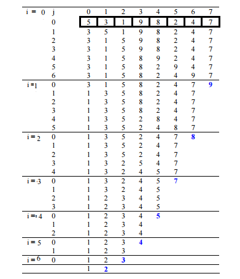


## Bubble Sort: Implementation

```python
def bubble_sort(list):
    n_times = len(list)
    # Traverse all list elements
    for i in range(n_times):
        print "round: " + str(i) + " with " + str(list)
        for j in range(0, n_times-i-1):
            # traverse the list from 0 to n-i-1 (e.g number of possible swap left)
            print str(list[j]) + " > " + str(list[j+1]) + "?"
            if list[j] > list[j+1] :
                list[j], list[j+1] = list[j+1], list[j]
                print "swap"
            else:
              print "no swap"
    return list
```

## Bubble Sort: Complexity


* How many comparison does each loop perform? (inner loop)
    + For each element in the list:  $n - 1$ comparisons
    + bubble sort does $O(n)$ comparisons
* How many times does it need to order the list? (outer loop)
    + The list contains $n$ elements and has $O(n)$ elements

For each iteration of loop variable $i$, there are $n-i$ comparisons performed.
Thus, Bubble sort conducts $O(n)$ operations on an $O(n)$ number of elements
that leads to a time complexity of $O(n^2)$

.   .   .

*What about best case scenario?*


## Bubble Sort: Complexity (2)
* When $i = 1$, no comparisons 
* When $i = 2$, one comparison is performed
* When $i = 3$, two comparisons are performed and so forth 

Therefore, when $i = n$, $n - 1$ comparisons are performed irrespective of the
input

For a list with $n$ elements does:

$1 + 2 + 3 + 4 + \cdots + (n - 2) + (n - 1) = O(n^2)$ comparisons

Last, the space complexity is $O(1)$ (e.g constant amount of memory)


## Selection Sort

* A natural sorting algorithm in which we first find minimum element in the
  list, then find the second minimum, third minimum and so forth and put them
  in an increasing order
* Similar to bubble sort, for $i^{th}$ iteration in the loop, performs $n - i$ 
  comparisons 
* Performs a linear search to find  $i^{th}$ minimum element


## Selection Sort: Overview

*key idea:* Search and swap algorithm

1. Find smallest element 
2. Swap it with the first element in the list
3. Repeat the steps above with the second, third position in the list until it
   is sorted

<!-- add small example -->
## Selection Sort: Example

Sort the following list $C = [-1,5,3,9,12,4,8]$

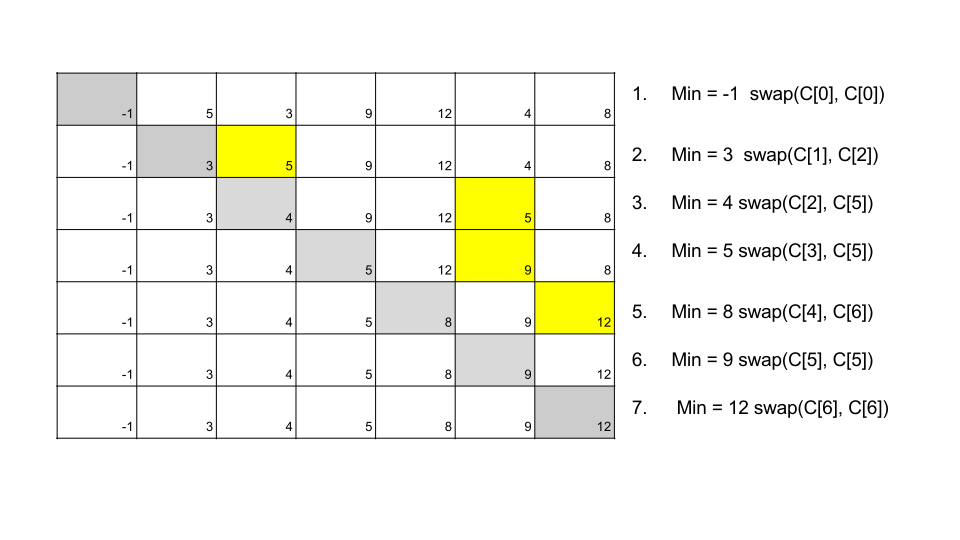


## Selection Sort: Implementation

```python
def selectionSort(list):
    for i in range(len(list)-1):
        print "index " + str(i) + " in the list"
        min = i
        for j in range(i + 1, len(list)):
            if list[j] < list[min]:
                min = j
        print "min value is " + str(list[min]) + " at index " + str(min)        
        list[i], list[min] = list[min], list[i]
    return list

```

## Selection Sort: Complexity

.   .   .

The selection sort makes the same number of comparisons
as the bubble sort and is therefore also $O(n^2)$. This is due to the linear
search for finding the minimum element in which we have to pass $i - n$ values


However, due to the reduction in the number of exchanges,
the selection sort typically executes faster than the bubble sort.

.   .   .

*What is the best case?*

## Insertion Sort

A simple sorting algorithm that works in similar fashion to sorting cards
with our hands

* The design is of an incremental algorithm; it constructs the sorted list one 
  number at a time. 
* Compared to the previous algorithms; during the $i^{th}$ iteration, the first 
  $i - 1$ elements (named $S$) are sorted and the $i^{th}$ element is inserted
  in $S$ by first making a linear search on $S$ and placing it in the right
  position. 
* Useful for sorting smaller lists


## Insertion Sort: Example

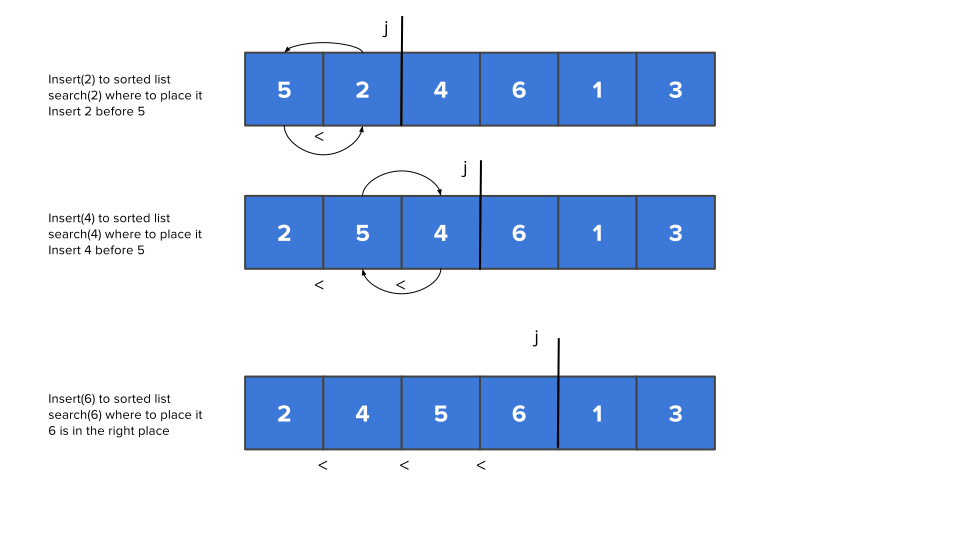


## Insertion Sort: Example (2)

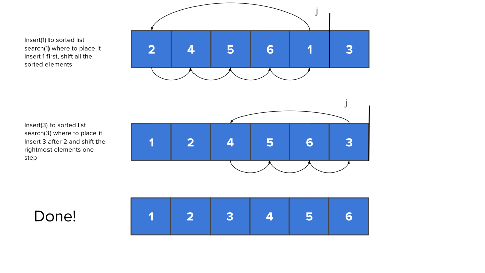


## Insertion Sort: Exercise

$A = [−1,4,7,2,3,8,−5]$


## Insertion Sort: Implementation

```python
def insertionSort(list):
    # Traverse through 1 to n
    for i in range(1, len(list)):
 
        key = list[i]
 
        # Move elements of list[0..i-1], that are
        # greater than key, to one position ahead
        # of their current position
        j = i-1
        while j >=0 and key < list[j] :
                list[j+1] = list[j]
                j -= 1
        list[j+1] = key
    return list
```

## Insertion Sort: Complexity

**Best case scenario:**
The list is sorted in ascending order, the $i^{th}$ element is only compared to $i^{th} - 1$ (e.g
 $j$), this amounts to $n$ comparisons and thus $O(n)$

$\sum _{ i=1 }^{ N-1}{N-1} = O(N)$

.   .   .

**Worst case scenario:**
The list is sorted inverse, the  $i^{th}$ needs to be shifted to the first
position


$\sum _{ i=1 }^{ N-1}{i} = 1 + 2 + 3 + \cdot + (N-1) + \frac{(N-1)N}{2} =
O(N^2)$


.   .   .

**Average case scenario:**
The list is half-way in order

$\sum _{ i=1 }^{ N-1}{\frac{i}{2}} = \frac{1}{2}(1 + 2 + 3 + \cdot + (N-1)) +
\frac{(N-1)N}{4} = O(N^2)$


## Faster Sorting

* There are two algorithms for faster sorting: Quick Sort and Merge Sort
* These algorithms is based on a *divide-and-conquer* technique 


## Divide-and-Conquer Technique


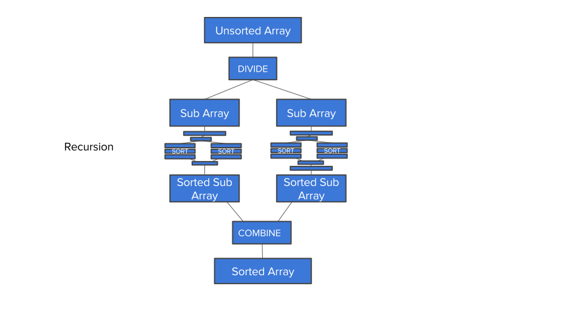


## Quick Sort

* A *divide-and-conquer* algorithm
* The idea is to select a special element called a *pivot*
* The *pivot* is used to partition the list into two sub-lists:
    + elements smaller than the *pivot* value in one partition
    + elements *greater* than the *pivot* in another partition
* Further, the partitions are divided into smaller partitions until the 
  sub-problem size becomes one

## Quick Sort (2)
* The *pivot* value can be any element in the list, we could also as an example use 
  a strategy where we select three random values where the middle most is
  selected.
* Compared to *Merge Sort*: Most of the work is performed at the *divide* stage 
  while the *merge sort* conducts most of the work and the *combine*
  stage (later on this)

## Quick Sort: Partition Phase
* Select a pivot
* Move elements that are less than the pivot to the left
* Move elements that are greater to the pivot to the right

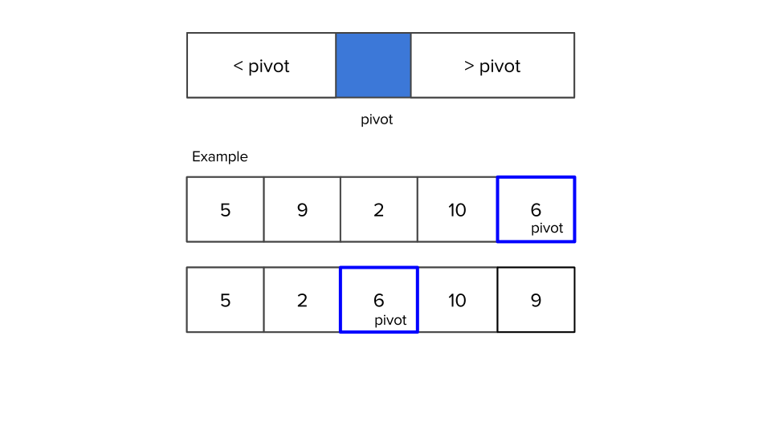{width=80%}

## Quick Sort: Process

1. **Divide:** Pick a pivot and divide into two partitions (see previous slide)
2. **Conquer:** Recursively apply Quick Sort to both the left and right
   partitions 
3. **Combine:**  All sub-partitions are sorted and no effort is needed to merge


## Quick Sort: Partition Example 
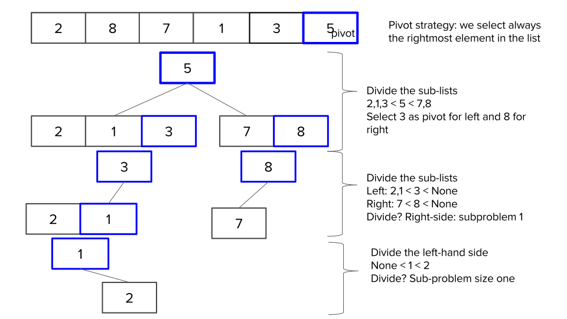


## Quick Sort: Combine Example 

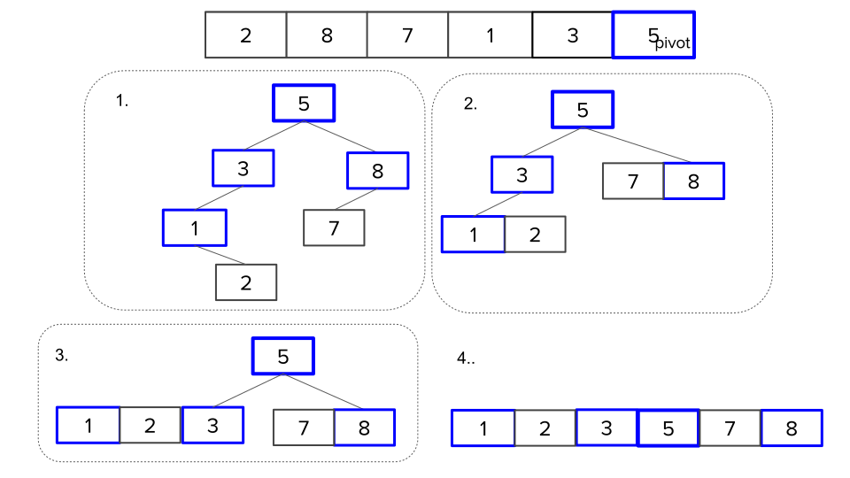


## Quick Sort: Implementation
* The hardest part is to implement the partitioning 
* The quick sort algorithm can be implemented in two ways:
    + Recursive
    + Iterative

.   .   .

*We have mainly discussed with recursion, how would we do it iteratively?*
*hint: think of a previous data structure*


## Quick Sort: Recursive

```python
def qs_recursive(list, left, right):
    """
    Quick sort method (Recursive)
    """
    if right <= left:
        return
    else:
        #Get pivot
        piv = partition(list, left, right)
        #Sort left side of pivot
        qs_recursive(list, left, piv-1)
        #Sort right side of pivot
        qs_recursive(list, piv+1, right)
    return list
```

What is `left` and `right` for $[1,5,8,9,10]$

.   .   .

left is $1$ and right is $10$


## Quick Sort: Iterative

``` python
def qs_iterative(list, left, right):
    """
    Quick sort (iterative)
    """
    stack = []
    stack.append((left,right))
    
    #Main loop to pop and push items until stack is empty
    while stack:      
        pos = stack.pop()
        right, left = pos[1], pos[0]
        pivot = partition(list,left,right)
        #If items in the left of the pivot push them to the stack
        if pivot-1 > left:
            stack.append((left,pivot-1))
        #If items in the right of the pivot push them to the stack
        if pivot+1 < right:
            stack.append((pivot+1,right))
    return list
```

## Quick Sort: Partition

``` python
def partition(list, left, right):
    i = left - 1          # index of smaller element
    pivot = list[right]     # pivot
 

    for j in range(left, right):
        print list
        print i, j, pivot

        # If current element is smaller than or
        # equal to pivot
        print "is " + str(list[j]) + " smallar or equal to " + str(pivot)
        if list[j] <= pivot:
            # increment index of smaller element
            i = i + 1
            print "swap list[i]= " + str(list[i]) + " with list[j]=" + str(list[j]) 
            list[i], list[j] = list[j], list[i]
    list[i + 1], list[right] = list[right], list[i + 1]
    return i + 1
```


## Quick Sort Complexity


**Best case scenario:**

* Pivot is the median of the array
* Each time we make a partition, the list is divided into two nearly equal
partitions where left and right have the same size. Thus, each recursive call process a list of half its size and
similar to a balanced BST, the depth of the call tree (e.g height)  is $log_2
n$. Further, to create each partition, we need to make $n$ comparisons but not more
than  $n/2$ swaps. Thus, the complexity is $O(n log n)$

## Quick Sort Complexity (2)

**Worst case scenario:**
This is when the pivot is the smallest or largest element. This means one of the
partitions are empty and we repeat the process $N-1$ elements. Think of this as
an unbalanced BST, the complexity is $O(n^2)$

.   .   .

**Average case scenario:**
In average, each partitioning divides the list into two partitions and creating
the partition takes $O(n)$, Thus
* Average $log n$ partitioning and creating partitions takes $O(n)$


## Merge Sort
* A *divide-an-conquer* algorithm 
* Main idea:
    + The *divide* phase recursively split the list into half until the 
      list size is reduced to one (top-down approach)
    + The *conquer* phase combines a sorted list of size 1 to get a sorted
      list of size 2 and so on; we combine two sorted list of $n/2$ to get a
      sorted list of $n$

## Merge Sort: Split phase


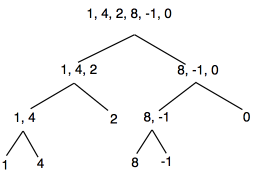


## Merge Sort: Merge phase


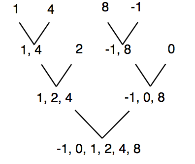

## Merge Sort: Implementation

``` python
def mergesort(lst):
    if len(lst) > 1:
        mid = len(lst) // 2
        left = mergesort(lst[:mid])
        right = mergesort(lst[mid:])
        return merge(left, right)
    return lst
```


## Merge Sort: How are we doing merge?
``` python
def merge(left, right):
    result = []
    while len(left) > 0 and len(right) > 0:
        if left[0] <= right[0]:
            result.append(left.pop(0))
        else:
            result.append(right.pop(0))
    if len(left) > 0:
        result += left
    else:
        result += right
    return result
```


## Complexity of Merge Sort
For all cases it is $O(n logn)$, can someone explain why?

.   .   .

While Merge Sort have better overall complexity than Quick Sort, why would
someone prefer quick sort? *hint: space complexity*

# Searching

## Search in a simple array

- A search returns `true` if the element is found in a collection, and
`false` when it does not reside in that collection.

- In Python, we can use the `in` operator
to search whether an element is a member of a particular collection of items.

```python
>>> 15 in [3,5,2,4,1]
False
>>> 3 in [3,5,2,4,1]
True
>>>
```

## Sequential Search

- When elements are stored in a collection,
such as a list, where they are relative to each other,
we say that these elements have a *linear* or *sequential* relationship.

- Given that the values of lists are *indexed*,
it is possible for us to order the items and process them in a *sequence*.

*But, how does this operate?*

. . .

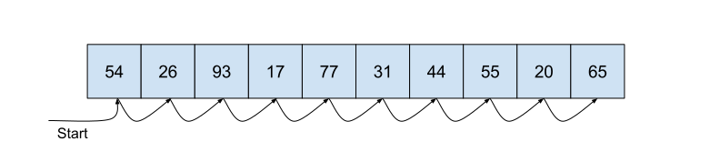

## Sequential Search Implementation

- In summary, we start from the first item of the list
and, then, we move from item to item,
following the sequential order,
until we find the item we are looking for.

- If we run out of items, it means that the item we are looking for
does not belong to the list.

```python
def sequentialSearch(alist, item):
    pos = 0
    found = False
    while pos < len(alist) and not found:
        if alist[pos] == item:
            found = True
        else:
            pos = pos+1
	
    return found
```

## Sequential Search Running Example

```python
#!/usr/bin/env python

def main():
	testlist = [1, 2, 32, 8, 17, 19, 42, 13, 0]
	print(sequentialSearch(testlist, 3))
	print(sequentialSearch(testlist, 13))

def sequentialSearch(alist, item):
	pos = 0
	found = False
	while pos < len(alist) and not found:
	    if alist[pos] == item:
	        found = True
	    else:
	        pos = pos+1

	return found

if __name__ == "__main__":
    main()
```

*What will be the result?*

. . .

```False```

```True```

## Complexity of Sequential Search

- To find the **complexity** of a **sequential search algorithm**,
we need to count the **number of the comparisons** we have to perform
until we find the element we are looking for in a collection.

- If we make the assumption that the elements of a list are in a **random order**,
the probability to find an element in a particular position
is the same as if the item was allocated in any other position in the list.

- Whereas if the elements are in an **ascending order**,
we still need to make a number of comparisons to find a particular element,
but our search will be faster if the element is not, finally, in the list.

## Comparisons in Random Assignment

- If the element we are looking for
does not belong to the randomly ordered list, $A = {2, 6, 1, ... n}$,
we will conduct $n$ comparisons for a sequential search.

- On the contrary, if the element does belong to the above list,
we will conduct either $1$ comparison (*best case scenario*),
or $n$ comparisons (*worst case scenario*), until we find the right element.

*Why does this happen?*

## Performance of a Sequential Search - Random Assignment (1)

- Assume that $L$ is a list with $n$ elements, that is, $|L| = n$.

- If the elements in $L$ are completely randomly assigned,
then the element we are looking for can be found in any position of the $L$
with equal probability, $1/n$.

- If the element is the first item of the list,
the loop of the sequential search (see the implementation in previous slides)
will be executed only *once* (best scenario).
Whereas if the element is the second item,
the loop will be executed *twice*, and so on.

## Performance of a Sequential Search - Random Assignment (2)

- If the element is the last item or it does not exist
in the list at all,
we need to execute the loop of the sequential search $n$ times (worst scenario).

- The performance of the algorithm is:

$\frac{1}{n}*1 + \frac{1}{n}*2 + \cdot \cdot \cdot + \frac{1}{n}*n = \frac{1 + 2 + \cdot \cdot \cdot + n}{n} = \frac{n + 1}{2}$

- Where $1 + 2 + \cdot \cdot \cdot + n = \frac{n*(n + 1)}{2}$.

- Therefore, the performance of a successfull sequential search will be, *on average*: $O((n + 1) / 2) = O(n)$

## Comparisons in Ordered List

- If an element does **not** belong to a **ordered list**, $L = {1, 2, 3, ... n}$,
we will need to conduct either $1$ comparison (*best case scenario*)
or $n$ comparisons (*worst case scenario*) for a sequential search.

- If an element does belong in the above list,
we will conduct either $1$ comparison (*best case scenario*),
or $n$ comparisons (*worst case scenario*) to find the right element.

- Therefore, the complexity of the sequential search algorithm is again $O(n)$.

## Binary Search

- We can split the list in the middle and applying the searching process in its
both halfs. For instance, consider to find the element $54$ by using the
so-called *divide and conquer* strategy.

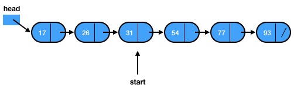

## Implementation of Binary Search Algorithm

```python
	def binarySearch(alist, item):
	    first = 0
	    last = len(alist)-1
	    found = False
	    while first<=last and not found:
	        midpoint = (first + last)/2
	        if alist[midpoint] == item:
	            found = True
	        else:
	            if item < alist[midpoint]:
	                last = midpoint-1
	            else:
	                first = midpoint+1
	    return found
```

## Running Example of Binary Search

```python
def main():
	testlist = [0, 1, 2, 8, 13, 17, 19, 32, 42,]
	print(binarySearch(testlist, 3))
	print(binarySearch(testlist, 13))

def binarySearch(alist, item):
    first = 0
    last = len(alist)-1
    found = False
    while first<=last and not found:
        midpoint = (first + last)/2
        if alist[midpoint] == item:
            found = True
        else:
            if item < alist[midpoint]:
                last = midpoint-1
            else:
                first = midpoint+1
    return found

if __name__ == "__main__":
    main()
```

*What will be the result?*

. . .

```False```

```True```

## Complexity of Binary Search (1)

- To estimate the complexity of a binary search algorithm,
we should take into account that each comparison eliminates
about half of the remaining elements.

- If we have an *ordered* list of $n$ elements,
around $n/2$ elements will be left after the first comparison.
After the second comparison, there will be around $n/4$, and so on,
until the list have only $1$ item.

## Complexity of Binary Search (2)

- The **left** number of comparisons at the last item ($i$th item)
will be $n/2^i = 1$. Solving this for $i$,
we will get $i = \log n$ (max number of comparisons).

- Then, the *worst case* performance of the algorithm is $O(\log n)$,
the *best case* performance is $O(1)$,
and the *average* performance is $O(\log n)$.

## Bibliography

- Problem Solving with Algorithms and Data Structures using Python, by Brad Miller and David Ranum, Luther College.

- Real-World Algorithms: A Beginner's Guide, by Panos Louridas, The MIT Press, 2017.

## Copyright

This work is (c) 2017 - onwards by TU Delft and Maria Kechagia, Joseph Hejderup
and licensed under the [Creative Commons Attribution-NonCommercial-ShareAlike 
4.0 International](http://creativecommons.org/licenses/by-nc-sa/4.0/) license.

<!--html_preserve-->
<script>
  (function(i,s,o,g,r,a,m){i['GoogleAnalyticsObject']=r;i[r]=i[r]||function(){
  (i[r].q=i[r].q||[]).push(arguments)},i[r].l=1*new Date();a=s.createElement(o),
  m=s.getElementsByTagName(o)[0];a.async=1;a.src=g;m.parentNode.insertBefore(a,m)
  })(window,document,'script','https://www.google-analytics.com/analytics.js','ga');

  ga('create', 'UA-2510585-3', 'auto');
  ga('send', 'pageview');

</script>
<!--/html_preserve-->
