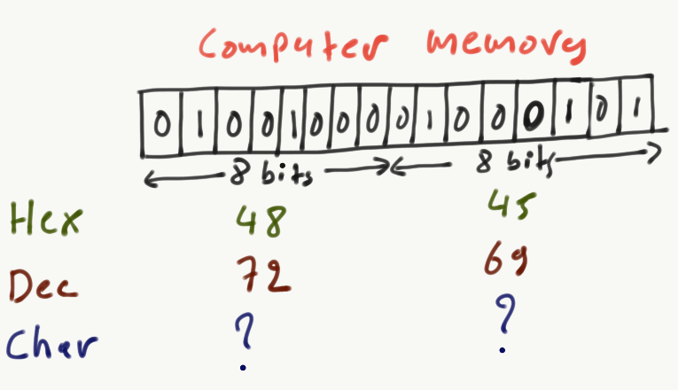
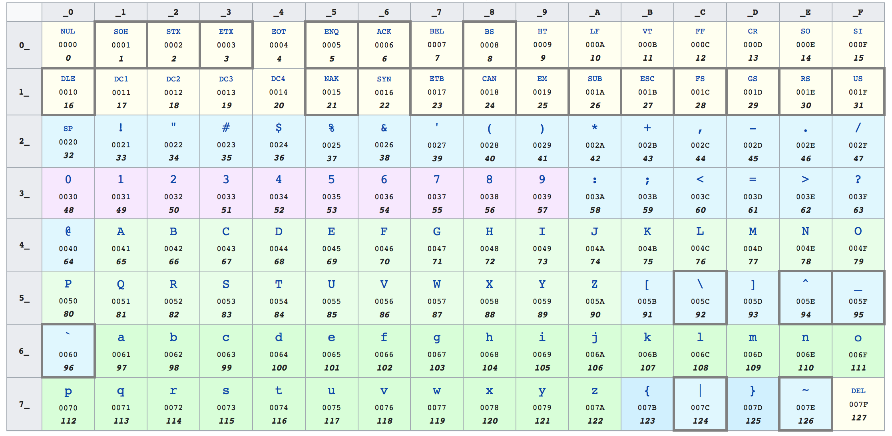
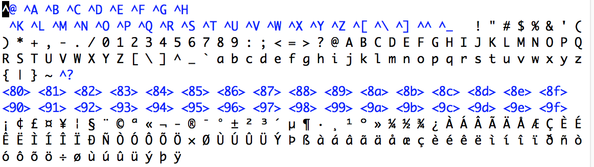
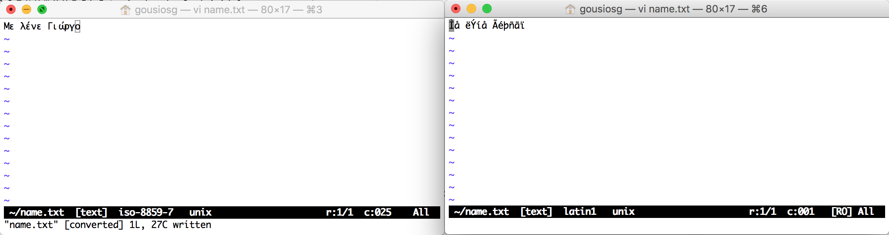
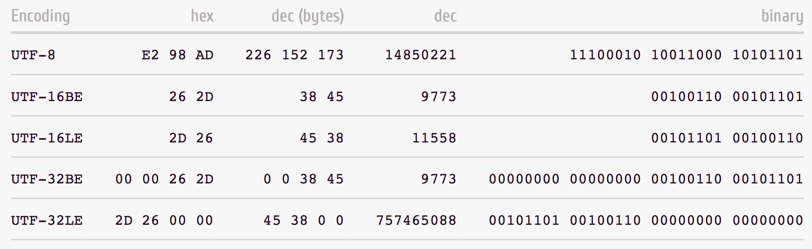
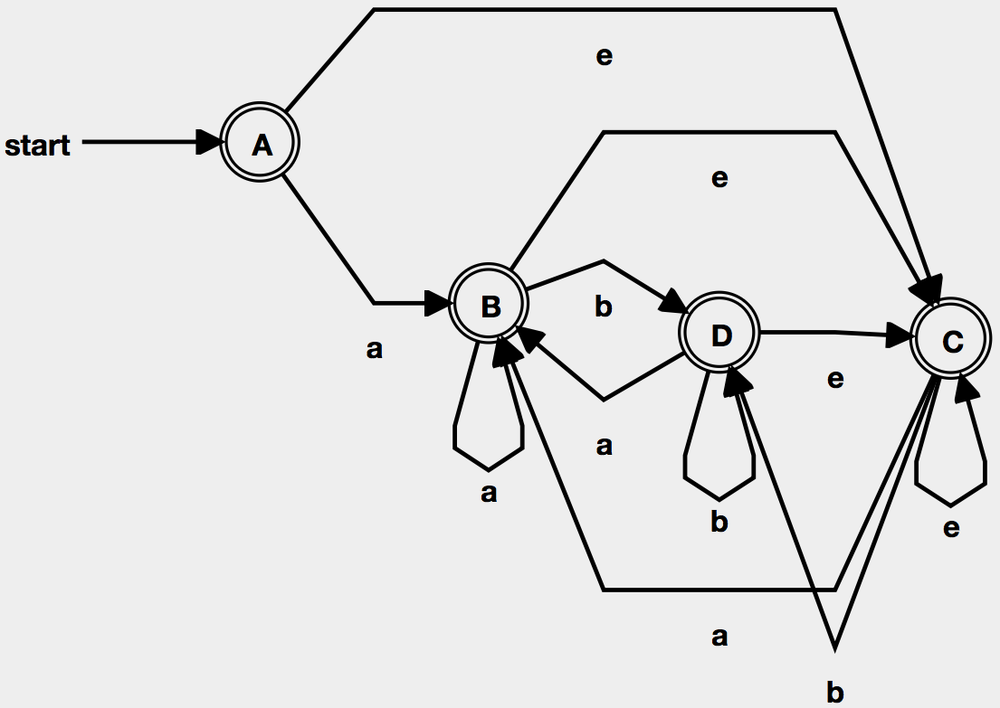
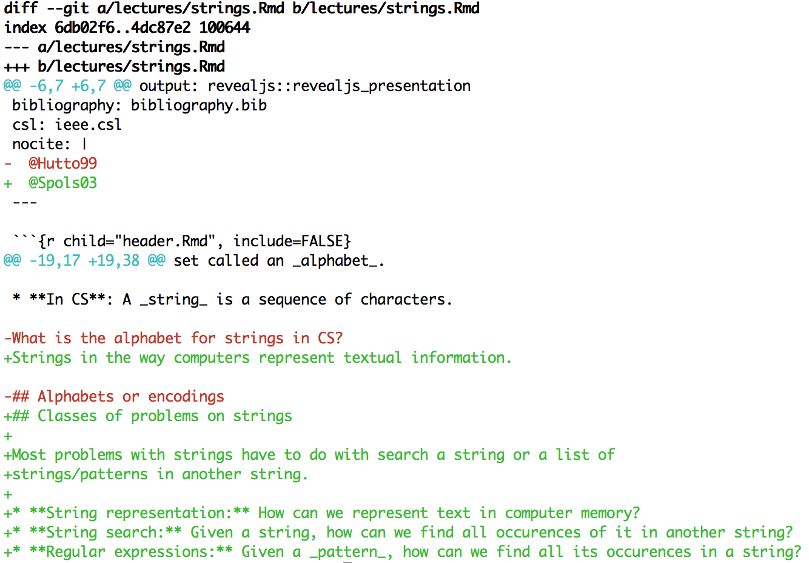

```{r child="header.Rmd", include=FALSE}
```

## What is a string?

* **In math**: A _string_ is a finite sequence of symbols that are chosen from a
set called an _alphabet_.

* **In CS**: A _string_ is a sequence of characters.

Strings in the way computers represent textual information.

## Classes of problems on strings

Most problems with strings have to do with search a string or a list of
strings/patterns in another string.

* **String representation:** How can we represent text in computer memory?
* **String search:** Given a string, how can we find all occurences of it in another string?
* **Regular expressions:** Given a _pattern_, how can we find all its occurences in a string?
* **Approximate matching:** How similar are two strings?
* **Edit script:** What is the minimal set of additions/deletions to go from one string to another?

# String representation

## Encodings

In computer memory, strings are nothing more that binary data.

{width=50%}

In order to interprect what the value `0x48` (first 8 bits) means in terms
of characters, we need an _encoding_.

The problem of encoding predates computers. For example, Morse code is an
encoding between short and long sounds to Latin script.

## Typical String Encodings

* **1-byte** encodings: EBCDIC and **ASCII**
* **2-byte** encodings: CJK (for logographic languages), Shift-JIS
* **multibyte-byte** encodings: Unicode **UTF-8**

## ASCII

ASCII was originally a 7-bit encoding.



## Fun with ASCII

ASCII characters are representable as numbers. This means that
we can do arithmetic on them. 

```c
#include<stdio.h>

main() {
    for (int i = 0; i < 128; i++)
      printf("%c ", i);

    printf("%d\n", c);    

    for (int i = 128; i < 256; i++)
      printf("%c ", i);
}
```

{width=70%}

## ISO-8859-*

To accomodate different languages with characters in non-Latin scripts, or
special characters (e.g. ø, ß, ç) in Latin-based languages,
ASCII was extended with an 8th bit.

This allowed operating systems in most of the world (non-logographic languages) to use
the American string representation as a basis and only customize encodings when
the extra characters where required.

**Q:** What problems did this create?

. . .

A file encoded in ISO-8859-7 (Greek) could not be read 
correctly in a computer configured with ISO-8859-1 (Latin-1).




## Unicode

The world has around 7k languages and 3.8k writing systems. Unicode is an
effort to specify 1 string encoding scheme for everything.
The latest version contains a repertoire of 136,755 characters covering 
139 modern and historic scripts, as well as multiple symbol sets (e.g. music,
math, emoji). 

Unicode defines a lookup table between a unique character ID and a character
name / description

* U+01E8 Ǩ LATIN CAPITAL LETTER K WITH CARON
* U+0E57 ๗ THAI DIGIT SEVEN
* U+1F638 😸 GRINNING CAT FACE WITH SMILING EYES
* U+262D ☭ HAMMER AND SICKLE

## Representing Unicode text

The word **hello** is represented in Unicode as:

```
U+0068 U+0065 U+006C U+006C U+006F
```

**Q**: How would you store that on disk?

. . .

One way would be to store the bytes: ``00 68 00 65 00 6C 00 6C 00 6F``

However, this assumes that Unicode symbols have equal probability of being used,
while we can only store $2^{16}$ characters. The later can be solved in we
use $2^{32}$ bytes for each character.

## UTF-8

To solve space issues we can use _variable length_ encodings.
The most common encoding format for Unicode data is UTF-8, developed by 
[Ken Tompson](https://en.wikipedia.org/wiki/Ken_Thompson) 
and [Rob Pike](https://en.wikipedia.org/wiki/Rob_Pike). 
 
In UTF-8, the most common characters are encoded with less bits than more
rare ones.

* The first 128 characters need 1 byte, and correspond to ASCII
* The next 1,920 characters need 2 bytes, and cover most western and middle-eastern languages
* 3 bytes cover all spoken languages
* 4 bytes cover emoji and other symbolic languages


## Various Unicode bit encodings

For the character U+262D (☭), various Unicode encodings produce the following
results




One thing to remember about strings in computers:

_Characters and bytes are 2 different things_


# String search


## The string search problem

Given a text $T$ and a pattern $P$, find all occurrences of $P$ within $T$.

$T = AGCATGCTGCAGTCATGCTTAGGCTA$
$P = GCT$

**Q:** How many times does $P$ occur in $T$

. . .

The answer 3. But how did you search for it?

## Naive string search
Say that we are searching for $P=$`ABC` in string $T=$`ABABABACCABC`.

```
  ABABABACCABC
1 ABX               (first two characters match, last does not)
2  X                (first character doesn't match)
3   ABX             (first two characters match, last does not)
4    X              (first character doesn't match)
5     ABX           (first two characters match, last does not)
6      X            (first character doesn't match)
7       AX          (first character matches, second doesn't)
8        X          (first character doesn't match)
9         X         (first character doesn't match)
10         ABC      (match found)
```

The brute force approach is $O(mn)$, whe $m = len(T)$ and $n = len(P)$.

. . .

A step 2, we are restarting the search at a character we _know_ it won't match.
We should instead start from step 4.

## How can we be more efficient?

_Idea:_ How about we build a lookup table of the lengths of _prefixes_ in $P$
that are also _suffixes_? Then, we can use that to jump ahead in our search 
if we get a mismatch!

|pattern          | a | b | a | b | a | c |
|-----------------|---|---|---|---|---|---|
| j               | 0 | 1 | 2 | 3 | 4 | 5 |
|Prefix: $P[0:j]$ | a | ab| aba | abab | ababa | ababac | 
|Prefix - Suffix  | $\emptyset$ | $\emptyset$ | a | ab | aba | $\emptyset$
|$p[i]$           | 0 | 0 | 1 | 2 | 3 | 0 |

This table is used to calculate where to jump to in $T$ in case of a 
mismatch of character position $i$ in $P$. The new position should be
$cur + i - jump[i]$, 
 

## The Knuth-Morris-Pratt algorithm

**Q**: Let `T = ABC ABCDAB ABCDABCDABDE` and `P = ABCDABD`. What is jump table?

. . .

`j = [0,0,0,0,1,2,0]`

. . .

```
T: ABC ABCDAB ABCDABCDABDE
P: ABCDABD
      |
      mismatch
```

Step **1**: We matched $k = 3$ letters so far and $j[k] = 0$. So we can jump by $k - j[k] = 3$
letters ahead:

```
T: ABC ABCDAB ABCDABCDABDE
P:    ABCDABD
      |
      mismatch
```

Step **2**: We matched $k = 0$ letters, $j[0] = -1$. So we can jump by $k - j[k] = 1$ letter

```
T: ABC ABCDAB ABCDABCDABDE
P:     ABCDABD
             |
             mismatch
```

Step **3**: We matched $k = 6$ letters, $j[6] = 2$. So we can jump by $k - j[k] = 4$ letters

```
T: ABC ABCDAB ABCDABCDABDE
P:         ABCDABD
             |
             mismatch
```

Step **4**: We matched $k = 2$ letters, $j[2] = 0$. So we can jump by $k - j[k] = 2$ letters

```
T: ABC ABCDAB ABCDABCDABDE
P:           ABCDABD
             |
             mismatch
```

Step **5**: We matched $k = 0$ letters, $j[0] = -1$. So we can jump by $k - j[k] = 1$ letters

```
T: ABC ABCDAB ABCDABCDABDE
P:            ABCDABD
                    |
                    mismatch
```

Step **6**: We matched $k = 6$ letters, $j[6] = 2$. So we can jump by $k - j[k] = 4$ letters

```
T: ABC ABCDAB ABCDABCDABDE
P:                ABCDABD
                
                    success!
```

The example above was adapted from [Jaehyun Park's String Algorithms lecture](https://web.stanford.edu/class/cs97si/10-string-algorithms.pdf)

## Calculating the jump table

```python
def jump_table(pattern):
  result = [None]

  for i in range(0, len(pattern)):
    j = i

    while True:
      if j == 0:
        result.append(0)
          break

      if pattern[result[j]] == pattern[i]:
        result.append(result[j] + 1)
          break
      j = result[j]
  return result
```

The complexity of the jump table calculator is $O(m)$

## KMP in Python

```python
def kmp(P, T):
    jump = jump_table(P)

    index = 0
    match = 0

    while index + match < len(T):
        if T[index + match] == P[match]:
            match = match + 1

            if match == len(P):
                return index
        else:
            if match == 0:
                index = index + 1
            else:
                index = index + match - jump[match]
                match = jump[match]

    return None
```

The complexity of KMP is $O(n)$; the overall complexity of applying KMP is
$O(m) + O(n)$, which is much better than the brute force's $O(mn)$.

## Pattern identification

A generalization of text search is _pattern identification_. Instead of using
exact strings as search terms, we use patterns that define repetions, groupings
and ranges of characters to match. This way, we can make our searches more generic.

The most common way to express search patterns are _regular expressions_.

## Regular expression syntax

* **.** Match any character once
* `*` Match the previous pattern 0 or more times
* **+** Match the previous pattern 1 or more times
* **[e-fF-M]** Match any character in the (ASCII) range `F-M` or `e-f`
* **[^e]** Match all characters _except_ e
* **^** and **$** Match the beginning or the end of the line, respectively
* **()** Group together items for future reference
* **|** Match either the left or the right group

## Regular expression evaluation

Regular expressions are converted to state machines, through which the text
passes. For example, the state machine for `((e|a)b*)*` is:

{width=50%}

## Regular expression examples

* `/^#?([a-f0-9])$/`

. . .

Matches hexademical numbers, perhaps starting with a `#`

* `/^([a-z0-9_\.-]+)@([\da-z\.-]+)\.([a-z\.]{2,6})$/`

. . .

Matches (a good subset of) valid email addresses. 
[Here](https://stackoverflow.com/a/2245312/51681) is a regexp that will match
everything.

* `{([1-2]?[1-9]\{1,2\}\.)\{3,\}[1-2]?[0-9]\{1,2\}}`

. . .

Match IPv4 addresses

# String distance

## Approximate string matching

_Approximate string matching_ (or _fuzzy search_) 
is a technique of finding strings that match a pattern approximately (rather than exactly).

Given a pattern string $P$ and a string $T$, find a sub-string $T'$ in the
set of all substrings of $T$, so that the distance to $P$ is minimal (for some
definition of distance).

**Q** Can you think of an application of fuzzy searching?

. . .

Some applications include spellcheckers, Google's "Did you mean...", DNA matching etc

## Levenstein distance

The distance between two strings $a,b$ (of length $|a|$ and $|b|$) is:

$$
\qquad\operatorname{lev}_{a,b}(i,j) = \begin{cases}
  \max(i,j) & \text{ if} \min(i,j)=0, \\
  \min \begin{cases}
          \operatorname{lev}_{a,b}(i-1,j) + 1 \\
          \operatorname{lev}_{a,b}(i,j-1) + 1 \\
          \operatorname{lev}_{a,b}(i-1,j-1) + 1
       \end{cases} & \text{ otherwise.}
\end{cases}
$$

$lev(i,j)$ is the distance at characters $a_i$ and $b_j$.

The Levenstein distance measures the minimal number of deletions, insertions
or replacements to make the strings equal.

## Levenstein distance in Python

```python
def levenshtein(s, t):
    if s == "":
        return len(t)
    if t == "":
        return len(s)
    if s[-1] == t[-1]:
        cost = 0
    else:
        cost = 1
       
    res = min([levenshtein(s[:-1], t) + 1,
               levenshtein(s, t[:-1]) + 1, 
               levenshtein(s[:-1], t[:-1]) + cost])
    return res
```

**Q:** What is the complexity of the simple implementation?

. . .

$O(3^{m+n-1})$, where $m$ and $n$ are the legths of `s` and `t`. See an
[explanation here](https://stackoverflow.com/a/24679205/51681)


## Memoization in action

```python
memo = {}
def levenshtein2(s, t):
    if s == "":
        return len(t)
    if t == "":
        return len(s)
    cost = 0 if s[-1] == t[-1] else 1
       
    i1 = (s[:-1], t)
    if not i1 in memo:
        memo[i1] = levenshtein2(*i1)
    i2 = (s, t[:-1])
    if not i2 in memo:
        memo[i2] = levenshtein2(*i2)
    i3 = (s[:-1], t[:-1])
    if not i3 in memo:
        memo[i3] = levenshtein2(*i3)
    res = min([memo[i1]+1, memo[i2]+1, memo[i3]+cost])
    
    return res
```

With memoization, we store intermediate results in a shared dictionary, whose
key is the function arguments. This takes space of $O(mn)$, but the algorithm
now becomes $O(mn)$.

---

## Differencing strings
Levenshtein distance does not tell us _which_ steps we need to take to ma.
To obtain the steps, we need to solve the
_longest common subsequence_ problem.

In LCS, we compare our $O$riginal string with a $N$ew one and obtain a 
sequence of all the items that are common in $O$ and $N$.
By comparing this sequence to both $O$ and $N$, we can obtain a set
of operations (or _edit script_) that when applied to $O$ will give us $N$.

```
O     1 a 2 3 4 r t
N     c 1 b 2 3 x d 4
LCS   1 2 3 4
DIFF  c 1 a b 2 3 x d 4 r t
OP    + = - + = = + + = - -
```
```python
def diff(xs, ys):
    cs = lcs(xs, ys)
    edit_script(xs, ys, cs)
```

## The least common subsequence

```python
def lcs(xstr, ystr):
    if not xstr or not ystr:
        return ""
    x, xs, y, ys = xstr[0], xstr[1:], ystr[0], ystr[1:]
    if x == y:
        return x + lcs(xs, ys)
    else:
        return max(lcs(xstr, ys), lcs(xs, ystr), key=len)
```

The complexity of the naive LCS is $O(2^{m+n})$. Similar to Levenstein
distance, we can use memoization to convert LCS to $O(mn)$.

What LCS returns are the common characters in `xstr` and `ystr`, in order of
appearence in `xstr`.

## The edit script function

```python
def edit_script(xs, ys, cs):
    if len(cs) == 0:
        for x in xs:
            print "-%s" % x
        for y in ys:
            print "+%s" % y
        return

    x, y, c = xs[0], ys[0], cs[0]
    if c != x:
        print "-%s" % x
        edit_script(xs[1:], ys, cs)
    elif c != y:
        print "+%s" % y
        edit_script(xs, ys[1:], cs)
    else:
        print "=%s" % c
        edit_script(xs[1:], ys[1:], cs[1:])
```

Given the two strings and the LCS, the edit script function will return
a sequence of additions `+` and removals `-` that when applied to `xs` will
give `ys`.

## The `diff` utility

The ability to compare strings and produce edit scripts has been generalized
in the `diff` Unix tool, where differences are only considered at the line level.

{width=50%}

The output of `diff` is the basis for all version control systems, like Git and 
Subversion.

## Content credits

* [Unicode Table](https://unicode-table.com/en/)
* [Knuth-Morris-Pratt algorithm](https://gist.github.com/Nicksil/5646003), by Nicksil@GitHub
* [String Algorithms](https://web.stanford.edu/class/cs97si/10-string-algorithms.pdf), by Jaehyun Park
* [Regular expression visualization](https://cyberzhg.github.io/toolbox/nfa2dfa), by CyberZHG@GitHub
* [Levenshtein distance](https://www.python-course.eu/levenshtein_distance.php)

```{r child="footer.Rmd", include=FALSE}
```
