```{r child="header.Rmd", include=FALSE}
```

# Tree as a data structure {data-background="figures/tree_american.jpg"}

## Why organize data as a tree structure?

- Humans have a natural inclination towards hierarchical thinking and this have
  had a profound impact on the way we reason, decide and look at *things*
- Examples are social and political structures such as *family tree*,
  *governance* and *species* 
- Introducing *order* such as *hierarchical order* to data allows computers
  to make decisions in a much more efficient way then linear data
  structures


## Example: Visiting a distant aunt
What do we know about this aunt and our family:

- You only meet her once every three years
- She is from your **dad's side**
- There is a huge family gathering next week and you have been asked to find her
  address.


## Example: Visiting a distant aunt (1)
- Equipped with the knowledge from the previous week, we would organize family
  relatives in the following fashion:

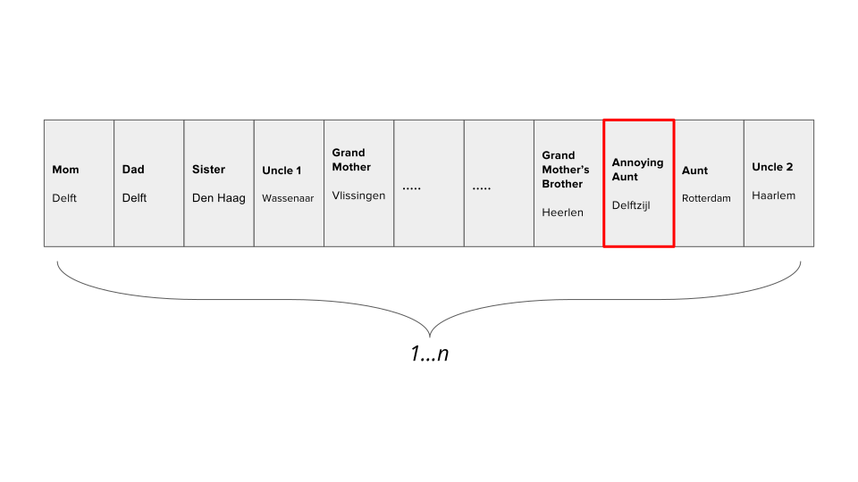

## Example: Visiting a distant aunt (2)
Knowing the hierarchical **order** of our family, we would prefer making a
family tree!

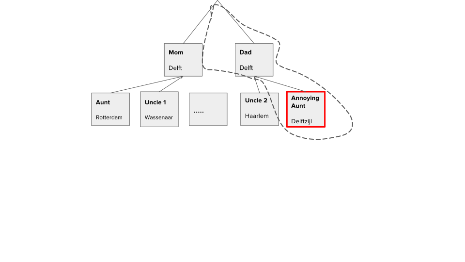

## Introducing the notion of *order* to a dataset

- Provides the computer additional insights on the relation between data values
- Allows the computer to examine the relationship between data values and make
  decisions based on them
- This makes lookup for a data value much faster, we can avoid examine a large
  chunk of the data set
- In the example, we knew the aunt was on the dad's side and thus avoided
  looking into mom's side of relatives!
- A tree is an example of organizing data values according to an **order** (e.g
  hierarchical order)

<!-- How can we integrate *order* in a data structure? -->

## Tree terminology (1)
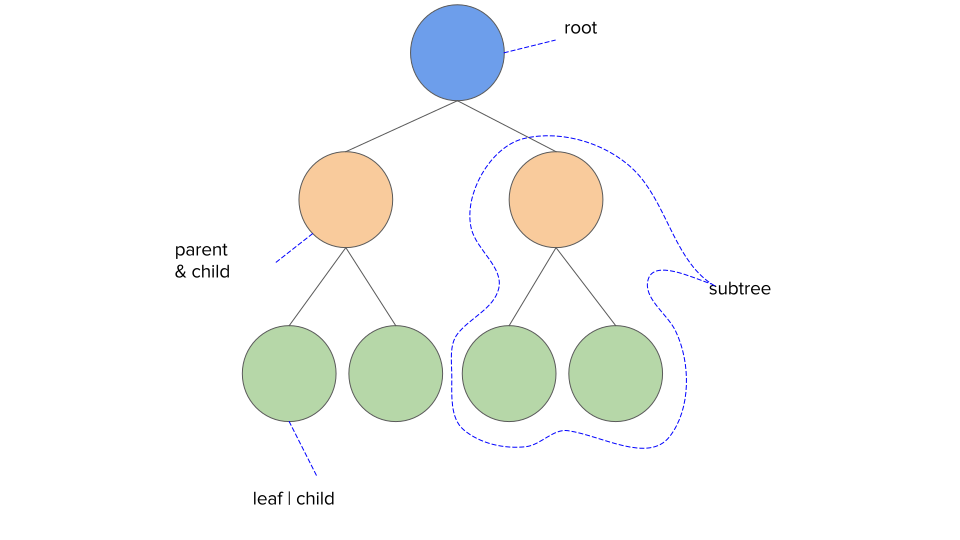

## Tree Properties (1)
A tree constitute with the following properties:

* A single & special node named **root**, start node on top of tree and does not have a **parent**
* Succeeding nodes can be either a **child** or **parent**
    + A **child** node is connected by *at-least* a preceding node
    + The *preceding* node is known as a **parent** node
    + A **parent** node has *zero, one or more* children(successor nodes)

## Tree terminology (2)


## Tree Properties (2)

* All nodes in a tree (except the **root**) are child nodes
* **Siblings** are nodes with the same **parent**
* **Subtree** are the descendants of a node
* A node without children is a **leaf** node

## Tree Height

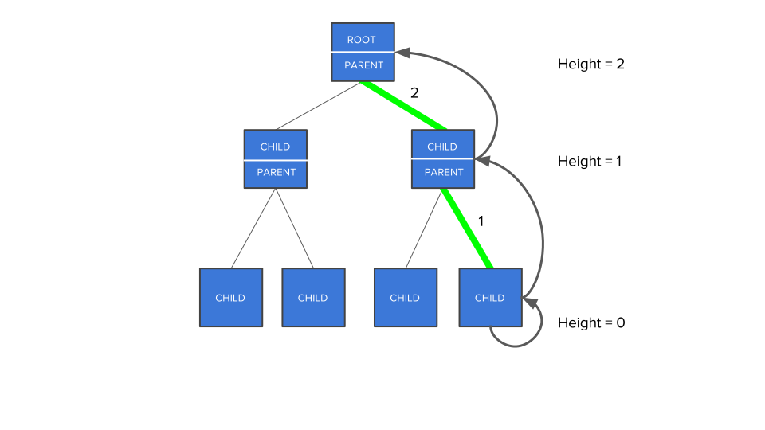

## Tree Depth

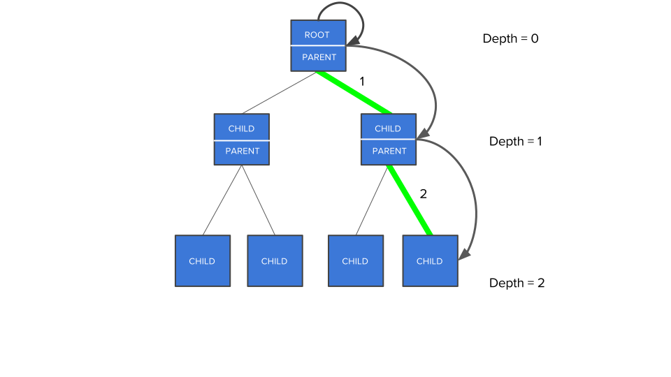

## Path 
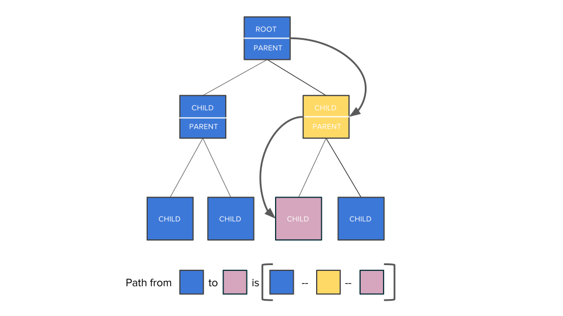


## Traversal Methods
Linear data structures have only one way to read data; a tree can be traversed
in two ways: **depth-first** and **breath-first**(discussed next week). Three
depth-first methods:

* Pre-order
* In-order
* Post-order

## Traversal Methods (1)

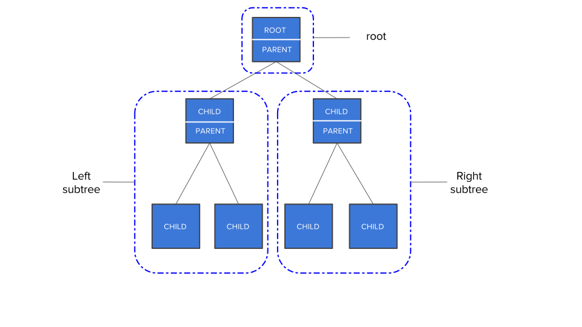


## Traversal Methods (3)

### Pre-order traversal
Visit this recursively 
```
root node => left sub-tree => right sub-tree
```
###In-order traversal
```
left sub-tree => root node => right sub-tree
```
### Post-order traversal
```
left sub-tree => right sub-tree => root node
```
# Binary Trees  {data-background="figures/tree_binary_intro.svg"}

## Binary Trees

* Each node contains a **data value**
- Branching at each node occur either at **left** or **right**
- A binary tree can be composed of zero, one or two children
- Useful for Searching: Traversing either **left** or **right** to find the
  target

## Example

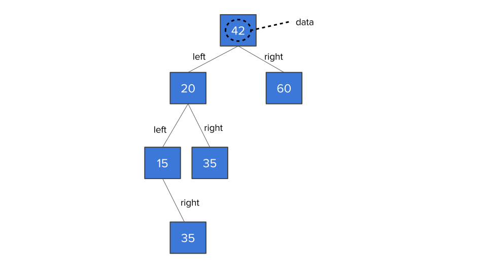

## Implementation of the data structure
``` python
class Node:
    def __init__(self, data):
        self.left = None
        self.right = None
        self.data = data

# Examples
root = Node(8) # root node & no children
a = Node(2)
a.left = Node(1)
b.right = Node(6)
root.left = a
root.right = a

#Q: How will the tree look like?


```

<!--
        2
       / \
      /   \
     /     \
    1       3
   / \     / \
  0   7   9   1
 /   / \     / \
2   1   0   8   8
       /
      7
  -->

## Binary Search Tree (BST)
*  Adding a notion of *order* to a Binary Tree structure
*  A tree is ordered the following way:
    + The child node on the **right** is **always** greater than its parent
    + The child node on the **left** is **always** lesser than its parent

## Example of a BST  

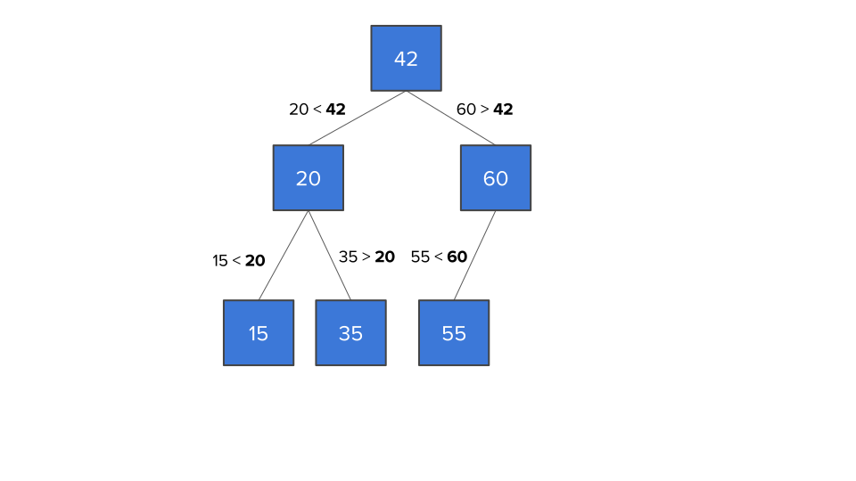


## Insertion in a BST

We want to insert a data value $K$

1. Compare $K$ with the data value $V$ of the current node.
2. If $K < V$,
    1. If `V.left is None`, we insert $K$ as left child of $V$.
    2. If `V.left is not None`, left child of $V$ becomes the **new
       current** node and start over from step 1.
3. If $K > V$,
    1. If `V.right is None`, we insert $K$the right child of $V$.
    2. If `V.right is not None`, right child of $V$ becomes the **new
       current** node and start over from step 1.

## Insert function
```python
def insert(self, data):

    if data > self.data:
        if self.right is None:
            self.right = Node(data)
        else:
            #Q: why are we calling insert here?
            self.right.insert(data)
    else:
        if self.left is None:
            self.left = Node(data)
        else:
            #Q: why are we calling insert here?
            self.left.insert(data)
```


## Inserting a value into a BST

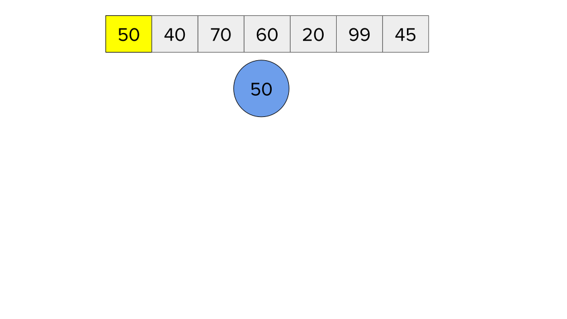

## Inserting a value into a BST

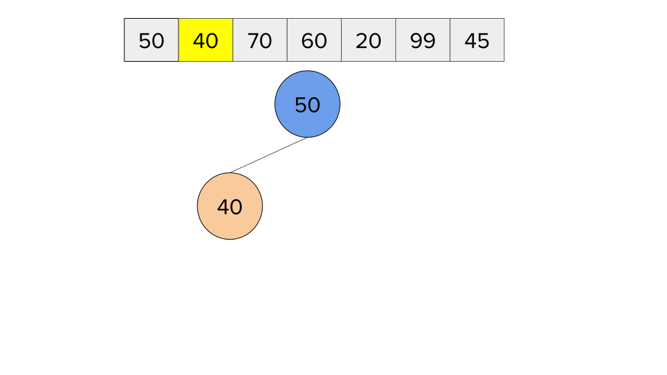

## Inserting a value into a BST

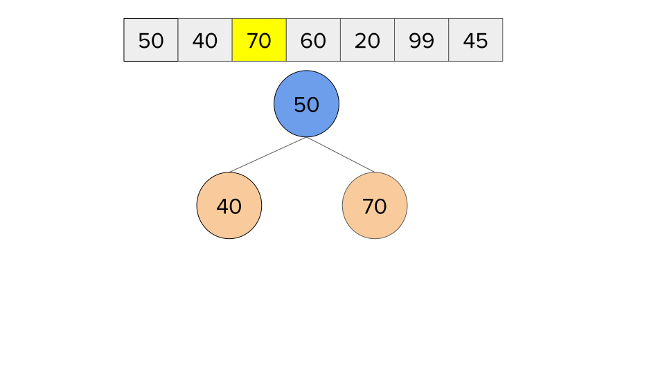

## Inserting a value into a BST

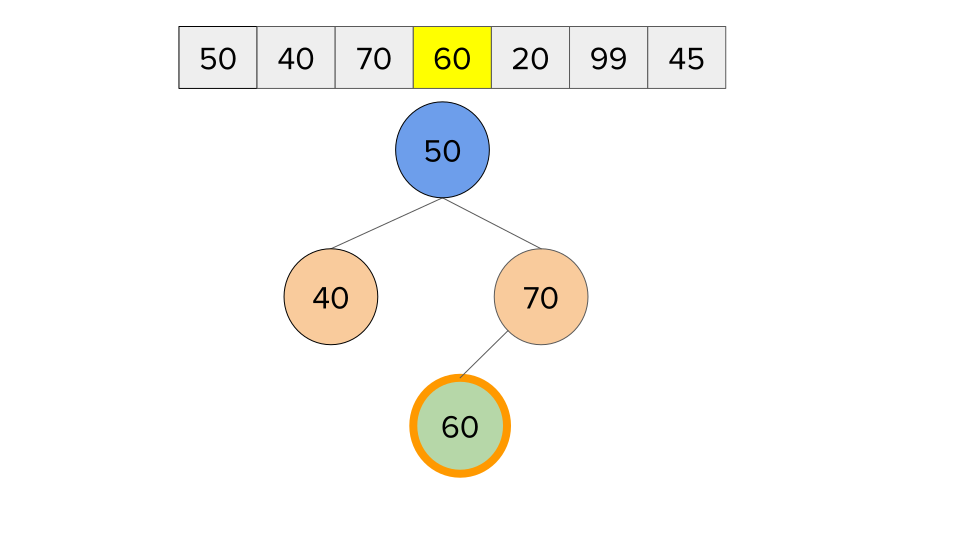

## Inserting a value into a BST

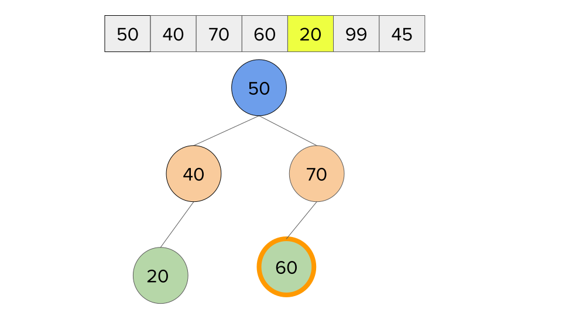

## Inserting a value into a BST

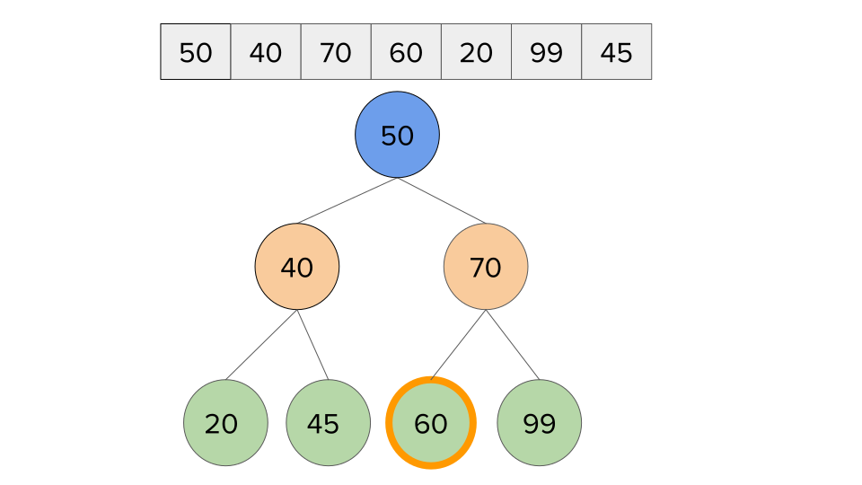

## Search in a BST

We search for a value $key$ by visiting the nodes in the BST

Compare the current node $V's$ value with $key$ 

1. if `key == V.data`, we have found the value and terminate
2. if `key > V.data`, we branch to `V.right`
3. if `key < V.data`, we branch to `V.left`

Base case: Repeat process above until:

* `key == V.data`
* `V.left == None && V.right == None` (e.g reach leaf-node)

## Search function

``` python
def find(root,key):
     
    # Base Case: root is null or key is present at root
    if root.left/right is None or root.val == key:
        return root
 
    # Key is greater than root's key
    if root.val < key:
        return find(root.right,key)
   
    # Key is smaller than root's key
    return find((root.left,key)
```

## Example: Lookup value 49 in a BST

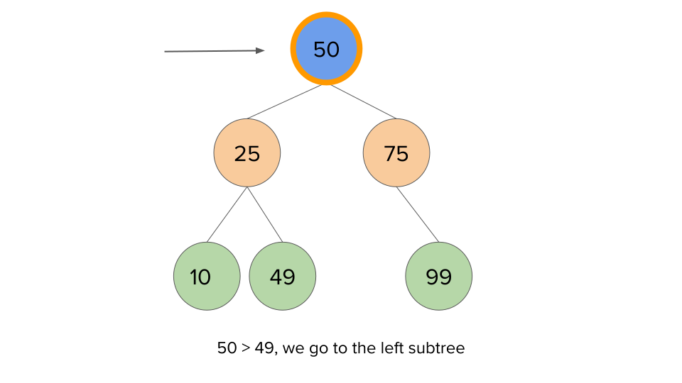

## Example: Lookup value 49 in a BST

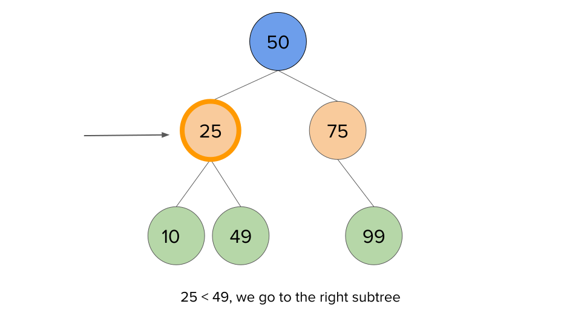

## Example: Lookup value 49 in a BST

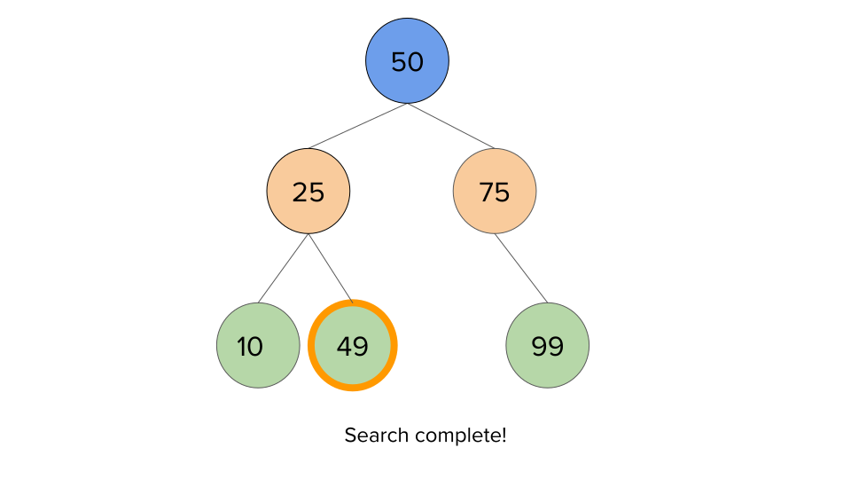

## Remove a node from a BST
<!-- before this slide show three examples -->
There are three situations to handle

* **Leaf Node:** Straightforward to delete
* **Node with one child:** Replace the node with it's only child
* **Node with two children:** More complicated

## Remove a node with two children
We want to remove a node $K$ with $L$ as left tree and $R$ as right tree

1. Perform a search to find node $K$
2. Find the **successor node** $S$ of $K$
3. Replace `K.data` with `S.data`

How do we find the **successor node** of $K$?


## Successor node
* The node with most minimum value in the **right sub-tree**
* Traverse the left child in each branch until there is a node that don't have a left child.

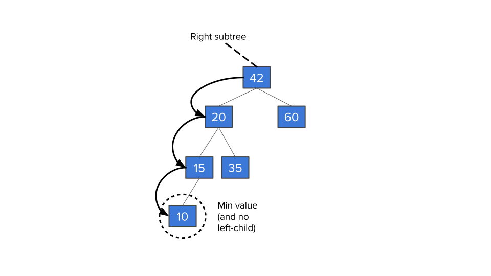{ width=80% }


## Removing 40 from the BST Example

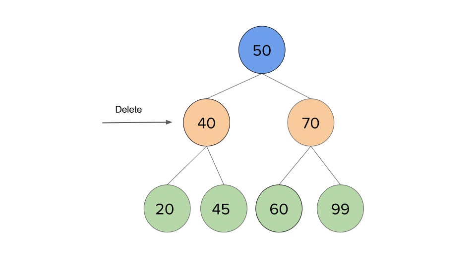


## Removing 40 from the BST Example

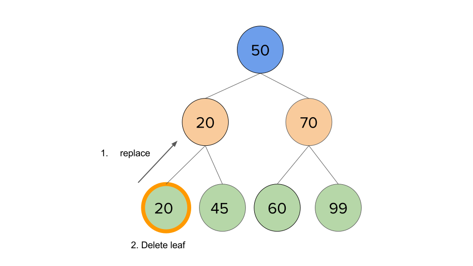

## Removing 40 from the BST Example

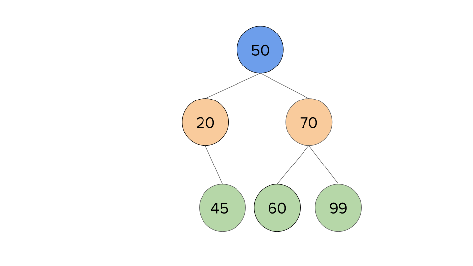


## Unbalanced Tree example

## Does shape matter?

Short Answer: YES!

- The depth of the tree impacts the time of traversing a tree
- The order in which we add elements matters, the shape it can take, is shown in
  the next slide

## Three different types of a tree?
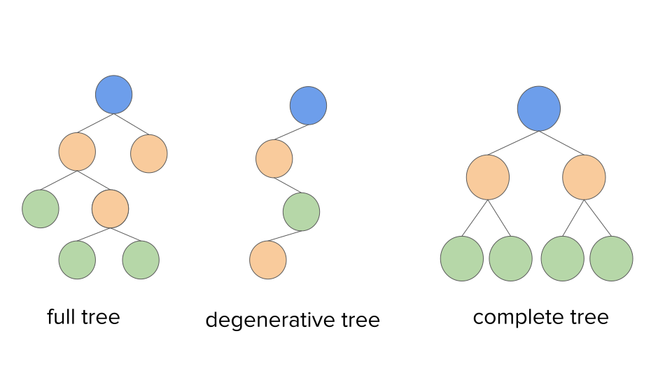


# Self-balancing binary search tree

## 
<!-- A self-balancing binary search tree or height-balanced binary search tree is a
binary search tree (BST) that attempts to keep its height, or the number of
levels of nodes beneath the root, as small as possible at all times,
automatically.

- Most operations on a BST take time proportional to the height of the tree, so it
is desirable to keep the height small.

- Self-balancing binary trees solve this problem by performing transformations on
the tree at key times, in order to reduce the height. Although a certain
overhead is involved, it is justified in the long run by ensuring fast execution
of later operations.

- The height must always be at most the ceiling of log2n.

- Balanced BSTs are not always so precisely balanced, since it can be expensive to
keep a tree at minimum height at all times; instead, most algorithms keep the
height within a constant factor of this lower bound. -->

## Typical Binary Tree

``` python
class Node:
   """
   AVL Tree Node class
   """

   def __init__(self, key):
      """
      Node constructor
      """
      self.left = None
      self.right = None
      self.key = key

   def __str__(self):
      return "%s" % self.key
```

## AVL Tree

``` python
class AVLTree():
    """
    Implementation of AVL tree
    """
    def __init__(self):
        self.node = None
        self.height = -1
        self.balance = 0
```

## Insertion

```python
    def insert(self, key):
        """
        Insert new key into node
        """
        # Create new node
        n = Node(key)

        # Initial tree
        if self.node == None:
            self.node = n
            self.node.left = AVLTree()
            self.node.right = AVLTree()
        # Insert key to the left subtree
        elif key < self.node.key:
            self.node.left.insert(key)
        # Insert key to the right subtree
        elif key > self.node.key:
            self.node.right.insert(key)

        # Exit, key already exists in the tree
            
        # Rebalance tree if needed
        self.rebalance()
```

## Traversal

```python
    def inorder_traverse(self):
        """
        Inorder traversal of the tree
            Left subree + root + Right subtree
        """
        result = []

        if not self.node:
            return result
        
        result.extend(self.node.left.inorder_traverse())
        result.append(self.node.key)
        result.extend(self.node.right.inorder_traverse())

        return result
```

## Deletion
```python
    def delete(self, key):
        if self.node != None:
            if self.node.key == key:
                # Key found in leaf node, just erase it
                if not self.node.left.node and not self.node.right.node:
                    self.node = None
                # Node has only one subtree (right), replace root with that one
                elif not self.node.left.node:                
                    self.node = self.node.right.node
                # Node has only one subtree (left), replace root with that one
                elif not self.node.right.node:
                    self.node = self.node.left.node
                else:
                    # Find  successor as smallest node in right subtree or
                    #       predecessor as largest node in left subtree
                    successor = self.node.right.node  
                    while successor and successor.left.node:
                        successor = successor.left.node

                    if successor:
                        self.node.key = successor.key

                        # Delete successor from the replaced node right subree
                        self.node.right.delete(successor.key)

            elif key < self.node.key:
                self.node.left.delete(key)

            elif key > self.node.key:
                self.node.right.delete(key)

            # Rebalance tree
            self.rebalance()

```

## Rebalance

``` python
 def rebalance(self):
```

# B-Trees & B+ trees

## B-Trees

- Primarily used by relational databases
- Provides an efficient way to implement common database features such as *join,
  fast deletion and ordering of rows* 
- AVL is ideal for in-memory while B-Tree is made for disk-based storage

## Implementation

There are two types of way to implement a B-Tree
- Iterative
- Recursive

## Some key implementation details


```{r child="footer.Rmd", include=FALSE}
```
