```{r child="header.Rmd", include=FALSE}
```

# Trees

## Why organize data as a tree structure? 

- Humans have a natural inclination towards hierarchical thinking and this have
had a profound impact on the way we reason, decide and look at *things*
- Examples are social and political structures such as *family tree*,
*governance* and *species* 
- Introducing *order* such as *hierarchical order* to data allows computers
to make decisions in a much more efficient way then linear data
structures


## Example: Visiting a distant aunt {- }
What do we know about this aunt and our family:

- You only meet her once every three years
- She is from your **dad's side**
- There is a huge family gathering next week and you have been asked to find her
address.


## Example: Visiting a distant aunt {- }
- Equipped with the knowledge from the previous week, we would organize family
relatives in the following fashion:

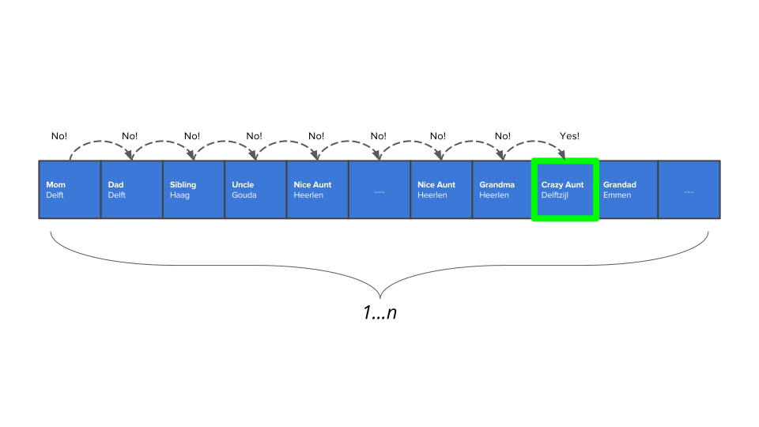

## Example: Visiting a distant aunt (2) {- }
Knowing the hierarchical **order** of our family, we would prefer making a
family tree!

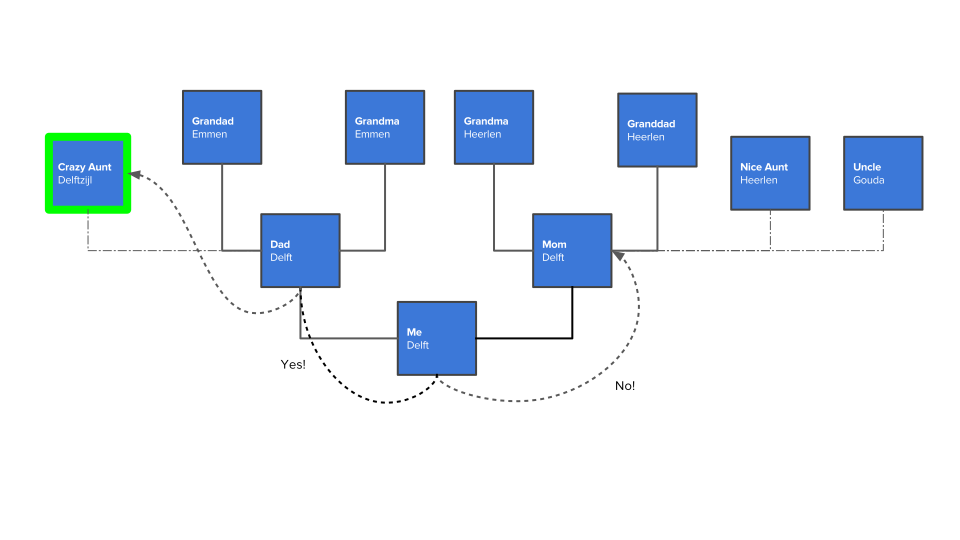

## Order

- Provides the computer additional insights on the relation between data values
- Allows the computer to examine the relationship between data values and make
decisions based on them
- This makes lookup for a data value much faster, we can avoid examine a large
chunk of the data set
- In the example, we knew the aunt was on the dad's side and thus avoided
looking into mom's side of relatives!
- A tree is an example of organizing data values according to an **order** (e.g
hierarchical order)

<!-- How can we integrate *order* in a data structure? -->

## Tree terminology


## Tree Properties {- }
A tree constitute with the following properties:

* A single & special node named **root**, start node on top of tree and does not have a **parent**
* Succeeding nodes can be either a **child** or **parent**
+ A **child** node is connected by *at-least* a preceding node
+ The *preceding* node is known as a **parent** node
+ A **parent** node has *zero, one or more* children(successor nodes)

## Subtrees {- }
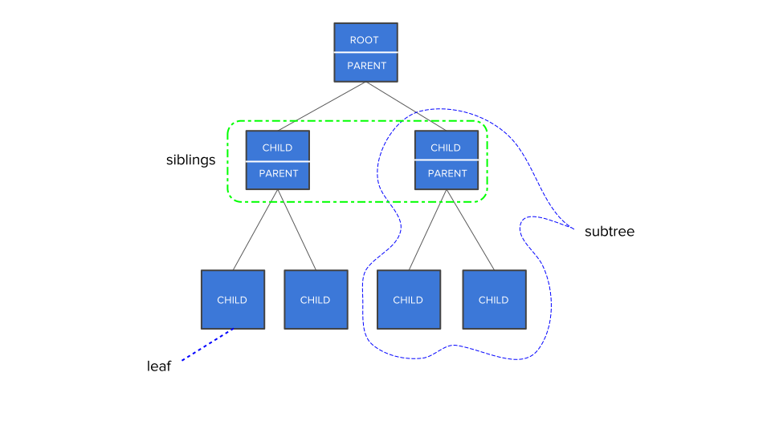

## Subtrees Properties {- }

* All nodes in a tree (except the **root**) are child nodes
* **Siblings** are nodes with the same **parent**
* **Subtree** are the descendants of a node
* A node without children is a **leaf** node

## Tree Height {- }

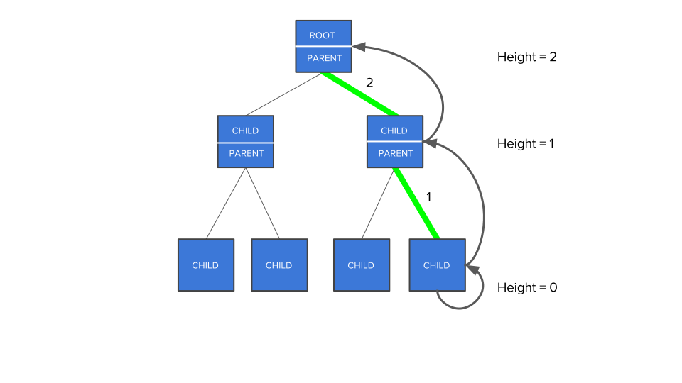

## Tree Depth {- }

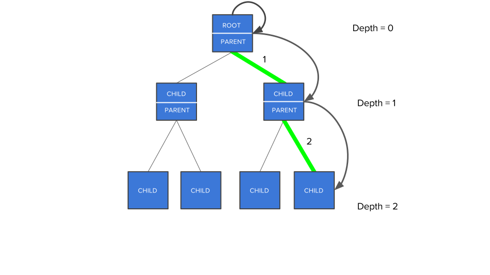

## Path {- }
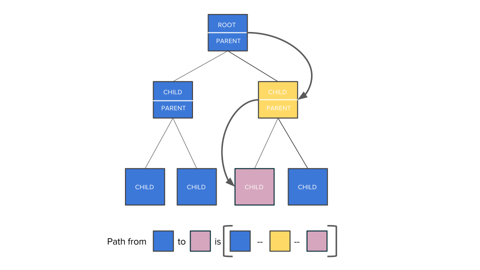


## Traversal Methods
Linear data structures have only one way to read data; a tree can be traversed
in two ways: **depth-first** and **breath-first**(discussed next week). Three
depth-first methods:

* Pre-order
* In-order
* Post-order

## Traversal Methods (1) {- }

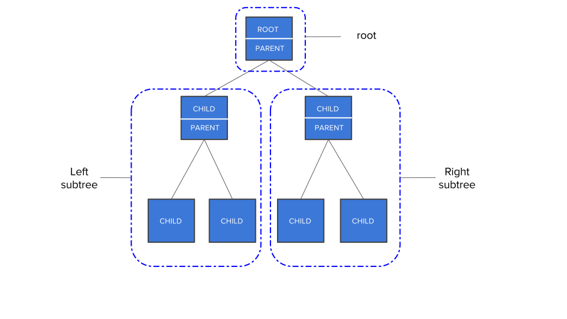


## Traversal Methods (3) {- }

Visit Nodes in a recursive fashion 

**Pre-order traversal**
```
root node => left sub-tree => right sub-tree
```
**In-order traversal**
```
left sub-tree => root node => right sub-tree
```
**Post-order traversal**
```
left sub-tree => right sub-tree => root node
```

## Binary Trees

* Each node contains a **data value**
- Branching at each node occur either at **left** or **right**
- A binary tree can be composed of zero, one or two children
- Useful for Searching: Traversing either **left** or **right** to find the
target

## Example {- }

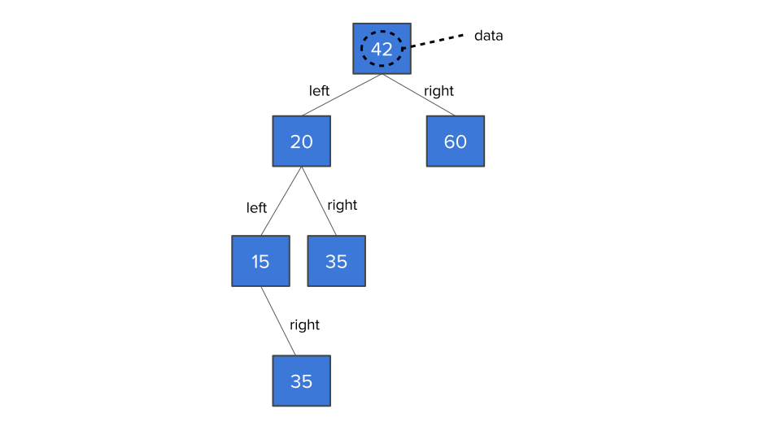

## Implementation {- }
``` python
class Node:
def __init__(self, data):
    self.left = None
    self.right = None
    self.data = data

# Examples
root = Node(8) # root node & no children
a = Node(2)
a.left = Node(1)
a.right = Node(6)
root.left = a
root.right = a

#Q: How will the tree look like?


```

<!--
    2
   / \
  /   \
 /     \
1       3
/ \     / \
0   7   9   1
/   / \     / \
2   1   0   8   8
   /
  7
-->

## Binary Search Tree (BST) {- }
*  Adding a notion of *order* to a Binary Tree structure, the *order invariant*
*  A tree is ordered the following way:
+ The child node on the **right** is **always** greater than its parent
+ The child node on the **left** is **always** lesser than its parent

## Example of a BST {- }

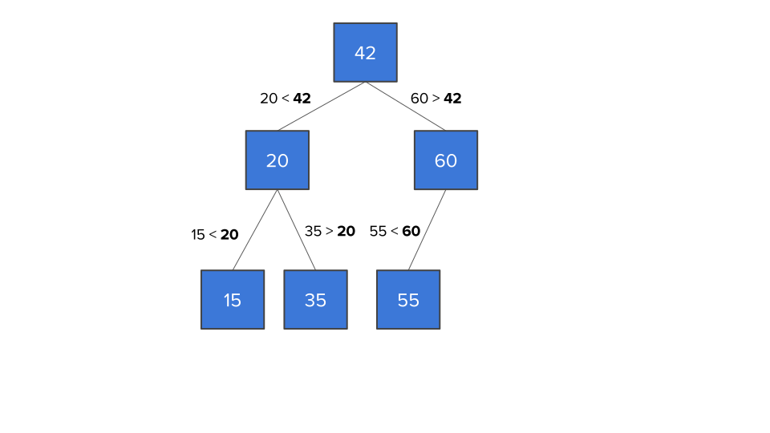


## Insertion in a BST

We want to insert a data value $K$

1. Compare $K$ with the data value $V$ of the current node.
2. If $K < V$,
1. If `V.left is None`, we insert $K$ as left child of $V$.
2. If `V.left is not None`, left child of $V$ becomes the **new
   current** node and start over from step 1.
3. If $K > V$,
1. If `V.right is None`, we insert $K$the right child of $V$.
2. If `V.right is not None`, right child of $V$ becomes the **new
   current** node and start over from step 1.

## Insert function
Let's extend  `class Node` with an `insert` method
```python
def insert(self, data):

if data > self.data:
    if self.right is None:
        self.right = Node(data)
    else:
        #Q: why are we calling insert here?
        self.right.insert(data)
else:
    if self.left is None:
        self.left = Node(data)
    else:
        #Q: why are we calling insert here?
        self.left.insert(data)
```


## Inserting a value into a BST

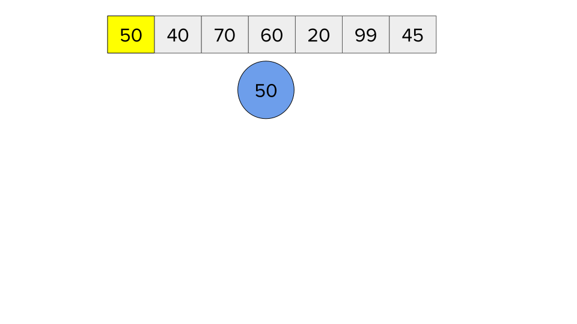

## Inserting a value into a BST

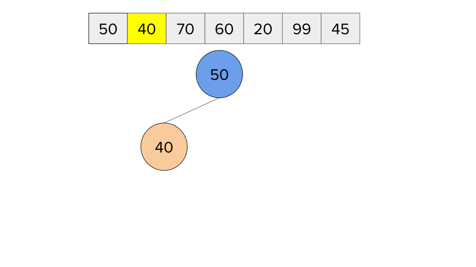

## Inserting a value into a BST

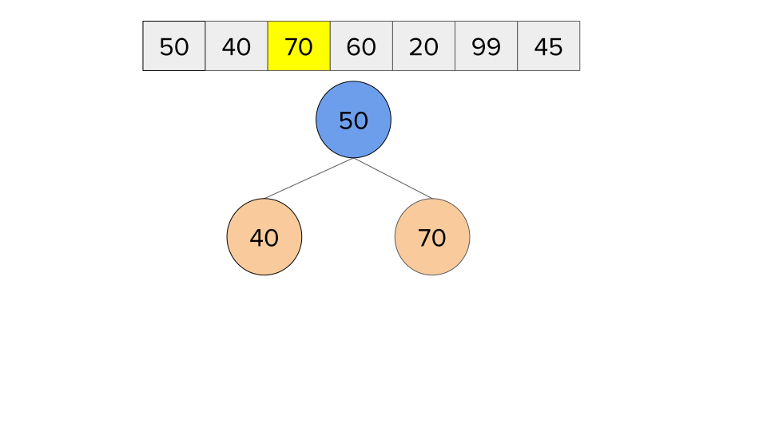

## Inserting a value into a BST

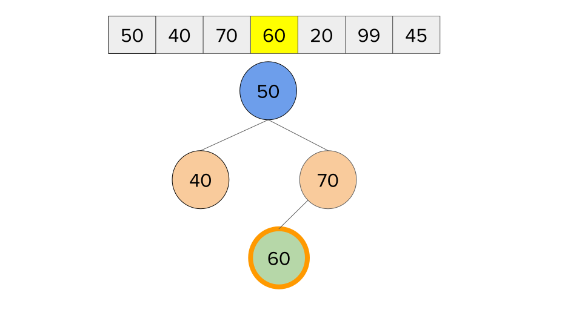

## Inserting a value into a BST

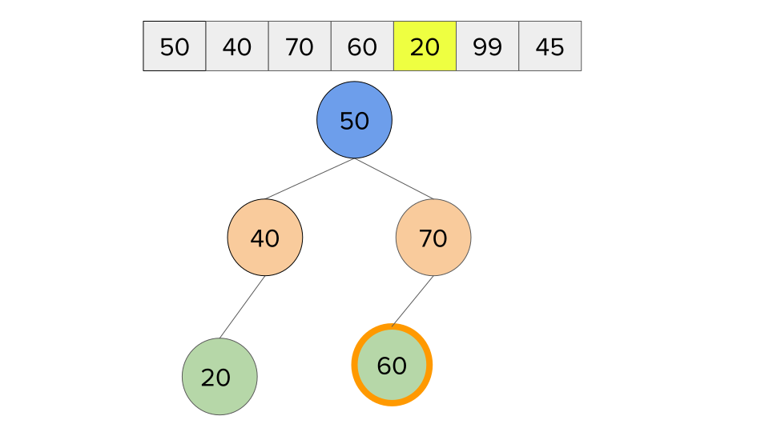

## Inserting a value into a BST

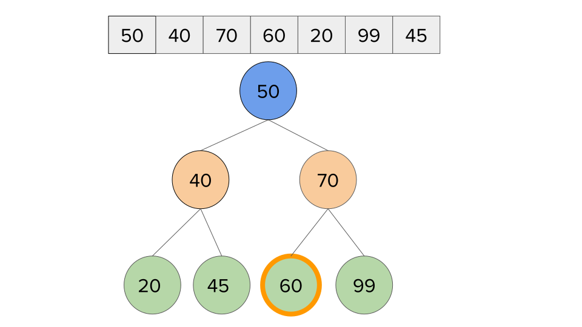

## Search in a BST

We search for a value $key$ by visiting the nodes in the BST

Compare the current node $V's$ value with $key$ 

1. if `key == V.data`, we have found the value and terminate
2. if `key > V.data`, we branch to `V.right`
3. if `key < V.data`, we branch to `V.left`

Base case: Repeat process above until:

* `key == V.data`
* `V.left == None && V.right == None` (e.g reach leaf-node)

## Search function

``` python
def find(root,key):
 
# Base Case: root is null or key is present at root
if root.left/right is None or root.val == key:
    return root

# Key is greater than root's key
if root.val < key:
    return find(root.right,key)

# Key is smaller than root's key
return find(root.left,key)
```

## Example: Lookup value 49 in a BST

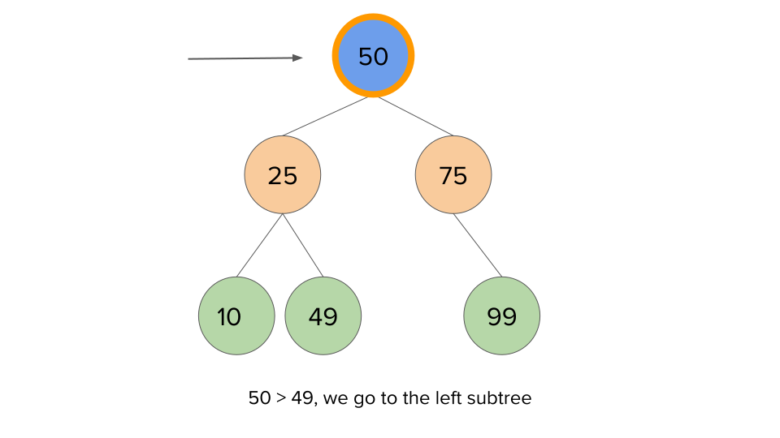

## Example: Lookup value 49 in a BST

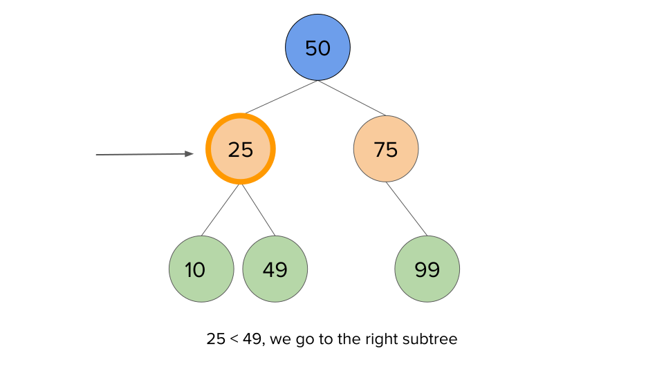

## Example: Lookup value 49 in a BST

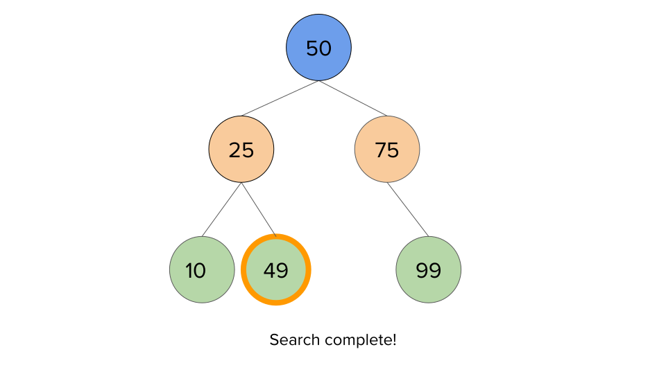

## Remove a node from a BST
<!-- before this slide show three examples -->
There are three situations to handle

* **Leaf Node:** Straightforward to delete
* **Node with one child:** Replace the node with it's only child
* **Node with two children:** More complicated

## Remove a node with two children
We want to remove a node $K$ with $L$ as left tree and $R$ as right tree

1. Perform a search to find node $K$
2. Find the **successor node** or **predecessor node** $S$ of $K$
3. Replace `K.data` with `S.data`

How do we find the **successor/predecessor node** of $K$?


## Successor node
* The node with most minimum value in the **right sub-tree**
* Traverse the left child in each branch until there is a node that don't have
a left child.

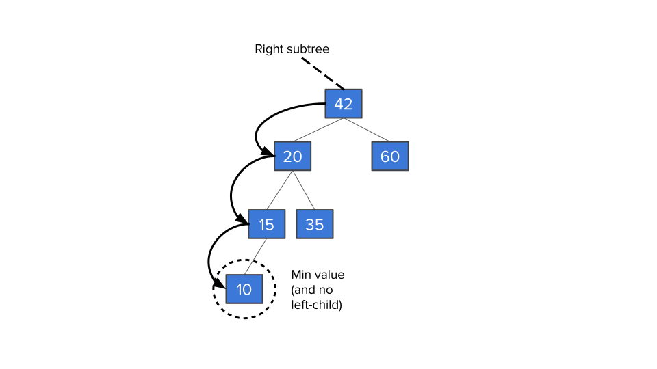{ width=80% }


## Predecessor node
* The node with most maximum value in the **left sub-tree**
* Traverse the right child in each branch until there is a node that don't have 
a right child.

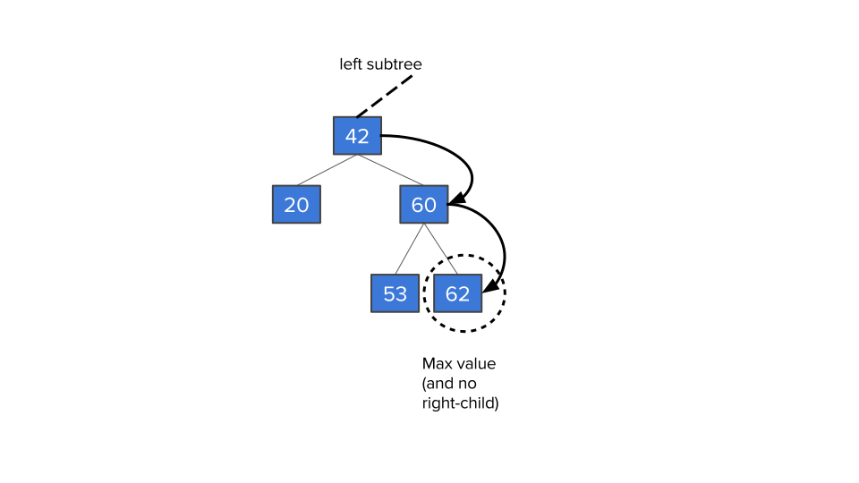{ width=80% }


## Removing 40 from the BST Example 
Finding the predecessor node


## Removing 40 from the BST Example

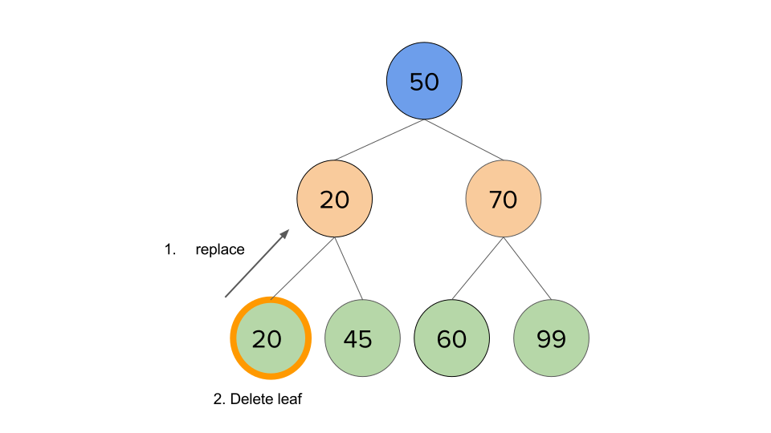

## Removing 40 from the BST Example

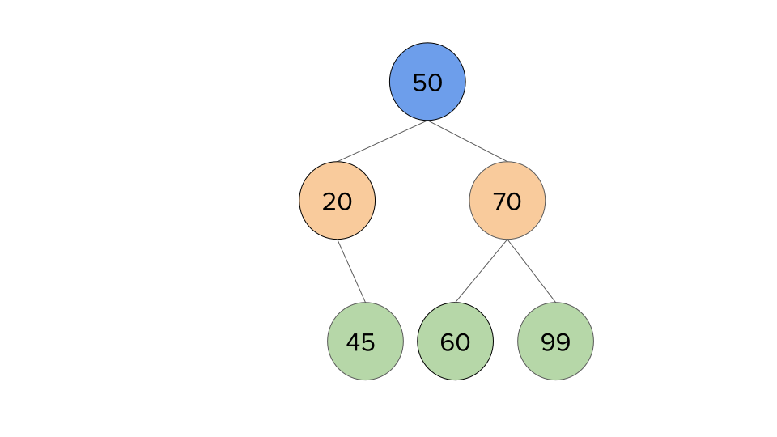


## Analysis of the BST operations

* `def insert:` limiting factor is the **height of the tree**
+ Worst case: Compare at every level of the tree to find an appropriate
  place to insert the value
* `def search`: same as for `insert`
+ Worst case: searches to the bottom and no key found!
* `def remove:` Additional: Search for the successor/predecessor before removing the element
+ finding the successor is also the height of the tree, so double the work!

From a performance perspective, the common operations requires a search and this
is bound by the *height of the tree*

## What is the height of the tree likely to be? 
A: *Depends on how the data values are inserted into the tree*

* A tree with the same number of nodes on the left sub-tree and right sub-tree
have a *worst-case* complexity of $\mathcal{O}(\log{}_2h)$ where $h$ is the
height of the tree
* This is the maximum number of comparisons that an operation like e.g `insert` 
will need to do to find a spot to insert a value. 
* *height of the tree* $= \log{}_2h$

How does it look like for BSTs that are not balanced? 

## What is the height of the tree likely to be? (2) 

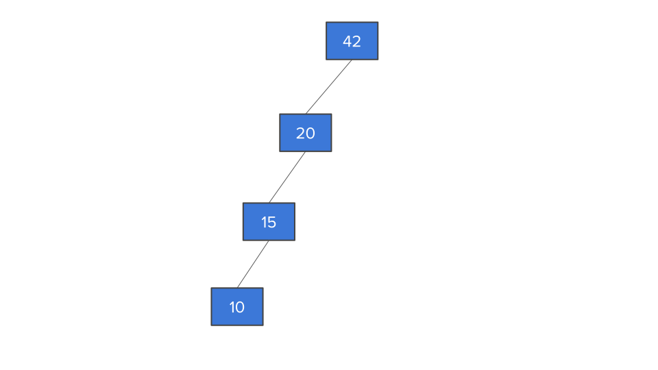{ width=80% }

What is the time complexity for such a tree? *Hint: think in terms of a list
structure*

## What is the height of the tree likely to be? (2) 

* We can quickly see that the worst case is similar to traverse an entire list 
and the complexity is $\mathcal{O}(h)$
* There are many scenarios where we end up with an unbalanced tree, this makes 
the worst case scenario for BST operations to be $\mathcal{O}(h)$

## Why is the height of a complete BST $\log{}_2h$?

The logarithmic value of number of nodes is truncated (e.g floor $\lfloor{x}\rfloor$)

| Height | Nodes | Log calculation |
|--------|-------|------------------|
| 0 | 1 | $\log{}_21 = 0$ |
| 1 | 3 | $\log{}_23 = 1$ |
| 2 | 7 | $\log{}_27 = 2$ |
| 3 | 15 | $\log{}_215 = 3$ |


## A look at the problem size
A great example on [StackOverflow](https://stackoverflow.com/questions/2307283/what-does-olog-n-mean-exactly/13093274#13093274)

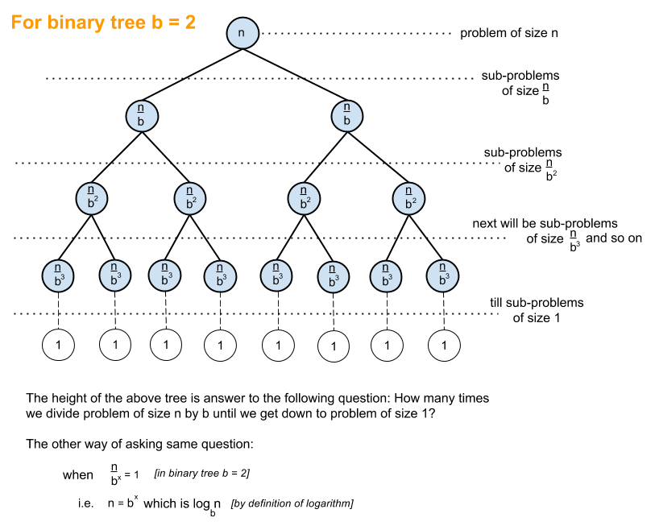{ width=60% }


# Self-balancing binary search tree


## Maintaining a balanced tree


* We want to avoid that a BST degenerates to $\mathcal{O}(h)$ time
* Needs to keep the height of the tree as small as possible, at worst, the
complexity should be  $\mathcal{O}(\log{}_2h)$
* We need a way to automatically keep the tree balanced

## AVL-tree

* Named after the inventors G.M. Adelson-Velskii and E.M. Landis
* Introduce a *balance invariant* to a binary search tree
* For every node $n$ in an AVL-tree, the heights of the left and
right sub-trees of $n$ can differ at most by 1.

## AVL-tree (2)

* The height of the tree should be bound by $\mathcal{O}(\log{}_2n)$ at worst
case
* Let's consider the height of an AVL tree as $h$ with $N_h$ nodes 
* To satisfy the balance invariant:
+ The **root** must have a child with height $h-1$ with $N_{h-1}$ nodes
+ The other child of the *root* must than have a height of $h-2$ with $N_{h-2}$ nodes
+ Why $h-2$? Height can differ at most by 1
* The AVL tree has in total  $N_{h-1} + N_{h-2} + 1$ nodes (root is $1$)  

## Visualize the relation between height and nodes 

{ width=60% }


<!--## AVL-tree (3)
* The base cases are $h=1,2$, the nodes are $N_1=1, N_2=2$
* Iteratively, we can construct $N_h$ as $N_h = N_{h-1} + N_{h-2} + 1$ as follows
+ $N_{h-1}$ is left sub-tree and $N_{h-2}$  is the right sub-tree
+ $N_h = N_{h-1} + N_{h-2} + 1$ 
+ $N_{h-1} = N_{h-2} + N_{h-3} + 1$ 
+ $N_{h} = (N_{h-2} + N_{h-3} + 1)+ N_{h-2} + 1$ 
+ $N_{h} > 2N_{h-2}$ 
    + $log N_{h} > log 2N_{h-2}$ 
    + $2N_{h} > h := h = \mathcal{O}(\log{}_n)$  -->

## AVL operations

* We have shown that the introduced invariant can maintain the tree balanced at
  $\mathcal{O}(\log{}_n)$ 
* We have to develop mechanisms to keep the tree balance at *insert* and
  *deletion* operations such that the height of the children must not differ by
  more than 1 for every node
* To balance an AVL tree, we need two mechanisms: left rotation and right
  rotations
* Rebalancing a tree takes $\mathcal{O}(1)$ and involves re-assigning nodes in 
  the tree to shift around the weights 


## `Right-rotation(y)`

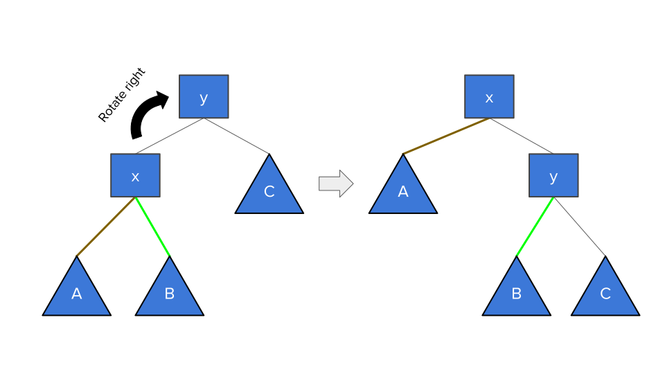


## `Left-rotation(x)`

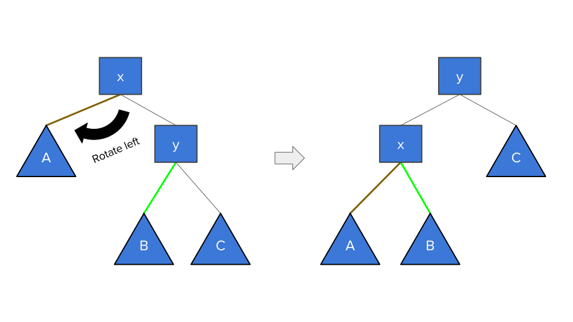

## Insertion 

There are three cases of insertion we need to consider:

1. Node $n$ with children of the same height $k$. Inserting in either sub-tree
   obeys the balance invariant
2. The right sub-tree of Node $n$ is heaver than the left sub-tree. Inserting
   into the right sub-tree can lead to an unbalanced AVL tree
3. The left sub-tree of Node $n$ is heaver than the left right-tree. Inserting
   into the left sub-tree can lead to an unbalanced AVL tree

## Insertion (2)

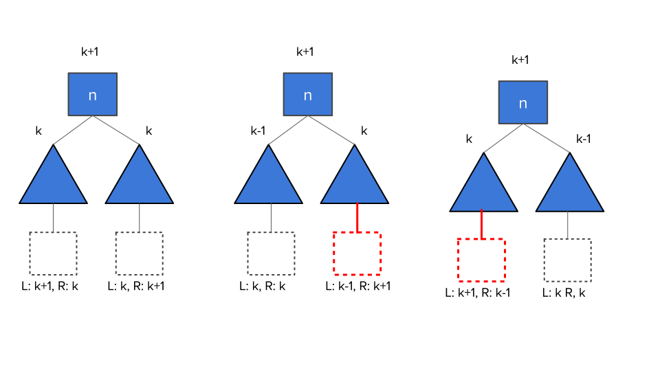

## Insertion: Violation on the left

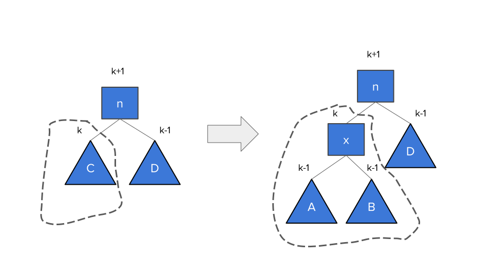{ width=80% }

Let's imagine we want to insert a value $\beta$ into the $C$ tree and the left tree
also has children $A$ and $B$


## Insertion: Violation on the left (2)

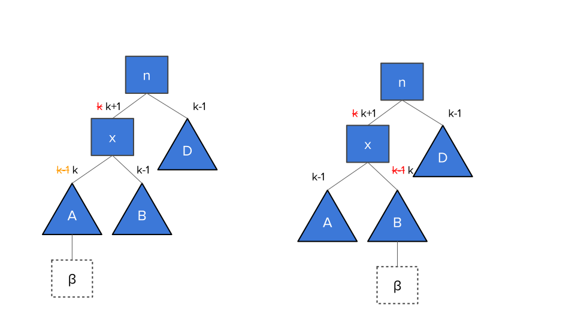{ width=80% }

Two places we can insert  $\beta$ 


## First Case: $\beta$ inserted in $A$

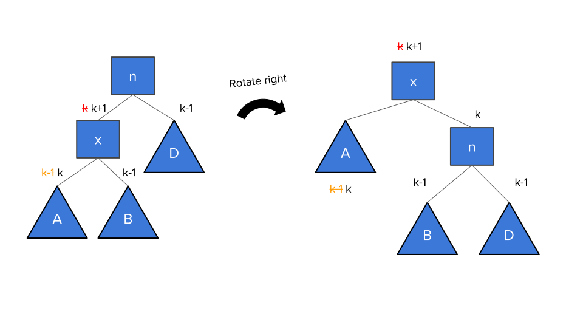{ width=80% }

This is a simple right rotation

## Right Rotation

``` python
def rotateRight(node, self):
    newRoot = node.left
    node.left = newRoot.right
    newRoot.right = node
    return newRoot
```

## Second Case: $\beta$ inserted in $B$

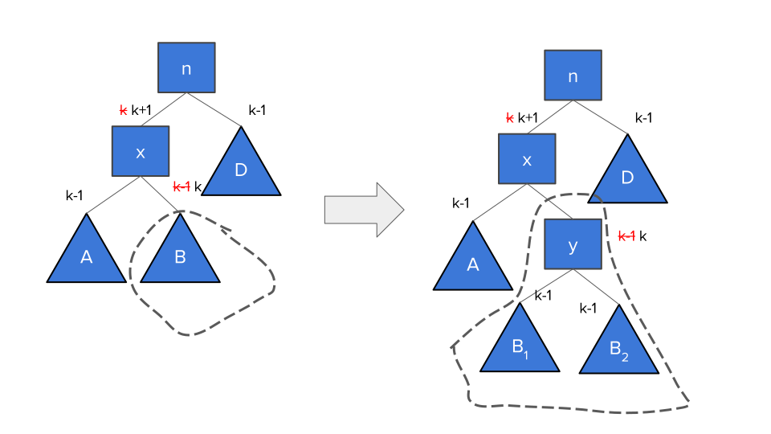{ width=80% }

A simple right or left rotation won't solve the problem

## Second Case: $\beta$ inserted in $B$ (1)
He have to perform something called a double right rotation

1. Make a left-rotation on $x$

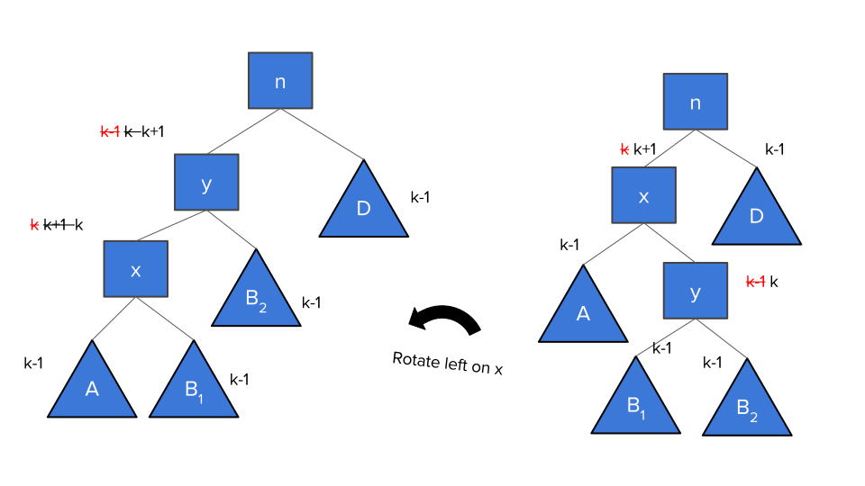{ width=90% }

## Second Case: $\beta$ inserted in $B$ (2)
2. Make a right-rotation on $y$
   
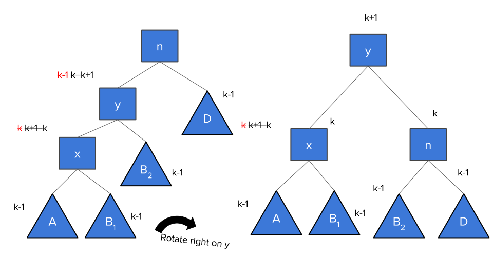{ width=80% }

Performing a left rotation or double left rotation is symmetric

## Double right rotation


``` python
def rotateRight(node, self):
    n = rotateRight(node.right)
    self.rotateLeft(n)
```


# B-Trees & B+ trees  {data-background="figures/btree-intro.png"}
<!-- 
based on
http://www.cs.carleton.edu/faculty/jgoldfea/cs201/spring11/inclass/Tree/BTreefinalNew.pdf
https://webdocs.cs.ualberta.ca/~holte/T26/ins-b-tree.html
-->
## B-Trees

- Primarily used by relational databases or filesystems
- Provides an efficient way to implement common database features such as *join,
  fast deletion and ordering of rows* 
- B-tree is an *m-ary tree*, a binary tree is special case (a *2-ary tree*)
* Ideal to work with large blocks of data


## Example of a B-tree

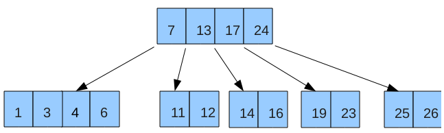

## B-Tree Invariant (1)

A B-tree of order $m$ is an $m-ary$ search tree:

* Data values stored in leaf nodes, non-leaf nodes guide the search process
* Each **non-leaf** node has:
    + $\lceil{m/2}\rceil$ and $m$ **children**
    + with number of keys as *number of children* - 1
 * Each **leaf** node contains:
    + between $\lceil{m/2}\rceil$ and $m$ **values**
    + with no more than $m-1$ keys


## B-Tree Invariant (2)
* The **root** is either a leaf node or has between 2 and $m$ children
* The keys at the non-leaf nodes partition the keys of the children
  (e.g the key guides the search similar to BST)
* Every path from the root to a leaf is the same distance

## Building a B-Tree
 On the blackboard, let's construct a B-tree of order 5 with the following
 values:

``` bash
1,12,8,2,25,5,14,28,17,7,52,16,48,68,3,26,29,53,55,45
```

## Insertion

For a value $V$:

1. Search to find the leaf node where it should be added
2. Insert $V$ into the leaf node
3.  If *number of values* is $=< m-1$ after insertion
    -   We are done!
4. If *number of values* is $= m$, we violate the invariant
5. To resolve this, we split the node into three ranges:
    * Left: first $\frac{m-1}{2}$ records
    * middle value:  $1+\frac{m-1}{2}$ 
    * Right: last $\frac{m-1}{2}$ records
6. Sequences of Left and Right becomes new nodes; middle value is promoted as a
   key to the parent and added

Q: What happens if there is no room at the parent node?

<!--## Deletion
* Insertion: we have to check that the *node* is not contain too many values
* Deletion: we have to check that the *node* does not have to less values

For a value $V$, we do the following

1. If value $V$ is in node $x$ and $x$ is a leaf, delete value $V$ 
2. If value $V$ is in node $x$ and $x$ is **not a leaf**
    + Find the successor/predecessor value for $V$


* Let's look again at the example
* The deletion algorithm is similar to BST
* Deleting a value in *non-leaf* node, replace by finding the successor or predecessor node


1. Going from the root, find leaf *L* -->

## B+ Trees

* There are many variations of B-Trees, one popular one is B+ Tree
* Useful structure in file-systems
* The idea is intuitive:
    + The non-leaf nodes act as an index with place holder values
    + The leaf node contains the actual data values that are linked
+ Ideal for range queries as every internal node is sub interval 
* Understand and animate B+ Trees, a [tool](https://www.cs.usfca.edu/~galles/visualization/BPlusTree.html) developed at UFSCA

## Example of a B+ Tree

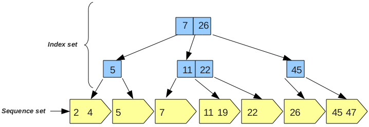


## Bibliography

<div id="refs"></div>

## Copyright

This work is (c) 2017 - onwards by TU Delft and Joseph Hejderup
and licensed under the [Creative Commons Attribution-NonCommercial-ShareAlike 
4.0 International](http://creativecommons.org/licenses/by-nc-sa/4.0/) license.

<!--html_preserve-->
<script>
  (function(i,s,o,g,r,a,m){i['GoogleAnalyticsObject']=r;i[r]=i[r]||function(){
  (i[r].q=i[r].q||[]).push(arguments)},i[r].l=1*new Date();a=s.createElement(o),
  m=s.getElementsByTagName(o)[0];a.async=1;a.src=g;m.parentNode.insertBefore(a,m)
  })(window,document,'script','https://www.google-analytics.com/analytics.js','ga');

  ga('create', 'UA-2510585-3', 'auto');
  ga('send', 'pageview');

</script>
<!--/html_preserve-->
