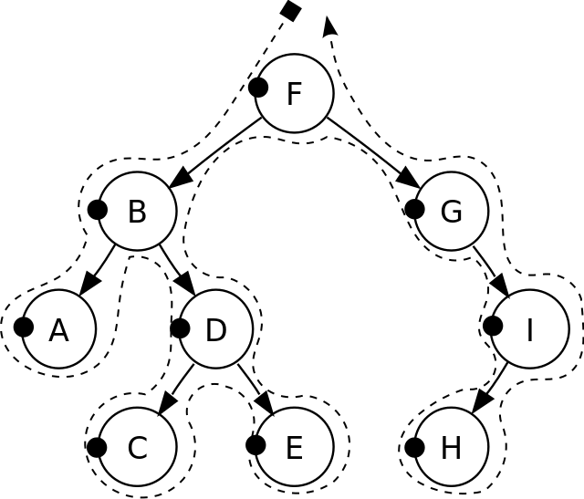
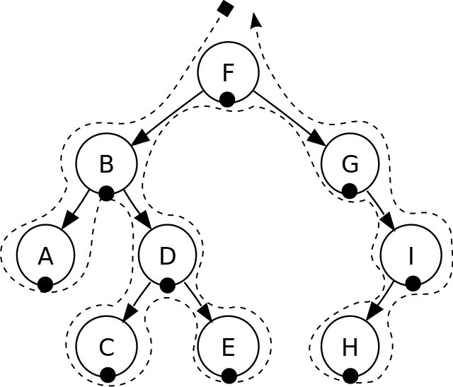
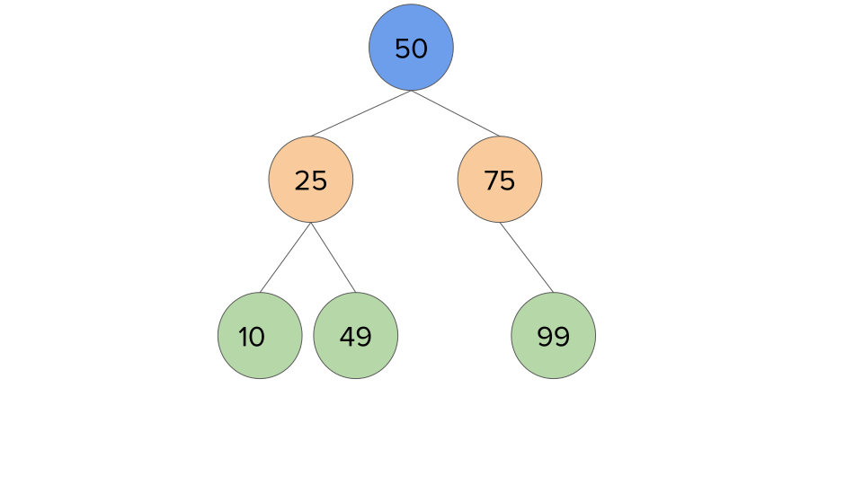

```{r child="header.Rmd", include=FALSE}
```

# Tree as a data structure {data-background="figures/tree_american.jpg"}

## Why organize data as a tree structure?

- Humans like hierarchies and *hierarchical* ordering. Examples are *family
  tree*, *governance*, *species* 
- This form of systematic organization in a hierarchical order helps computers
  to localize and make decisions in a much more efficient way then linear data
  structures

## Example: Visiting a distant aunt

- You only meet her once every three years, she is from your dad's side. There
  is a huge family gathering next week and you need to find her address.
  Learning from the previous lecture, the data is organized in this fashion


## Example: Visiting a distant aunt

If we structure the family in a tree, we can find it her address in less time,
we know she is on the dad side, thus we avoid exploring half the family!


## Definition of a tree


## Tree terminology

- The **root** node does not have a **parent node**
- A **parent** node has zero, one or more **children**
- Certain nodes are both a parent and child
- Nodes on the same level, are *siblings*
- Each branch of the tree are disjoint and is a sub-tree of the tree
- This is called *m-ary tree*

## Traversing a tree
There are three types of ways to traverse a tree


- Pre-order
- In-order
- Post-order

## Pre-order




## In-order




## Post-Order


# Binary Trees  {data-background="figures/tree_binary_intro.svg"}

## Properties

- A Binary tree is a *2-ary* tree with zero, one or two *children* (left or
    right)
- The structure is simple and forms more of a "decision" tree, where each step
  resembles a yes or no answer
- This makes it efficient for sorting and searching 
  
- The depth of a node is the number of edges from the root to the node.
- The height of a node is the number of edges from the node to the deepest leaf.
- The height of a tree is a height of the root.
- A full binary tree.is a binary tree in which each node has exactly zero or two
  children.
- A complete binary tree is a binary tree, which is completely filled, with the
  possible exception of the bottom level, which is filled from left to right.

## Implementation

```python
class BinaryTree():

    def __init__(self,rootid):
      self.left = None
      self.right = None
      self.rootid = rootid

    def getLeftChild(self):
        return self.left
    def getRightChild(self):
        return self.right
    def setNodeValue(self,value):
        self.rootid = value
    def getNodeValue(self):
        return self.rootid

```

## Adding elements to the tree

```python

    def insertRight(self,newNode):
        if self.right == None:
            self.right = BinaryTree(newNode)
        else:
            tree = BinaryTree(newNode)
            tree.right = self.right
            self.right = tree

    def insertLeft(self,newNode):
        if self.left == None:
            self.left = BinaryTree(newNode)
        else:
            tree = BinaryTree(newNode)
            tree.left = self.left
            self.left = tree
```


## Does shape matter?

Short Answer: YES!

- The depth of the tree impacts the time of traversing a tree
- The order in which we add elements matters, the shape it can take, is shown in
  the next slide

## Three different types of a tree?


## Binary Search Trees (BST)
- As the name indication, it provides means to search in a Binary Tree
  structure
- A binary tree is a Binary Search tree if the value of the node is greater the
  values of each node in the left subtree and smaller than the values of each
  node in the right subtree

## Example of a BST  




## Searching in a Binary Search Tree

If we are looking for element X:

1. Compare current node's key with X. If it's equal, we've found the key. All
   done.
2. If X is less than node's key, we start looking at node's left subtree. It's
   because we know that right subtree cannot contain anything greater than X.
3. If X is greater than node's key, we start looking in the right subtree.
4. We repeat this process until we find the key or we reach the leaf node. If we
   reach the leaf node and haven't found the key as yet, we return not found.

## Example: Lookup value 49 in a BST


## Example: Lookup value 49 in a BST


## Example: Lookup value 49 in a BST


## Inserting a value into a BST

1. Compare current node's key with K.
2. If K is less than the current node,
    1. If left child of current node is Null, we insert K as the left child of
    current node and return.
    2. If the left child is not Null, the left child becomes the new current
       node, and we repeat the process from step 1.
3. If K is greater than the current node,
    1. If right child of current node is Null, we insert K as the right child of
       the current node and return.
    2. If the right child is not Null, the right child becomes the new current
       node, and we repeat the process from step 1.

## Inserting a value into a BST


## Inserting a value into a BST


## Inserting a value into a BST


## Inserting a value into a BST


## Inserting a value into a BST


## Inserting a value into a BST


## Removing a value from a BST

When we have to delete a node with two children, we have two options. Let's say
that the node to be deleted has key X.

1. Replace the current node's key with its predecessor and then trigger delete
   for predecessor in node's left subtree.
2. Replace the current node's key with its successor and then trigger delete for
   predecessor in node's right subtree.

## Removing 40 from the BST Example


## Removing 40 from the BST Example


## Removing 40 from the BST Example


# Self-balancing binary search tree

## 

A self-balancing binary search tree or height-balanced binary search tree is a
binary search tree (BST) that attempts to keep its height, or the number of
levels of nodes beneath the root, as small as possible at all times,
automatically.

- Most operations on a BST take time proportional to the height of the tree, so it
is desirable to keep the height small.

- Self-balancing binary trees solve this problem by performing transformations on
the tree at key times, in order to reduce the height. Although a certain
overhead is involved, it is justified in the long run by ensuring fast execution
of later operations.

- The height must always be at most the ceiling of log2n.

- Balanced BSTs are not always so precisely balanced, since it can be expensive to
keep a tree at minimum height at all times; instead, most algorithms keep the
height within a constant factor of this lower bound.

## Typical Binary Tree

``` python
class Node:
   """
   AVL Tree Node class
   """

   def __init__(self, key):
      """
      Node constructor
      """
      self.left = None
      self.right = None
      self.key = key

   def __str__(self):
      return "%s" % self.key
```

## AVL Tree

``` python
class AVLTree():
    """
    Implementation of AVL tree
    """
    def __init__(self):
        self.node = None
        self.height = -1
        self.balance = 0
```

## Insertion

```python
    def insert(self, key):
        """
        Insert new key into node
        """
        # Create new node
        n = Node(key)

        # Initial tree
        if self.node == None:
            self.node = n
            self.node.left = AVLTree()
            self.node.right = AVLTree()
        # Insert key to the left subtree
        elif key < self.node.key:
            self.node.left.insert(key)
        # Insert key to the right subtree
        elif key > self.node.key:
            self.node.right.insert(key)

        # Exit, key already exists in the tree
            
        # Rebalance tree if needed
        self.rebalance()
```

## Traversal

```python
    def inorder_traverse(self):
        """
        Inorder traversal of the tree
            Left subree + root + Right subtree
        """
        result = []

        if not self.node:
            return result
        
        result.extend(self.node.left.inorder_traverse())
        result.append(self.node.key)
        result.extend(self.node.right.inorder_traverse())

        return result
```

## Deletion
```python
    def delete(self, key):
        if self.node != None:
            if self.node.key == key:
                # Key found in leaf node, just erase it
                if not self.node.left.node and not self.node.right.node:
                    self.node = None
                # Node has only one subtree (right), replace root with that one
                elif not self.node.left.node:                
                    self.node = self.node.right.node
                # Node has only one subtree (left), replace root with that one
                elif not self.node.right.node:
                    self.node = self.node.left.node
                else:
                    # Find  successor as smallest node in right subtree or
                    #       predecessor as largest node in left subtree
                    successor = self.node.right.node  
                    while successor and successor.left.node:
                        successor = successor.left.node

                    if successor:
                        self.node.key = successor.key

                        # Delete successor from the replaced node right subree
                        self.node.right.delete(successor.key)

            elif key < self.node.key:
                self.node.left.delete(key)

            elif key > self.node.key:
                self.node.right.delete(key)

            # Rebalance tree
            self.rebalance()

```

### Rebalance

``` python
 def rebalance(self):
```


# B+ Trees


## ```{r child="footer.Rmd", include=FALSE}
```
